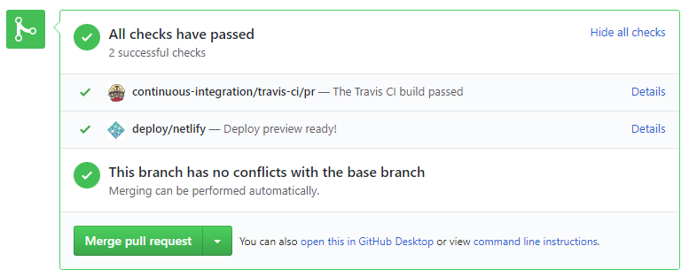






## Creating a GitHub Account

Create a personal GitHub account if you don't have one yet. 
1. You are advised to choose a sensible GitHub username as you are likely to use it for years to come in professional contexts e.g., in job applications.
2. Strongly recommended: Complete your GitHub profile. In particular,  
   * Specify your full name. 
   * Upload a profile photo that matches <trigger trigger="click" for="modal:creatingGitHubAccount-photoCriteria">our requirements</trigger>.

   <panel type="seamless" header="%%Why am I being encouraged to complete my GitHub profile?%%" >

   The GitHub profile is useful for the tutors and classmates to identify you. If you are reluctant to share your info in your long-term GitHub account, you can remove those details after the module is over or create a separate GitHub account just for the module.

   </panel>
3. ==You are discouraged from changing your GitHub username during the semester/exam/grading period== as it can cause our auto-grading scripts to miss your GitHub activities. If you do change your GitHub username during that period, please let us know immediately.

<modal large header="Our requirements for the profile photo" id="modal:creatingGitHubAccount-photoCriteria">
  <include src="tp-deliverables-website.mbdf#profile-photo"/>
</modal>

<!-- ==================================================================================================== -->

## Guidelines for Reviewing PRs

Follow the [_Best practices for reviewing PRs_ @SE-EDU/guides](https://se-education.org/guides/guidelines/PRs-reviewing.html). You are ==expected to follow all of them==.

<!-- ==================================================================================================== -->

## tP Team Organization Setup

<box type="important" seamless>

Please follow the organization/repo name format precisely or else our grading scripts will not be able to detect your work.

</box>

****({{ icon_individual }}/%%{{ icon_team }}%%) Only one team member:****

After receiving your team ID, one team member should do the following steps:
* Create a GitHub organization with the following details:
  * **Organization name** ==(all UPPER CASE) : `{{ semester }}-TEAM_ID`==. e.g.  `{{ semester }}-{{ module }}T-W12-1`, `{{ semester }}-{{ example_team_id }}`
  * Plan:  Open Source ($0/month) 
  * This organization belongs to: My personal account
* Add members to the organization:
  * Create a team called `developers` to your organization.
  * Add your team members to the developers team.

<!-- ==================================================================================================== -->

## tP Team Repo Setup

****({{ icon_individual }}/%%{{ icon_team }}%%) Only one team member:****

<box tags="m--cs2113 m--tic4001" seamless type="important">

The tP project template given to you is a variation of the iP repo you used for the iP, but ==with some important differences==. Please follow instructions carefully, rather than follow what you remember from the iP.

</box>

1. **Fork** the [{{url_module_org}}/{{ tp_repo_name }}]({{url_module_org}}/{{ tp_repo_name }}) repo to your team org.
   * This repo (let's call it the _team repo_) is to be used as the repo for your project.
   * {{ icon_important_big_red }} Please do not rename the fork %%Reason: our grading scripts rely on the repo name.%%
1. **Enable the issue tracker**.
1. **Enable GitHub Actions**: Go to the {{ show_as_rounded_tab(':fas-play-circle: Actions') }} tab and enable workflows by clicking the {{ button('I understand my workflows ...', button_style="success") }} button. That will enable the GitHub Actions that are already included in the repo you forked. 
   **Set up codecov**, as explained in the [DevOps guide]({{ url_ab3_fork_website }}/DevOps.html).

1. **Set up the project website** 
   Follow instructions in the [_Documentation guide_ page]({{ url_ab3_fork_website }}/Documentation.html) of AB3 developer guide. When set up correctly, your project website should be available via the URL  `https://{{ semester | lower }}-{team-id}.github.io/{{ tp_repo_name }}` e.g., `https://{{ semester | lower }}-{{ module | lower }}-w13-1.github.io/{{ tp_repo_name }}`.

1. **Enable GitHub Pages**: Go to the {{ show_as_rounded_tab(':octicon-gear: Settings') }} tab and enable `GitHub Pages` for the `master branch /docs folder` (similar to how you did it in the iP). 
   Remember to choose a theme too by clicking the {{ button('**Choose a theme**') }} button (that will create a commit in your repo that is needed in a later step. 
   After a few minutes, confirm your tP website is available in the corresponding `github.io` URL.

1. **Add members**. Ensure your team members have the desired level of access to your team repo. 
   Recommended: Give _admin access_ to 1-2 members and _write access_ to others.
1. **Create a _team PR_** for us to track your project progress: i.e., create a PR from your ==team repo `master` branch== to [[nus-{{ module | lower }}-{{ semester }}/{{ tp_repo_name }}]({{url_module_org}}/{{ tp_repo_name }})] `master` branch. PR name: `[Team ID] Product Name` e.g., `[{{ example_team_id }}] InsureList`. %%As you merge code to your team repo's `master` branch, this PR will auto-update to reflect how much your team's product has progressed.%% 
   Please fill in these details as specified because they are used by our grading scripts.
   * **PR subject: the name of your product** e.g., `[{{ example_team_id }}] InsureList`
   * **Description: a 1-2 sentence overview** (plain text only, no formatting or links) of your project indicating the target user and the value proposition e.g., `InsureList helps insurance agents manage detail of their clients. It is optimized for CLI users so that frequent tasks can be done faster by typing in commands.`

<!-- ==================================================================================================== -->

## tP Issue Tracker Setup

We recommend you configure the issue tracker of the tP team repo as follows:

* Delete existing labels and add the following labels. 
  {{ icon_tip }} **Issue type** labels are useful from the beginning of the project. The other labels are needed only when you start implementing the features.

<box>

**Issue type** labels:
* `type.Epic` : A big feature which can be broken down into smaller stories e.g. search
* `type.Story` : A user story
* `type.Enhancement`: An enhancement to an existing story
* `type.Task` (or `type.Chore`) : Something that needs to be done, but not a story, bug, or an epic. e.g. Move testing code into a new folder)
* `type.Bug` : A bug

</box>

<box>

**Priority** labels:
* `priority.High` : Must do
* `priority.Medium` : Nice to have
* `priority.Low` : Unlikely to do

</box>

<box>

**Bug Severity** labels:
* `severity.VeryLow` : A flaw that is purely cosmetic and does not affect usage e.g., a typo/spacing/layout/color/font issues in the docs or the UI that doesn't affect usage.
  Only cosmetic problems should have this label.
* `severity.Low` : A flaw that is unlikely to affect normal operations of the product. Appears only in very rare situations and causes a minor inconvenience only.
* `severity.Medium` : A flaw that causes occasional inconvenience to some users but they can continue to use the product.
* `severity.High` : A flaw that affects most users and causes major problems for users. i.e., makes the product almost unusable for most users.

{{ icon_info }} When applying for documentation bugs, replace _user_ with _reader_.

</box>

* Create following milestones : `v1.1`, `{{ version_first }}`, `{{ version_penultimate }}`, `{{ version_final }}`

* You may configure other project settings as you wish. e.g. more labels, more milestones

<!-- ==================================================================================================== -->

## tP Individual Fork Setup

****({{ icon_individual }}, {{ icon_individual }}, {{ icon_individual }}, ...) Every team member:****

1. **Watch** the `{{ tp_repo_name }}` repo (created above) i.e., go to the repo and click on the {{ button(':octicon-eye: Watch :octicon-triangle-down:') }} button to subscribe to activities of the repo.
1. **Fork** the `{{ tp_repo_name }}` repo to your personal GitHub account. 
   <include src="appendixE-gitHub.md#do-not-rename" inline />
1. **Clone** the fork to your computer.
1. **Set up** the developer environment in your computer by following the
   [_Setting up and getting started_ page]({{ url_ab3_fork_website }}/SettingUp.html) of AB3 developer guide.the [README]({{url_module_org}}/{{ tp_repo_name }}) carefully as the ==steps are different from the iP==.

<box type="wrong" seamless>

**Do not alter these paths** in your project as our grading scripts depend on them.
* `src/main/java`
* `src/test/java`
* `docs`
</box>

<!-- ==================================================================================================== -->

## tP Workflow

{{ icon_important_big_red }} **Read <trigger trigger="click" for="modal:appE-reusePolicy">our reuse policy %%(in Admin: Appendix B)%%</trigger>**, in particular, ==how to give credit when you reuse code from the Internet or classmates==:

<modal large header="Admin {{ icon_embedding }} Appendix E → Setting Git Username to Match GitHub Username" id="modal:appE-gitUsername">
  <include src="tools.md#git-username"/>
</modal>
<modal large header="Admin {{ icon_embedding }} Appendix B: Policies → Policy on Reuse" id="modal:appE-reusePolicy">
  <include src="appendixB-policies.md#policy-reuse"/>
</modal>

* **Follow the <trigger trigger="click" for="modal:appErecommendedWorkflow-forkingworkflow">forking workflow</trigger>** in your project. Normally, we expect you to follow the forking workflow at least until (and including) {{ version_first }} after which you may tweak the workflow {{ version_penultimate }}. However, after following the forking workflow for 2-3 PRs (per person) in {{ version_first }}, if you are confident that you can follow the forking workflow well, you may switch to the <trigger trigger="click" for="modal:appErecommendedWorkflow-featurebranchworkflow">feature branch workflow</trigger> workflow <tooltip content="i.e., without waiting for the end of {{ version_first }}">earlier</tooltip>.
* {{ icon_tip }} **Protect the `master` branch**: You can use GitHub's [_Protected Branches_](https://help.github.com/articles/about-protected-branches/) feature to protect your `master` branch against rogue PRs. We suggest the following:
  * Go the the {{ show_as_rounded_tab(':octicon-gear: settings') }} of your team repo.
  * Click on the `Branches` option on the navigation menu on the left.
  * Click the {{ button('**Add rule**') }} button. In the _Branch protection rule_ page,
    * Specify the _Branch name pattern_ to be `master`
    * Tick the option `Require status checks to pass before merging` to ensure that a branch has to pass CI before it can be merged into the `master` branch
    * If you think all PRs should be reviewed by someone other than the PR author before they are merged, also tick the `Require pull request reviews before merging` option.
* **Create issues to represent project tasks** so that they can be tracked using the issue tracker features.
* **Create a PR when you implement a project task** that updates the code. Remember to use a separate branch for each PR. 
  {{ icon_tip }} You can use GitHub's [_draft PRs_](https://github.blog/2019-02-14-introducing-draft-pull-requests/) feature to indicate that a PR is not yet ready for merging. 
* **Get team members to review PRs.** A workflow without PR reviews is a risky workflow.
  * Follow the [_Best practices for reviewing PRs_ @SE-EDU/guides](https://se-education.org/guides/guidelines/PRs-reviewing.html). 
    {{ icon_pro_tip }} `LGTM` is common abbreviation you can use in the review comments to mean `Looks Good To Merge`.
* **Go breadth-first iterative:** As you are expected to follow breadth-first iterative approach, almost ==all code additions to the `master` branch should take the product from a working version to a slightly better working version==.
  * {{ bad }} Let's add all data classes first %%reason: this is the depth-first approach%%
  * {{ bad }} Let's finish the part of the code that saves and loads data first %%reason: this is the depth-first approach%%
  * {{ good }} Let's add code to support simple todo tasks first (i.e., read, delete, save, load)
* **Do not merge PRs failing <tooltip content="Continuous Integration e.g., GitHub Actions">CI</tooltip>.** The CI status of a PR is reported at the bottom of the {{ show_as_rounded_tab(":octicon-comment-discussion: conversation")}} tab of the PR page. Here's an example: 
  
  * **If there is a failure**, you can click on the `Details` link in corresponding line to find out more about the failure. Once you figure out the cause of the failure, push the a fix to the PR.
* **Avoid rebasing/squashing** when merging PRs. While both are good alternatives to the default behavior of creating a merge commit, rebasing/squashing can affect the timestamp of the commits, which can interfere with the progress tracking that we do for grading purposes %%i.e., the commits can get detected under a week different from the week they were actually done%%.
* **After merging a PR**,
  * close the corresponding issue. 
    {{ icon_pro_tip }} You can use GitHub's [`Fixes #123` trick](https://help.github.com/en/articles/closing-issues-using-keywords) to get the issue to close automatically when the PR is merged.
  * sync your repos with the team rep by pulling the latest `master` from the team repo and pushing it to your own fork.

* **As you add functionality, update the `input.txt` and `EXPECTED.txt` as well** so that the functionality you add gets regression tested automatically every time the code is updated from that point onwards.


<modal large header="TextBook {{ icon_embedding }}" id="modal:appErecommendedWorkflow-forkingworkflow">
  <include src="../book/revisionControl/forkingWorkflow/unit-inElsewhere-asFlat.md" boilerplate/>
  <include src="../book/gitAndGitHub/forkingWorkflow/unit-inElsewhere-asFlat.md" boilerplate/>
</modal>

<modal large header="TextBook {{ icon_embedding }}" id="modal:appErecommendedWorkflow-featurebranchworkflow">
  <include src="../book/revisionControl/featureBranchFlow/unit-inElsewhere-asFlat.md" boilerplate/>
</modal>

**After following the given workflow for at least <tooltip content="i.e., until the end of {{ version_first }}">one iteration</tooltip>, optionally, you may adjust the process rigor** to suit your team's pace. Here are some examples:

* **Switch to a lighter workflow**:
  * While _forking workflow_ is the safest (and is recommended), it is also rather heavy. You may switch to a simpler workflow if the forking workflow if you wish. Refer the textbook to find more about [alternative workflows](../se-book-adapted/chapters/revisionControl.html):
    * The _feature branches_ workflow: a reasonable alternative, but if you choose this, make sure your master branch is _protected_ and most members have write access only (i.e., no admin access)
    * The _centralized workflow_: discouraged.
  * Even if you do switch, we still recommend that you use PR reviews, at least for PRs affecting others' features.

* **Reduce automated tests**: Automated tests have benefits, but they can be a pain to write/maintain. 
  It is OK to get rid of some of the troublesome tests and rely more on manual testing instead. The less automated tests you have, the higher the risk of regressions; but it may be an acceptable trade-off under the circumstances if tests are slowing you down too much. 
  There is no direct penalty for removing tests. Also note <trigger trigger="click" for="modal:appEworkflow-testingExpectations">our expectation on test code</trigger>.

* **Reduce automated checks**: You can also reduce the rigor of checkstyle checks to expedite PR processing.

* If you are unsure if a certain adjustment is allowed, you can check with the teaching team first.

<modal header="Admin {{ icon_embedding }} Project Grading → Expectation on testing" id="modal:appEworkflow-testingExpectations">
  <include src="tp-expectations.md#testing-expectations"/>
</modal>

<!-- ==================================================================================================== -->

## tP Project Schedule Tracking

In general, use the issue tracker (Milestones, Issues, PRs, Tags, Releases, and Labels) for assigning, scheduling, and tracking _all_ noteworthy project tasks, including user stories. Update the issue tracker regularly to reflect the current status of the project. You can also use GitHub's [Projects feature](https://www.youtube.com/watch?v=C6MGKHkNtxU) to manage the project, but keep it linked to the issue tracker as much as you can.

<!-- ------------------------------------------------------------------------------------------------------ -->

#### Using Issues:

* **Record each of the user stories you plan to deliver as an issue in the issue tracker.** e.g.,

<include src="..\book\specifyingRequirements\userStories\usage\tools.md#user-stories-in-issue-tracker" />

* **Assign the `type.*` and `priority.*` labels to those issues.**

* **Formalize the project plan** by assigning relevant issues to the corresponding milestone.

* **Define project tasks as issues**. When you start implementing a user story (or a feature), break it down to smaller tasks if necessary. Define reasonable sized, standalone tasks.  ==Create issues for each== of those tasks so that they can be tracked. 
  * A typical task should be small enough for one person to do in a few hours. %%eg.,%%
    * %%{{ icon_dislike }} Bad (reasons: not a one-person task, not small enough): `Write the Developer Guide`%%
    * %%{{ icon_like }} Good: `Update class diagram in the Developer Guide for {{ version_final }}`%%

  * There is no need to break things into VERY small tasks. Keep them as big as possible, but they should be no bigger than what you are going to assign a single person to do within a week. %%eg.,%%
    * %%{{ icon_dislike }} Bad:`Implementing parser ` (reason: too big).%%
    * %%{{ icon_like }} Good:`Implementing parser support for adding of floating tasks`%%

  * Do not track things taken for granted. %%e.g., `push code to repo` should not be a task to track. In the example given under the previous point, it is taken for granted that the owner will also (a) test the code and (b) push to the repo when it is ready. Those two need not be tracked as separate tasks.%%

  * Write a descriptive title for the issue. %%e.g. `Add support for the 'undo' command to the parser`%%
    * Omit redundant details. In some cases, the issue title is enough to describe the task. In that case, no need to repeat it in the issue description. There is no need for well-crafted and detailed descriptions for tasks. A minimal description is enough. Similarly, labels such as `priority` can be omitted if you think they don't help you.  

* **Assign tasks (i.e., issues) to the corresponding team members using the `assignees` field.** ==Normally, there should be some ongoing tasks and some pending tasks against each team member at any point==.

<!-- ------------------------------------------------------------------------------------------------------ -->

#### Using Milestones:

==Given below are the conditions to satisfy for a milestone to be considered _properly managed_==:

**Planning a Milestone** (to do within the first week of the iteration): 

* **Issues assigned to the milestone, team members assigned to issues**: Used [GitHub milestones](https://help.github.com/articles/about-milestones/) to indicate which issues are to be handled for which milestone by assigning issues to suitable milestones. Ensured issues are assigned to team members. %%Note that you can change the milestone plan along the way as necessary.%%

* **Deadline set for the milestones** (in the GitHub milestone). %%Your internal milestones can be set earlier than the deadlines we have set, to give you a buffer.%%

**Wrapping up a Milestone**: 

  * **A working product tagged** with the correct tag (e.g. `{{ version_penultimate }}`) and is pushed to the main repo or a **product _release_ done on GitHub** ([example](https://github.com/se-edu/addressbook-level3/releases/)).

  * **CI passing** for the version tagged/released.

  * **Milestone updated to match the product** i.e. all issues completed and PRs merged for the milestone should be assigned to the milestone. Incomplete issues/PRs should be moved to a future milestone. 
    <pic src="{{baseUrl}}/admin/images/assigningIssuesToMilestones.png" width="700"/>

  * **Milestone closed.** 
    <pic src="{{baseUrl}}/admin/images/closingMilestones.png" width="700"/>

<!-- ------------------------------------------------------------------------------------------------------ -->

<!-- no longer using GH classrooms

## Getting started with GitHub Classroom

* Retrieve the links to a particular assignment from the GitHub Classroom exericses page.
  {{ embed_topic("githubClassroomInfo.md#ghclassroom-exercises-list" ,"Admin " + icon_embedding + " **GitHub Classroom exercises**", "2", indent="1", status="collapsed") }}

#### Registering in GitHub Classroom

* ==**When you start the assignments, for the first time**== you will be asked to select your identifier to associate your GitHub username to you. 
   
  Find your identifier correctly and click on it. GitHub Classroom will ask you to confirm, click OK.  
   
     * ==If you missed this step at the first assignment==, GitHub Classroom will ask you to associate your GitHub username to your identifier again when you accept subsequent assignments.
     * You need to associate the identifier with your GitHub username _only once_; once you have linked the two, nothing needs to be done for future assignments.
     * Upon linking, we can track your progress, _including the past submissions_.
    

#### Accepting an assignment

* Upon opening the assignment, you will be presented with a screen to accept it.  
   
  
* Click `Accept this assignment`; wait for a moment and refresh the subsequent page.

* Here you will be presented with the link to your assignment repository  
   
  

#### Working on the assignment

* Click on the assignment repository, and you will land in the familiar GitHub repository page.

* Clone the repository to your machine.

* Open the project as a `gradle project` in IntelliJ 
   
  and select `Open as Project` 
   
  
* Complete the assignment by adding necessary code/additional files.

* Test using the given `TestMain.java` file under `src/test/java`  
   
  If `Run 'TestMain'` doesn't appear for you, open the `TestMain.java` file and select Run (from the menubar on top) -> Run 
  You will be asked to select the configuration. Here select the Gradle configuration (the one with an elephant icon) 
   
  
* Once the tests pass, you can commit and push to your assignment repository. That would be a complete submission.

-->


