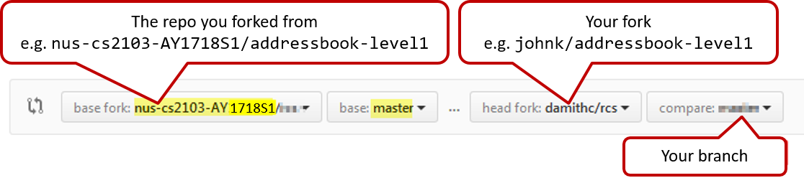

## Create a GitHub profile

Create a personal GitHub account. 
1. You are advised to choose a sensible GitHub username as you are likely to use it for years to come in professional contexts. 
2. Strongly recommended: Complete your GitHub profile. In particular,  
  * Specify your full name. 
  * Upload a suitable profile photo (i.e. a recent photo of your face). 

<Panel header="**Why am I being pushed to complete my GitHub profile?**" expandable>

The GitHub profile is useful for the tutors and classmates to identify you. If you are reluctant to share your info in your long-term GitHub account, you can remove those details after the module is over or create a separate GitHub account just for the module.

</Panel>

## Submitting Pull Requests for tutorials

1. Fork the repo to your personal GitHub account, if you haven't done so already.
2. Create a branch named after tutorial activity e.g. `T2A2`  
    ==Remember to switch to master branch before creating the new branch.==
3. Commit your changes to that branch. Push to your fork.
4. Create a Pull Request against the master branch of the repo  
    `https://github.com/**nus-cs2103-AY1718S1**/{repo_name}`  
    e.g. `https://github.com/nus-cs2103-AY1718S1/addressbook-level1`  
    ==(do not create PRs against the upstream repo at `se-edu` org)==   
      
    PR name should be: `[ACTIVITY_ID][TEAM_ID]Your Name`  
    e.g. If you are in team 1 of tutorial W09 (i.e. Wednesday 9am), `[T3A2][W09-A1]James Yong`  
    Note that our tutorial IDs are different from those shown in CORS/IVLE. Refer to the 'Tutorial Schedule' in the 'Overview' section of the [Schedule Page](schedule.html).
5. Check the 'Files Changed' tab on GitHub to confirm the PR contains intended changes only.  
    
6. If the content of the PR is not as you expected, you can fix those problems in your local repo, commit, and push those new commits to the fork. The PR content will update automatically to match new commits. 
    Alternatively, you can close that PR and create a new one with the correct content.
7. ==If your PR adapted/referred code from elsewhere== (e.g. a stackoverflow post or a classmate's PR -- which is allowed, even encouraged), acknowledge the source in your PR description text. 
    e.g. `Some code adapted from #2431 (I followed the same technique for parsing user command)`
8. If the PR is not ready for review yet, add a comment `Work in progress`. When the PR is ready for review later, add a comment `Ready for review`  
    If there is no comment, we assume the PR is ready for review.

## Organization setup

The instructions below are for setting up a GitHub organization for your team, which you should do at the start of Phase B.

You can create your GitHub account after receiving your phase B team ID. Here are the instructions (==please follow the organization/repo name format closely because we use scripts to download your code. If the names are not as expected, our scripts will not work==):

* One team member (e.g. team leader) should create an organization with the following details:
* ==Organization name : `CS2103AUG2017-TEAM_ID`==. e.g.  `CS2103AUG2017-W09-B3`
* Plan:  Open Source ($0/month) 
* After that, the same person can add members to the organization:
* Create a team called `developers` to your organization and give that team write permission.
* Add your team members to the developers team.

## Repo setup

Only one team member:

1. Fork [Address Book Level 4](https://github.com/nus-cs2103-AY1718S1/addressbook-level4) to your team org.
1. Rename the forked repo as `main`. This repo is to be used as the repo for your project.
1. Ensure your team members have the desired level of access to your team repo

All team members:

1. Fork the `main` repo (created above) to your personal GitHub account. 
1. Clone the fork to your Computer.
1. Set it up as an Intellij project (follow the instructions in the Developer Guide carefully).

Note that some of our download scripts depend on the following folder paths. Please do not alter those paths in your project. 
`/src/main`  
`/src/test`  
`/docs`

## Issue tracker setup

When you create a repo, you get an issue tracker for that repo automatically. Configure it as follows:

* Delete existing labels and add the following labels.
  * `type.epic` : A big feature which can be broken down into smaller stories e.g. search
  * `type.story` : A user story
  * `type.enhancement`: An enhancement to an existing story
  * `type.task` : Something that needs to be done, but not a story, bug, or an epic. e.g. Move testing code into a new folder)
  * `type.bug` : A bug
  * `status.ongoing` : The issue is currently being worked on. note: remove this label before closing an issue.
  * `priority.high` : Must do
  * `priority.medium` : Nice to have
  * `priority.low` : Unlikely to do  

* Create following milestones

* `v1.0`, `v1.1`, `v1.2`, `v1.3`, `v1.4`, `v1.5rc`, `v1.5`

* You may configure other project settings as you wish. e.g. more labels, more milestones

## Project Schedule Tracking

In general, use the issue tracker (Milestones, Issues, PRs, Tags, Releases, and Labels) for assigning, scheduling, and tracking _all_ noteworthy project tasks, including user stories. Update the issue tracker regularly to reflect the current status of the project. You can also use GitHub's new [Projects feature](https://www.youtube.com/watch?v=C6MGKHkNtxU) to manage the project, but keep it linked to the issue tracker as much as you can.

### Using Issues:

* Record each of the user stories you plan to deliver as an issue in the issue tracker. 
    e.g. `Title: As a user I can add a deadline`  
    `Description: ... so that I can keep track of my deadlines`
* Assign the `type.*` and `priority.*` labels to those issues.
* When you start implementing a story, break it down to tasks. Define reasonable sized, standalone tasks. A task should be able to done by one person, in a few hours. e.g.   
  Good: Update class diagram in the project manual for v1.5  
  Bad (reasons: not a one-person task, not small enough): Write the project manual
* Write a descriptive title for the issue.   
  e.g. Add support for the 'undo' command to the parser.
* There is no need to break things into VERY small tasks. Keep them as big as possible, but they should be no bigger than what you are going to assign a single person to do within a week. So the user story `Implementing parser `  is too big because it cannot be done by a single person in a week. However,`Implementing parser support for adding of floating tasks` is of appropriate size.
* Do not track things taken for granted. e.g., 'push code to repo' should not be a task to track. In the example given under the previous point, it is taken for granted that the owner will also (a) test the code and (b) push to the repo when it is ready. Those two need not be tracked as separate tasks.
* Omit unnecessary details. In some cases, the summary/title is enough to describe the task. In that case, no need to repeat it in the description. There is no need for well-crafted and detailed descriptions for tasks. A minimal description is enough. 
  Similarly, labels such as 'priority' can be omitted if you think they don't help you.
* Assign tasks to team members using the 'owner' field. At any point, there should be some ongoing tasks and some pending tasks against each team member.
* Use status labels to indicate which tasks are completed, which are ongoing, and which are to be done by next milestone.

### Using Milestones:

* Use milestones to indicate which issues are to be handled for which milestone by assigning issues to suitable milestones.
* Set the deadlines for milestones (in GitHub). Your internal milestones can be set earlier than the deadlines we have set, to give you a buffer.
* Note that you can change the milestone plan along the way as necessary.
* IMPORTANT: To consider the milestone as 'reached', ==you should have the following done *before* the tutorial begins. 'Missed milestones' will count against the 'project management' component of your final grade==:
  * A working product tagged with the correct tag (e.g. v1.2) and pushed to the main repo.
  * All tests passing on Travis.
  * Milestone updated to match the product.
  * Milestone closed. All issues assigned to that milestone should be closed too.
  * Doing a 'release' on GitHub is optional for v1.1 and v1.2 but compulsory from v1.3.

## Workflow

We recommend using the _Forking Workflow_.

<dynamic-panel src="../book/gitAndGithub/forkingWorkflow/embed.md" header="%%Textbook &raquo;%%Git and GitHub: Forking Workflow" />

