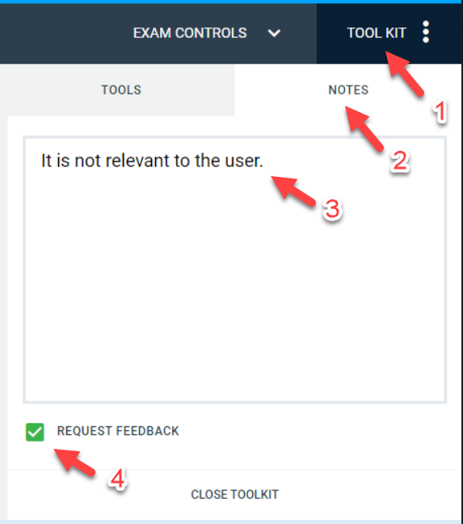

<panel type="danger" header="**Answering follow-up questions:**" minimized>

1. Click on `TOOL KIT`.
2. Click on the `NOTES` tab, if it is not selected already.
3. Type in your answer in the text box.
4. ==Tick the `REQUEST FEEDBACK` checkbox.== If you don't, the note will not be saved!!!

</panel>

