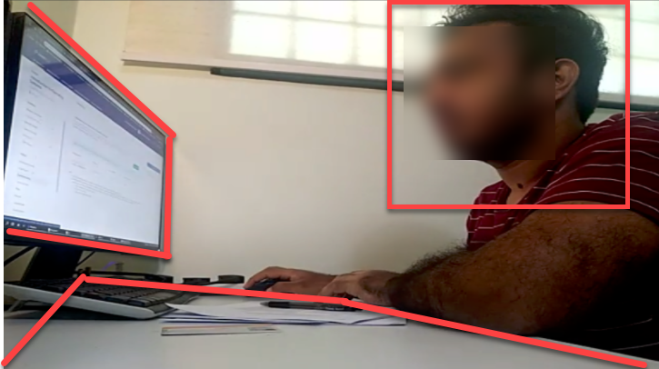





There is no midterm exam. Information about the final exam is given below.


<box type="important">

Instructions below are from the previous semester. Will be updated closer to the exam.
</box>


* The final exam will be as per the normal exam schedule, and will count for {{ marks_exam }}% of the final grade.

* The exam is open-book.
* We will use Examplify for the final exam this time.
* Examplify is set to block internet access during the exam.
* However, you are allowed to refer to the PDF version of the textbook and your own notes on your laptop.
* Permitted materials:  
  PDF of the module textbook, lecture slides (allowed format: PPT/PDF), self-created notes (please convert everything to PDF).   
  A printed copy of the module textbook, hand-written notes.  
  No other device other than the laptop you are using to take the exam is allowed; however, NUS-approved calculators are allowed.

## Exam structure

The exam duration is 90 minutes.

The final exam has two types of questions:
1. MCQ questions - includes True/False like concept questions and some multiple choice/response questions
2. Short-answer questions

 

* All questions will be displayed at once as Examplify doesn't allow creating sections
* Based on the question you are answering, you need to manage your time appropriately
* Weightage of the questions will be displayed to help you with time management

## Exam briefing, mock exam, practice exam paper

* There will be an exam briefing in the penultimate lecture that covers Examplify usage.
* You will be given a practice exam paper (smaller than the full paper) to help you practice timing. That practice paper will be released at least one week before the exam.

* The exam will be done online.
* ==**We will be following the [SoC's E-Exam SOP](https://mysoc.nus.edu.sg/academic/e-exam-sop-for-students/)**==, combined with the deviations/refinements given in the section below. Please read the SOP carefully and ensure you follow all instructions.

## SOP deviations/refinements

1. **Tools: LumiNUS, Zoom, Microsoft Teams (MST), PDF scanner**, PDF reader.
1. **The webcam view should capture all four** of these: your face (side view, ==no mask==), your hands, the working area of the table, and the entire screen area of your active screen. Here is an example: 
  
1. ==**Recording of your PC screen** is not required.==
1. **Only one computer screen** allowed. If you have multiple screens, switch off except one. It is better if you can physically remove unused screens if possible %%e.g., do not keep a switched off tablet on the table%%. 
  You may split the screen though i.e., show module website in one half and the quiz in the other half.
1. **You may not use a second laptop/computer as the web cam.** Use either an external webcam or a mobile phone instead. %%Reason: the screen of that second computer will not be captured in the video feed.%%
1. **Not allowed to use the printer or other devices during the exam.**
1. **You may use headphones during the exam.**
1. **Soft copies of notes: only PDF format is allowed.** Other formats (e.g., MS Word, .txt, html) are not allowed. No limitation on what the PDF file contains or the number of PDF files to be used. 
  You may use any hard copies or written materials too.
1. **The Browser should only be used to access LumiNUS and the module website.** ==Accessing other websites is not allowed==. 
  Do not use the browser to view PDFs. %%Reason: viewing PDF files in the browser makes it harder for invigilators to detect students accessing unauthorized websites.%%
1. **Use Zoom private messages to communicate with the invigilator. Use Microsoft Teams to communicate with the prof.** Communicating with others is not allowed, except with NUS IT staff (for tech help).
1. **The quiz will not appear on LumiNUS until a few minutes before we release the password**. Wait until we announce that the quiz is available to see.
1. **When the invigilator asks you to do an _identity check_**, turn your face towards the camera (do not adjust the camera position), move closer to the camera, and hold the pose until the invigilator tells you to go back to your working position.

1. **If you have a doubt/query about a question**, or want to make an assumption about a question, please write it down in the 'justification' text box. ==Do not try to communicate those with the invigilator during the exam.== We'll take your doubt/query/assumption into account when grading. For example, if many had queries about a specific question, we can conclude that the question is unclear and omit it from grading.

1. **If you encounter a serious problem** that prevents you from proceeding with the exam (e.g., the password to open the quiz doesn't work), PM the invigilator using MS Teams (failing that, use Zoom chat).

1. **If your computer crashed/restarted** during the exam, try to get it up again and resume the exam. LumiNUS will allow you to resume from where you stopped earlier. However, note that there is a deadline to finish the quiz and you will overrun that deadline if you lose more than 5 minutes due to the computer outage.

1. **The zoom link and the invigilator info** will be distributed via LumiNUS gradebook at least 24 hours before the exam.

## Format

* The exam will be divided into {{ 3 if cs2103 else 2 }} parts.

### Final exam - part 1

* A LumiNUS quiz containing 16 MCQ questions. All questions are estimated to be equal size/difficulty.
* You only need to answer 15 questions correctly to get full marks. The extra question is there to cushion you against careless mistakes or misinterpreting a question.
* Questions will appear in random order.
* You will not be able to go back to previous questions. 
  %%Reasons: 
  1\. to minimize opportunities for collusion 
  2\. not unreasonable for the materials tested and the proficiency level expected -- i.e., when using this knowledge in a real life SE project discussion, it will be rare for you to go back to revise what you said earlier in the discussion%%
* Duration: **{{ 45 if tic2002 else 35 }} minutes** (recommended: allocate 2 minutes per question, which gives you a 3 minutes buffer)
* You are required to give a justification for your answer. ==The question will specify what should be included in the justification. **Answers without the correct justification may not earn full marks.**== However, we'll give full marks up to two correct answers (per 16 questions) with missing/incorrect justifications %%(to cater for cases where you accidentally proceeded to the next question before adding the justification)%%.
* Here is an example question. The answer is `a` and the justification can be `OOP is only one of the choices for an SE project`.

<panel haader="A sample question" expanded >

Choose the incorrect statement.

[Justification: why is it incorrect?]
- ( ) a. Software engineering projects always use OOP.
- ( ) b. Some software engineering projects can be large and complex.
- ( ) c. Some software engineering projects can go on for many years.
- ( ) d. Software projects can involve people who are not software engineers.

</panel>

* {{ icon_tip }} Almost all questions will ask you to choose the INCORRECT statement and justify why it is incorrect.

* There will be a 5-minutes toilet break after this part

### Final exam - part 2

* You will be asked to draw some UML diagrams, **to be hand-drawn on paper** (not on a tablet). You may use pencils if you wish.
* Duration: 20 minutes
* The questions will be in an encrypted PDF file that will be given to you in advance. The password will only be given at the start of this section.
* At the _end_ of the exam (i.e., after all three parts are over), you will upload a scanned copy to LumiNUS. Do not do any scanning/uploading at this time.
* These diagrams will not be graded directly. Instead, you will use them when answering part 3 of the exam. 
  However, we may use the diagrams to give _some_ consolation marks should you score very low in the corresponding MCQ questions.

### Final exam - part {{ 3 if cs2103 else 2 }}

* Similar to part 1 (e.g., 16 questions, same length).
* Some questions will refer to the UML diagrams that you drew in part 2.
* You _may_ modify your UML diagrams during this time. %%Reminder: diagrams are not graded.%%
* You may refer the PDF file used in part 2 during this part too.
* **Show the diagram to the camera** at the end of this part, when the examiner asks you to.
* Due to the above point, you will have to stay back in Zoom until the full exam is over (==not allowed to leave early==).
* Due to the above point, you may want to have something to read, in case you finish early. ==You are not allowed to use other devices or use the computer to do other things even if you have finished the exam==.
* After the exam, scan and **upload the diagrams you drew in part 2 onto LumiNUS**, as a single PDF file, **within an hour**. The file name does not matter. 

## Exam briefing, mock exam, practice exam paper

* There will be an exam briefing in the penultimate lecture. It will include a minimal mock exam, just to help you understand the structure.
* You will be given a practice exam paper (at least half the size of the full paper) to help you practice timing. That practice paper will be released at least one week before the exam.


