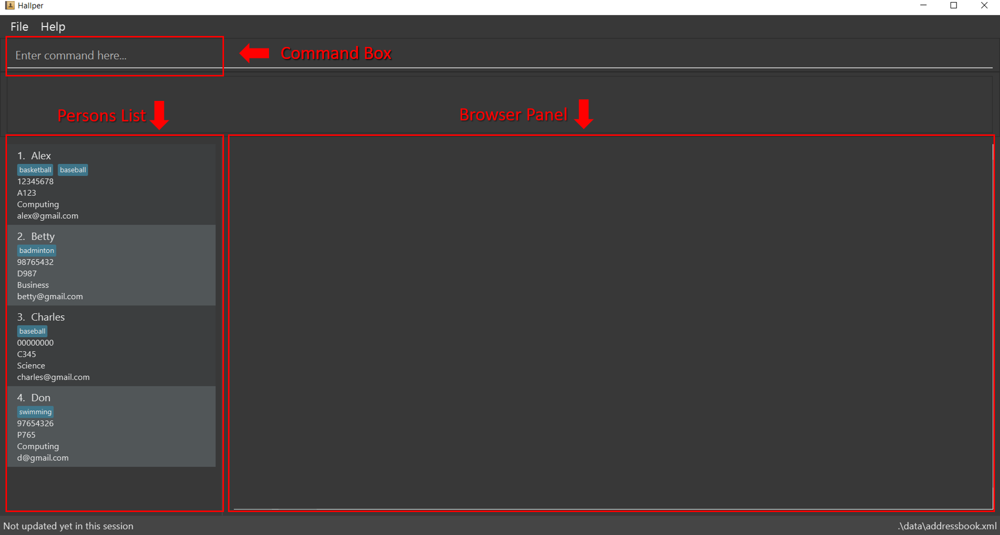
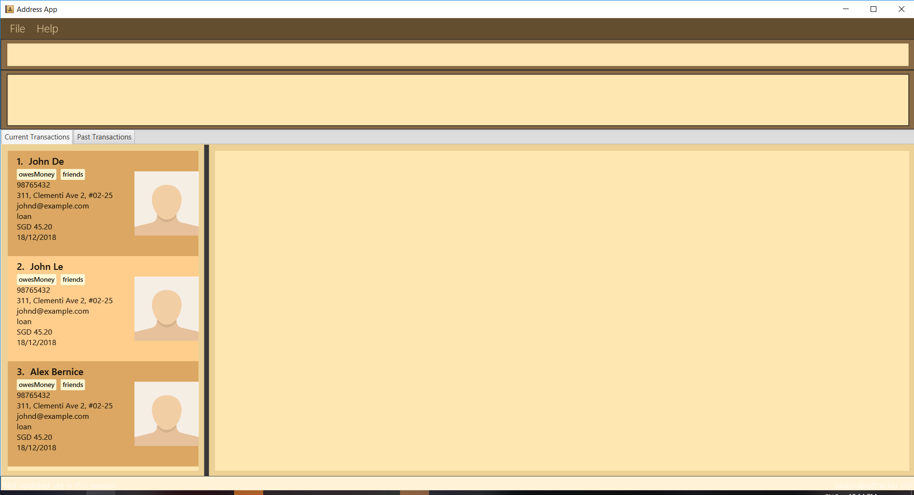
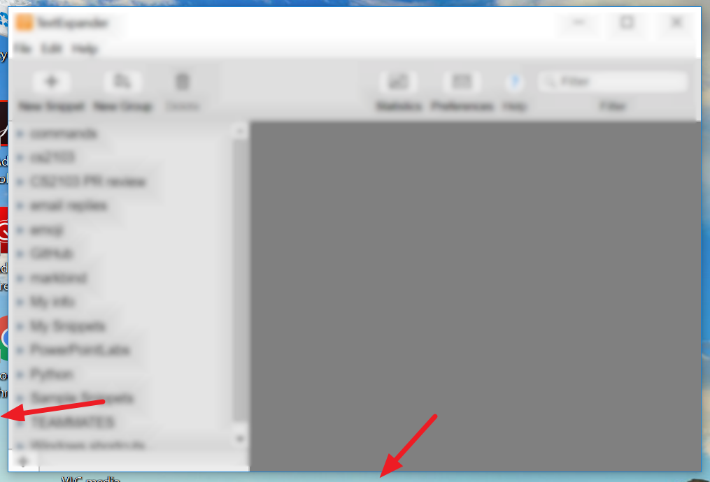
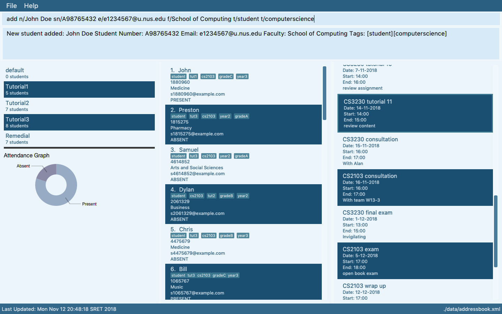
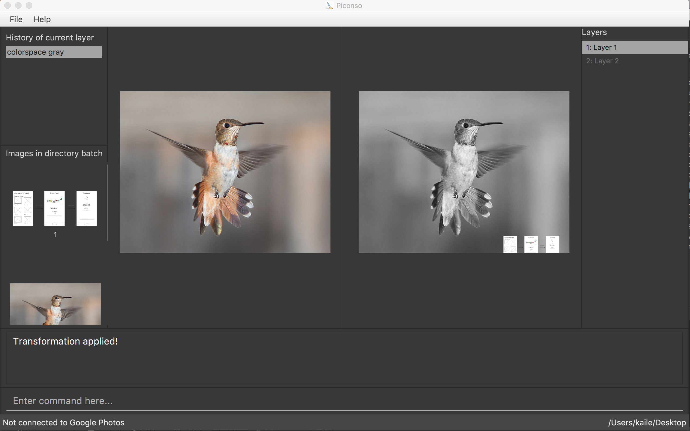

* **Should match the submitted deliverables** e.g., the UG on the website should match the submitted PDF file.

#### Website README
  * ==Ensure the `Ui.png` matches the current product==

<box>

{{ icon_tip }} **Some common sense tips for a good product screenshot**

`Ui.png` represents your product in its full glory.
* Before taking the screenshot, populate the product with data that makes the product look good. For example,
* If the product is supposed to show photos, use real photos instead of dummy placeholders.
* If the product doesn't have nice line wrapping for long inputs/outputs, don't use such inputs/outputs for the screenshot.
* It should show a state in which the product is well-populated %%i.e., don't leave data panels largely blank%%
* Choose a state that showcase the main features of the product %%i.e., the login screen is not usually a good choice%%
* Take a clean screenshot with a decent resolution. Some screenshot tools can capture a specified window only. If your tool cannot do that, make sure you crop away the extraneous parts captured by the screenshot.
* Avoid annotations (arrows, callouts, explanatory text etc.); it should look like the product is in use for real.

<panel type="seamless" header="Examples" expanded >

<tabs>
  <tab header=":-1: Not Good">

Reason: Distracting annotations.

</tab>
  <tab header=":-1: Not Good">

Reason: Not enough data.

</tab>
  <tab header=":-1: Not Good">

Reason: screenshot not cropped cleanly (contains extra background details)

</tab>
<tab header=":+1: Good">

</tab>
  <tab header=":+1: Good">

</tab>
</tabs>

</panel>

</box>

#### Website AboutUs Page

* **Use a suitable profile photo.**

The purpose of the profile photo is for the teaching team to identify you. Therefore, choose a recent individual photo showing your face clearly (i.e., not too small) -- somewhat similar to a passport photo. Some examples can be seen in the 'Teaching team' page. Given below are some examples of good and bad profile photos. 

If you are uncomfortable posting your photo due to security reasons, you can post a lower resolution image so that it is hard for someone to misuse that image for fraudulent purposes. If you are concerned about privacy, you may use [a placeholder image](https://en.wikipedia.org/wiki/File:Portrait_placeholder.png) in place of the photo in module-related documents that are publicly visible.

* **Include a link to each person's PPP page.**
* **Team member names match full names used by LumiNUS.**
