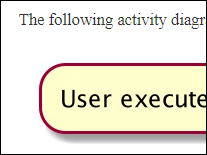







1. {{ icon_individual }} Start on the full version of the new features
1. {{ icon_individual }} Update DG with design details {{ timing_badge("IMPORTANT!") }}
1. {{ icon_team }}  Do a release
1. {{ icon_individual }} Make code RepoSense-compatible


#### {{ thumb(1) }} {{ icon_individual }} Start on the full version of the new features

* Start on implementing the full version of your new feature(s). Aim to finish it in v1.3 (v1.4 can serve as a buffer). As before, you can divide the work into even smaller increments %%e.g., aim to deliver a v1.2.1 at the end of this week%%.
* **Maintain the defensiveness of the code**: Remember to use assertions, exceptions, and logging in your code, as well as other defensive programming measures when appropriate. 
  {{ icon_important_big_red }} Remember to enable assertions in your IDEA run configurations and gradle file.
* Continue to do deliberate project management using GitHub issue tracker, milestones, labels, etc. as you did in v1.2.
* {{ icon_tip }} We recommend that **each PR also updates the relevant parts of documents and tests**. That way, your documentation/testing work will not pile up towards the end.
* {{ icon_tip }} There is [a way to get GitHub to auto-close the relevant issue when a PR is merged](https://help.github.com/articles/closing-issues-using-keywords/) ([example](https://github.com/se-edu/addressbook-level4/pull/888)).

#### {{ thumb(2) }} {{ icon_individual }} Update DG with design details {{ timing_badge("IMPORTANT!", "secondary") }}

<box>

{{ icon_important_big_red }} Do a sincere job on this task because this is your only chance to get feedback on the DG before it is graded at v1.4.
</box>

* **Update the Developer Guide** as follows:
  * ==Each member should describe the implementation of at least one enhancement she has added== (or planning to add).  
    Expected length: 1+ page per person
  * The description can contain things such as,
    * How the feature is implemented (or is going to be implemented).
    * Why it is implemented that way.
    * Alternatives considered.
  * **Diagramming tools**: AB3 uses PlantUML (see [instructions]({{ ab3_website }}/UsingPlantUml.html)) for diagrams. but you may use any other tool (e.g., PowerPoint). If you do, choose a tool that allows incremental updates to diagrams %%(reason: because diagrams need to be updated multiple times as the product evolves)%%. For example, if you use PowerPoint to draw diagrams, also commit the source PowerPoint files so that they can be reused when updating diagrams in future.

<panel type="success" expanded>

##### {{ icon_tip }} DG Tips

* **Aim to showcase your documentation skills.** The stated objective of the DG is to explain the implementation to a future developer, but a secondary objective is to show evidence that you can document deeply-technical content using prose, examples, diagrams, code snippets, etc. appropriately. To that end, you may also describe features that you plan to implement in the future, even beyond v1.4 (hypothetically). 
  For an example, see [the description of the undo/redo feature implementation in the AddressBook-Level3 developer guide]({{ ab3_website }}/DeveloperGuide.html#proposed-undo-redo-feature).
* **Use multiple UML diagram types.** Following from the point above, try to include UML diagrams of multiple types to showcase your ability to use different UML diagrams.
* **Keep diagrams simple.** The aim is to make diagrams ==_comprehensible_, not necessarily _comprehensive_==. Ways to simplify diagrams:
  * **Omit less important details**. Examples:
    * a class diagram can omit minor utility classes, private/unimportant members; some less-important associations can be shown as attributes instead.
    * a sequence diagram can omit less important interactions, self-calls. 
  * **Omit repetitive details** e.g., a class diagram can show only a few representative ones in place of many similar classes (note how the <trigger trigger="click" for="modal:ipWeek10-logicClassDiagram">AB3 Logic class diagram</trigger> shows concrete `*Command` classes).
  * **Limit the scope of a diagram.** Decide the purpose of the diagram (i.e., what does it help to explain?) and omit details not related to it. In particular, avoid showing lower-level details of multiple components in the same diagram unless strictly necessary e.g., note how the <trigger trigger="click" for="modal:ipWeek10-deleteSd">this sequence diagram</trigger> shows only the detailed interactions within the Logic component i.e., does not show detailed interactions within the model component.
  * **Break diagrams into smaller fragments** when possible.
    * If a component has a lot of classes, consider further dividing into sub-components (e.g., a Parser sub-component inside the Logic component). After that, sub-components can be shown as black-boxes in the main diagram and their details can be shown as separate diagrams.
    * You can use `ref` frames to break sequence diagrams to multiple diagrams. Similarly, `rake`s can be used to divide activity diagrams.
  * **Stay at the highest level of abstraction** possible e.g., note how <trigger trigger="click" for="modal:ipWeek10-archiSd">this sequence diagram</trigger> shows only the interactions between architectural components, abstracting away the interactions that happen inside each component.
  * For some more examples, see <trigger trigger="click" for="modal:ipWeek10-umlExamples">here</trigger>.
* **Integrate diagrams into the description.** Place the diagram close it where it is being described.
* **Use code snippets sparingly.** The more you use code snippets in the DG, and longer the code snippet, the higher the risk of it getting outdated quickly. Instead, use code snippets only when necessary and cite only the strictly relevant parts only.
* **Resize diagrams** so that the text size in the diagram matches the the text size of the main text of the diagram. See <trigger trigger="click" for="modal:ipWeek10-diagramSizeNegative">example</trigger>.

<modal large title="UML Diagrams: Negative Examples " id="modal:ipWeek10-umlExamples">

  These class diagrams seem to have lot of member details, which can get outdated pretty quickly: 
   
  

  

  This class diagram seems to have too many classes:
  

  

  These sequence diagrams are bordering on 'too complicated':
  
  

  

</modal>

<modal large title="Diagram resizing: a negative example" id="modal:ipWeek10-diagramSizeNegative">

In this negative example, the text size in the diagram is much bigger than the text size used by the document:  
 
It will look more 'polished' if the two text sizes match.
</modal>

<modal large title="AB3 - Class Diagram of the Logic Component" id="modal:ipWeek10-logicClassDiagram">
  
</modal>

<modal large title="AB3 - Sequence Diagram for the `delete` command" id="modal:ipWeek10-deleteSd">
  
</modal>

<modal large title="AB3 - Architecture-Level Sequence Diagram" id="modal:ipWeek10-archiSd">
  
</modal>

</panel>

#### {{ thumb(3) }} {{ icon_team }} Do a release

* {{ icon_important_big_red }} **Do a <tooltip content="resulting in a jar file on GitHub that can be downloaded by potential users">proper product release</tooltip>** [as described in the Developer Guide]({{ ab3_website }}/DevOps.html#making-a-release). You can name it something like `v1.2.1`. ==Ensure that the jar file works as expected== by doing some manual testing. %%Reason: You are _required_ to do a proper product release for v1.3. Doing a trial at this point will help you iron out any problems in advance. It may take additional effort to get the jar working especially if you use third party libraries or additional assets such as images.%%

#### {{ thumb(4) }} {{ icon_individual }} Make code RepoSense-compatible

* **Ensure your code is <tooltip content="i.e., RepoSense can detect your code as yours">RepoSense-compatible</tooltip>** and the **code it attributes to you is indeed the code written by you**, as explained below:

{{ embed_topic("tools.md#reposense", "Admin " + icon_embedding + " Tools → RepoSense", "midv13_repoSenseCompatibility", "1") }}




{{ show_admin_page("project-w10-mid-v13", show_main_text) }}