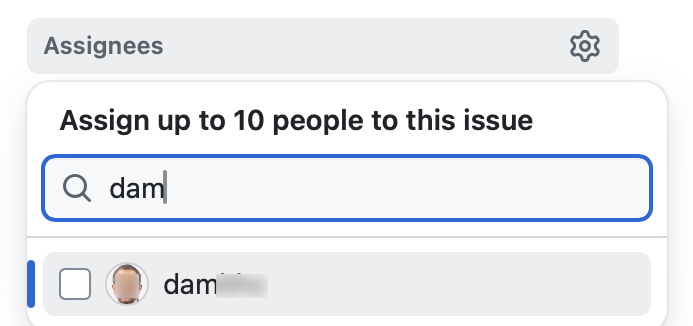
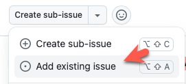



#### <span class="badge bg-success">PE</span> <span class="text-success">Overview</span>

<div id="pe-overview">

* **PE is not entirely a pleasant experience, but is an essential component** that aims to increase the quality of the tP work, and the rigor of tP grading.
<div class="indented-level1">
<panel header="more details on the motivation and objectives..." minimized>

* **The upfront objective of the PE is to increase the rigor of project grading.** Assessing most aspects of the project involves an element of subjectivity. As the project counts for a large percentage of the final grade, it is not prudent to rely on evaluations of tutors alone as there can be significant variations between how different tutors assess projects. That is why we collect more data points via the PE to minimize the chance of your project being affected by evaluator-bias.
* **PE also evaluates your testing skills**, done as the following two-parts:
  1. **You will be given a chance to find bugs in a different software.** Furthermore, you will be given an opportunity to ~~defend your bug reports against any possible objections~~ interact with the developers (anonymously) to refine the bug report further %%e.g., correct the severity level if the level you chose initially was incorrect%%. If you report possible bugs that turn out to be actual bugs, you earn marks (provided the product actually had bugs in the first place).
  2. **Your product will be subjected to a rigorous testing** and you will be given a chance to point out any inaccuracies in the bugs reported. You will lose marks for any bugs that turned out to be real bugs, but only if your work has more bugs than a certain bar.
* **The above two can lead to high-rigor, <tooltip content="based on how well you achieve the objectives of testing, as opposed to indirect measures such as number of test cases">_outcome-based_</tooltip> evaluation of your testing skills**. The alternative is to rely solely on other easy-to-measure metrics %%(e.g., the number of test cases, test coverage, test LoC etc.)%% which we don't think as good representations of your actual testing skills.
**The _ultimate_ objective of the PE is not even the higher rigor of grading.** Because of the PE, you will realize that any bugs are very likely to be detected, which means you will work extra hard to avoid bugs; and THAT is the real benefit. Ultimately, <span class="text-success">**what we want is for you to internalize a higher standard for testing and a lower tolerance for bugs in your own code**</span> -- something that can have a longer-lasting impact on your future careers, beyond the mere course grade.
* **Problem: There is no way we can carry out the above-mentioned** two-part evaluation at a high-level of rigor if using tutors as testers, or using an automated testing script. %%e.g., some tutors might not have the motivation to try hard enough to find bugs, and it will be hard to find tutors willing to spend many hours testing products so near to their own exams.%%<br>
  **Solution: Get the two parts of the evaluation to feed each other** by getting student to test each other's products.
* **The fact that you are testing products created by your classmates and objecting to bugs reported by your classmates can make this a rather 'unpleasant' experience**. You might feel like _being pitted against each other_, or as if _you are forced to bring down each other_. But as you read above, it is a necessary evil for this evaluation to be even possible. Given the actual goal is to get you to create products with very few bugs, we think switching off the 'collaborative learning' mode for just a few days is a price worth paying to achieve that goal. After all, the PE is an evaluation activity (not a _learning activity_) and happens _after_ the regular learning period is over.
* **You are not taking marks from someone else** -- at least, don't think of it that way. The point of contention is 'is this really a bug?' which is independent of the people involved. Furthermore, the reward for detecting a bug and the penalty for having a bug in your code are calculated independently.
* **Still, _none of us_ likes it when others point out problems of our work**. Some of us don't even like pointing out problems of others' work. But ==we just have to learn not to take bug reports personally==. Another important intended outcome is to be able to report bugs in a way that doesn't feel like you are _attacking_ or trying to _sabotage_ the dev team.
* **PE also evaluates aspects other than testing** e.g., your product evaluation skills, effort estimation skills etc. When evaluating those aspects in particular, they are ==not graded solely based on peer ratings==. Rather, PE data are cross-validated with tutors' grades to identify cases that need further investigation. When peer inputs are used for grading, they are usually combined with tutors' grades with appropriate weight for each. In some cases ratings from team members are given a higher weight compared to ratings from other peers, if that is appropriate.
</panel><p/>
</div>

* **The PE is divided into four phases, and is of the form 'take home assignment'**:
  * ****Phase 1: Bug Reporting****{.text-success}: <span id="pe-p1-desc">In this phase, you will test the allocated product and report bugs, similar to PE-D.<br>
    This phase is divided further into parts I, II, and III.<br>
    the recommended order and the recommended duration of each part is given below. you will be given about **24 hours (friday 12 noon to saturday 12 noon) to finish this phase**.<br>
    **We recommend that you do during the lecture slot, or earlier** (reason: support from the teaching team will be available only during that time).</span>
    * <span class="badge bg-success">Phase 1 - part I</span> **Product Testing** [60 minutes] -- to focus on reporting bugs in the product (but can report documentation bugs too)
    * <span class="badge bg-success">Phase 1 - part II</span> **Evaluating Documents** [30 minutes] -- to focus on reporting bugs in the UG and DG (but can report product bugs too)
    * <span class="badge bg-success">Phase 1 - part III</span> **Overall Evaluation** [15 minutes] -- to give overall evaluation of the product, documentation, effort, etc.
    * <span class="badge bg-success">Phase 1 - part IV</span> **Bug trimming** [15 minutes] -- to choose upto {{ tp_pe_bug_count }} bugs that you wish to send to the dev team.

  * ****Phase 2: Developer Response****{.text-success}: <span id="pe-p2-desc">This phase is for you to respond to the bug reports you received. Done during Sunday - Tuesday period after PE </span>
  * ****Phase 3: Tester Response****{.text-success}: <span id="pe-p3-desc">In this phase you will receive the dev teams response to the bugs you reported, and will give your own counter response (if needed). Done during Wednesday - Friday period after the PE.</span>
  * ****Phase 4: Tutor Moderation****{.text-secondary}: <span id="pe-p4-desc">In this phase tutors will look through all dev responses you objected to in the previous phase and decide on a final outcome. Students are not usually involved in this phase.</span><br><br>

{{ show_faq('peTooLong', is_compact=1) }}
{{ show_faq('peOtherCommitments') }}

* **Grading**:
  * Your performance in the practical exam will affect your final grade and your peers', as explained in [_Admin: Project Grading_]({{ baseUrl }}/admin/tp-grading.html) section.
  * As such, we have put in measures to identify and ==penalize insincere/random evaluations==.
  * Also see:

{{ embed_topic("tp-grading-bugs-fragment.md#bugCalculationNotes", "Admin " + icon_embedding + " tP Grading → Notes on how marks are calculated for PE", "3", indent="2") }}

</div>

------------------------------------------------------------------------------------ {.thick-2 .border-success}

<div id="pe-preparation">

#### <span class="badge bg-success">PE</span> <span class="text-success">Preparation, Restrictions</span>

<div id="pe-mode-info">

* **Mode: individual, take-home assignment.** You may do this from anywhere, but you should do it on your own.
</div>

* **When**: ==Fri 1200 to Sat 1200 of week {{ pe_week }}== ({{ get_date(date_w13_start if pe_week == "13" else date_w12_start, 4, format=format_normal, time="") | trim }} noon to {{ get_date(date_w13_start if pe_week == "13" else date_w12_start, 5, format=format_normal, time="") | trim }} noon).

* Bug reporting will be done mostly similar to PE-D. See the panel below to learn how:
<div class="indented-level1">

<panel type="primary" header="PE Preparation" expanded>

<include src="tp-testing-fragment.md#testingPreparations" var-pe_session="pe" var-pe_session_name="PE" var-pe_active_tab="1"/>
</panel>
</div>
<p/>

* **Bugs reported during the PE should be the result of your own testing**. <span class="text-danger">Reporting bugs found by others as your own will be reported as a case of academic dishonesty</span> (severity is similar to cheating during the final exam).
* **While the PE is primarily a manual testing session, you may use automated tools** or scripts to flush out bugs as well, including AI tools.

{{ show_faq('peMorePowerfulTools') }}

* **Recommended to read the guidelines the dev team will follow when responding to your bug reports later**, given in the panel below. This will help decide what kind of bugs to report.
<div class="indented-level1">
<panel type="info" header="Guidelines for the dev team to follow when triaging PE bugs" peek>

<include src="tp-pe-bug-triaging-guidelines-fragment.md"/>
</panel>
</div>
<p/>

* **Download the PE files to test**, as given below:

{{ embed_topic(baseUrl+"/admin/tp-testing-fragment.md#zip-download-unzip-info",  icon_embedding + " Downloading and unzipping JAR/PDF files you will test in the PE", indent=1, status='expanded') }}

</div>

------------------------------------------------------------------------------------ {.thick-2 .border-success}

<div id="pe-phases">

#### <span class="badge bg-success">PE</span> <span class="text-success">Phase 1: Bug Reporting</span>

<include src="tp-pe-fragment.md#pe-p1-desc" inline /><p/>

-------------------------------------------------------------------------{.border-success}

#### <span class="badge bg-success">&rarr; PE Phase 1 - Part I</span> <span class="text-success">Product Testing [~60 minutes]</span>

**Test the product and report bugs** as described below. You may report both product bugs and documentation bugs during this period.

<include src="tp-ped-fragment.md#tp-pe-testing-instructions" var-pe_session="pe" var-pe_session_name="PE" var-pe_active_tab="1"/>


* =={{ icon_tip }} **When in doubt, choose the lower severity:**== If the severity of a bug seems to be smack in the _middle_ of two severity levels, choose the lower severity (unless much closer to the higher one than the lower one).
  * Reason: The teaching team follow the same policy when adjudicating disputed severity levels in the last phase of the PE.
  * As the tester, you might feel like you are throwing away marks by choosing a lower priority; but the lower priority has a lower risk of being disputed by the dev team, giving you (and the dev team) a better chance of earning bonus marks for accuracy.

{{ show_faq("tpTestingLessBuggyProducts", is_compact="1") }}
{{ show_faq("tpNoBugsInTestedProduct", is_compact="1") }}
{{ show_faq("tpNeedToFindAllBugs") }}

-------------------------------------------------------------------------{.border-success}

#### <span class="badge bg-success">&rarr; PE Phase 1 - Part II</span> <span class="text-success">Evaluating Documents [~30 minutes]</span>

* **Use this slot mainly to report documentation bugs** (but you may report product bugs too). You may report bugs related to the UG and the DG.<br>
  Only the content of the UG/DG PDF files (not the online version) should be considered. Do not report bugs that are not contained within those two files (e.g., bugs in the `README.md`).
* **For each bug reported, cite evidence and justify.** For example, if you think the explanation of a feature is too brief, explain what information is missing and why the omission hinders the reader.<br>


{{ embed_topic("tp-grading-bugs-fragment.md#ugBugs", "Admin " + icon_embedding + " tP Grading → **Possible UG Bugs**", "3", indent="1") }}
{{ embed_topic("tp-grading-bugs-fragment.md#dgBugs", "Admin " + icon_embedding + " tP Grading → **Possible DG Bugs**", "3", indent="1") }}
<p/>

* **You _may_ report grammar issues** as bugs but note that minor grammar issues that don't hinder the reader are allowed to be categorized as `response.NotInScope` (by the receiving team) -- such bugs earn only small amount or credit for the tester (hence, do not waste time reporting too many minor grammar errors).


-------------------------------------------------------------------------{.border-success}

#### <span class="badge bg-success">&rarr; PE Phase 1 - Part III</span> <span class="text-success">Overall Evaluation [~15 minutes]</span>

* To be submitted via TEAMMATES. If you fail to submit this you will receive an <span class="text-danger">automatic penalty</span>.
* The TEAMMATES email containing the submission link should have reached you the day before the PE. If you didn't receive it by then, you can request it to be resent from [this page](https://teammatesv4.appspot.com/web/front/help/session-links-recovery).
* **If TEAMMATES submission page is slow/fails to load** (all of you accessing it at the same time is likely to overload the server), wait 3-5 minutes and try again. <span class="text-danger">Do not refresh the page repeatedly</span> as that will overload the server even more, and recovery can take even longer.

<div class="indented">
<panel header="##### Important questions included in the evaluation" peek>

<div id="projectGrading-featureFit-instructions">

{{ icon_green_Q }} **Quality of the product design,**<br>
Evaluate based on the User Guide and the actual product behavior.

 Criterion | Unable to judge | Low | Medium | High
-----------|-----------------|-----|--------|-----
`target user` | Not specified | | | Clearly specified and narrowed down appropriately
`value proposition`| Not specified | The value to target user is low. App is not worth using | Some small group of target users might find the app worth using | Most of the target users are likely to find the app worth using
`optimized for target user` | | Not enough focus for CLI users | Mostly CLI-based, but cumbersome to use most of the time | Feels like a fast typist can be more productive with the app, compared to an equivalent GUI app without a CLI
`feature-fit` | | Many of the features don't fit with others | Most features fit together but a few may be possible misfits | All features fit together to form a cohesive whole
</div>
<p/>
<div id="projectGrading-userGuide-instructions">

{{ icon_green_Q }} **Compared to AddressBook-Level3 (AB3), the overall quality of the UG you evaluated is,**<br>
Evaluate based on fit-for-purpose, from the perspective of a target user.
For reference, the AB3 UG is [here]({{ url_ab3_upstream_website }}/UserGuide.html).<br>

- ( )  Significantly lower
- ( )  Slightly lower
- ( )  Similar
- ( )  Higher

</div>
<p/>
<div id="projectGrading-devGuide-instructions">

{{ icon_green_Q }} **Compared to AB3, the overall quality of the DG you evaluated is,**<br>
Evaluate based on fit-for-purpose from the perspective of a new team member trying to understand the product's internal design by reading the DG.
For reference, the AB3 DG is [here]({{ url_ab3_upstream_website }}/DeveloperGuide.html).<br>

- ( )  Significantly lower
- ( )  Slightly lower
- ( )  Similar
- ( )  Higher

</div>
<p/>
<div id="projectGrading-effort-instructions">

<div tags="m--cs2103">

{{ icon_green_Q }} **If the implementation effort required to create AB3 from scratch is 10, the estimated implementation effort of this team is,** [`0`..`20`] e.g., if you give `5`, that means the team's effort is about 50% of that spent on creating AB3. We expect most typical teams to score near to `5`.
* Do read the DG appendix named `Effort`, if any.
* ==Consider implementation work only (i.e., exclude testing, documentation, project management etc.)==
* Do not give a high value just _to be nice_. ==Your responses will be used to evaluate your effort estimation skills.==
* Do ==not consider the team size== when deciding this rating. We'll factor in the team size later.
</div>
<div tags="m--cs2113">

{{ icon_green_Q }} **[For each member] The functional code contributed by the person is,**<br>
==Consider implementation work only (i.e., exclude testing, documentation, project management etc.)==<br>
The _typical iP_ refers to an iP where all the requirements are met at the minimal expectations given.<br>
Use the person's PPP and RepoSense page to evaluate the effort.

- ( )  Unable to judge
- ( )  Significantly less than a typical iP
- ( )  Slightly less than a typical iP
- ( )  At least as much as a typical iP
</div>

</div>

{{ icon_green_Q }} **[Optional] Concerns or any noteworthy observations about the product you evaluated**

<div tags="m--cs2103">

{{ icon_green_Q }} **Finally, what did you like about the product you tested?**
</div>

</panel>
<p/>
</div>

-------------------------------------------------------------------------{.border-success}

#### <span class="badge bg-success">&rarr; PE Phase 1 - Part IV</span> <span class="text-success">Trimming bugs</span>

**In this part testers choose ==upto {{ tp_pe_bug_count }} bugs== that they wish to send to the dev team.**

<box type="tip" seamless>

**Bonus marks for high accuracy rates!**{.text-success}

You will receive bonus marks if a high percentage (e.g., some bonus if >50%, a substantial bonus if >70%) of your bugs are _**accepted as reported**_ (i.e., the eventual ~~`type.*` and~~ `severity.*` of the bug matches the value you chose initially and the bug is either `response.Accepted` or `response.NotInScope`).
</box>

<div id="pe-questions-we-cannot-answer">
<box type="info" seamless>

**If you are not sure if something is a bug, or the correct severity ...**{.text-info}

If you are not sure if something is a bug, or the correct severity, you are welcome to post in the forum and discuss with peers. But given these decisions are part of PE deliverables, the teaching team will not be able to directly answer questions such as 'is this a bug?' or 'what's the correct severity for this bug?' -- but we can still pitch in by providing relevant information/guidelines.

The above **applies to this and all remaining PE phases**.
</box>
</div>

****Procedure:****

1. **Decide which bugs should be sent to the dev team**. You may select ==no more than {{ tp_pe_bug_count }}==.<br>
   **Of these bugs, ==the highest scoring 5 bugs will be used for your tP grading==.** %%We allow you to select up to {{ tp_pe_bug_count }} bugs (instead of 5), to reduce your decision-stress (i.e., it provides a safety margin against wrong choices).%%
   * **Choose based on,**<br>
     * **severity** -- %%because higher severity will earn higher marks.%% {{ bullet_tick_green }}
     * **confidence** level that it is indeed a bug %%-- if the bug is eventually rejected, it will not earn any marks.%%
     * **but not bug type** -- for this purpose, consider all bug types as equal. {{ bullet_x_red }}
1. **Close the remaining bug reports**.
   * What if I closed a bug that I intended to keep? You can reopen it.
   * What if I keep more than {{ tp_pe_bug_count }} bugs? In that case, we take the {{ tp_pe_bug_count }} bugs with the highest severity. When choosing between two bugs with same severity, we take the bug that was created earlier (i.e., the one with a lower issue number).

------------------------------------------------------------------------------------ {.thick-2 .border-success}

#### <span class="badge bg-success">PE</span> <span class="text-success">Phase 2: Developer Response</span>

<include src="tp-pe-fragment.md#pe-p2-desc" inline /><p/>

==**Deadline:** {{ get_date(date_w13_start if pe_week == "13" else date_w12_start, 8 if S == 2 else 8) }}==

<box type="important" >

****Yes, that can be better!**** For each bug report you receive, if you think a software engineer who takes pride in their own work would say "yes, that can be better!", accept it graciously, even if you can come up with _some_ BS argument to justify the current behavior. <br>
  Even when you still want to defend the current behavior, instead of pretending that the behavior was a deliberate choice to begin with, you can say something like,
  > "Thanks for raising this. Indeed, it didn't occur to us. But now that we have thought about it, we still feel ..."

**_Some_ bugs are 'expected'.** Given the short time you had for the tP and your inexperience in SE team projects, this work is not expected to be totally bug free. The grading scheme factors that in already -- i.e., your grade will not suffer if you accept a few bugs in this phase.
</box>

<box type="tip" seamless>

**Bonus marks for high accuracy rates!**{.text-success}

You will receive bonus marks if a high percentage (e.g., some bonus if >60% substantial bonus if >80%) of bugs are _**accepted as triaged**_ (i.e., the eventual ~~`type.*`,~~ `severity.*`, and `response.*` of the bug match the ones you chose).
</box>

<box type="important" seamless>

**It's not bargaining!**{.text-danger}

When the tester and the dev team cannot reach a consensus, the teaching team will select either the dev team position or the tester position as the final state of the bug, whichever appear to be closer to being reasonable. <span class="text-danger">The teaching team will not come up with our own position, or choose a middle ground.</span>

Hence, do not be tempted to argue for an unreasonable position in the hope that you'll receive something less than asked but still in your favor e.g., if the tester chose `severity.High` but you think it should be `severity.Medium`, don't argue for `severity.VeryLow` in the hope that the teaching team will decide a middle ground of `severity.Low` or `severity.Medium`. It's more likely that the teaching team will choose the tester's position as yours seems unreasonable.

More importantly, this is not a bargaining between two parties; it's **an attempt to determine the true nature of the bug, and your ability to do so (which is an important skill)**.
</box>

<box type="tip" seamless>

==**Favor `response.NotInScope` over `response.Reject`**=={.text-success}

If there is even the slightest chance that the change directly suggested (or indirectly hinted at) by a bug report is an improvement that you *might* consider doing in a future version of the product, choose `response.NotInScope`.<br/>
 Choose `response.Reject` only for bug reports that are clearly incorrect (e.g., the tester misunderstood something).<br>
Accordingly, it is typical a team to have a lot more `response.NotInScope` bugs and very few `response.Reject` bugs.

Note that `response.NotInScope` bugs earn a small amount of credit for the tester without any penalty for the dev team, unless there is an unusually high number of such bugs for a team.
</box>

<include src="tp-pe-fragment.md#pe-questions-we-cannot-answer" />


****Where to find the bug reports****:{ .text-info }

* We will create a private repo `pe-{your team ID}` in the [course's GitHub org]({{ url_course_org }}) and transfer there all bugs your team received. Only your team members will be able to access it. We'll let you know when it is ready.
* The issue tracker will already contain the necessary labels.
  * Do not edit the labels (i.e., text/colour) that we have provided.
  * You may add more labels. We will ignore those extra labels.<br>
    Do not use `type.` and `severity.` as prefixes of extra labels you add.
* Do not use the 'transfer bug' feature to transfer the bug to another repo (to your team repo, for example).
* Do not edit the body text or the subject of the issue. Doing so will invalidate your response (i.e., we accept the bug as reported by the tester).
* Do not create new issues in this issue tracker.
* You may close bug reports if you wish, to move them out of your view. Closing an issue does not affect their status in the PE i.e., we process close issues the same way open issues are processed.
    You may pin issues if you wish, to help with triaging.

****How to respond to bug reports:****{ .text-info }

* **Stray bugs:**{ .text-info } **If a bug seems to be for a different product** (i.e., wrongly assigned to your team), let us know ASAP.
* **Assignee(s):**{ .text-info } **Assign to the issue team member(s) responsible for the bug.** If no one is assigned, we consider the whole team as responsible for it.
  * There is no need to actually fix the bug though. It's simply an indication/acceptance of responsibility. The penalty for the bug (if any) will be divided among the assignees %%e.g., if the penalty is -0.4 and there are 2 assignees, each member will be penalized -0.2%%.
  * If it is not easy to decide the assignee(s), we recommend (but not enforce) that the feature owner should be assigned bugs related to the feature, Reason: The feature owner should have defended the feature against bugs using automated tests and defensive coding techniques.
  * It is also fine to not assign a bug to anyone, in which case the penalty will be divided equally among team members.
  * You may need to type the GitHub username of a member for it to appear in the assignee list.<br>
   
* **Acceptance status:**{ .text-info } **Apply exactly one `response.*` label** (if missing, or if there are multiple such labels, we assign: `response.Accepted`)

<div class="indented">
<box>

**Response** Labels:
* `response.Accepted`: You accept it as a valid bug.
* `response.NotInScope`: It is a valid issue, but fixing it is less important than the work done in the current version of the product %%e.g., it was not related to features delivered in {{ version_final }} or lower priority than the work already done in {{ version_final }}%%.
* `response.Rejected`: What tester treated as a bug is in fact the _expected_ and _correct_ behavior (from the user's point of view), or the tester was mistaken in some other way. %%Note: Disagreement with the bug severity/type given by the tester is not a valid reason to reject the bug.%%
* `response.CannotReproduce`: You are unable to reproduce the behavior reported in the bug after multiple tries.
* `response.IssueUnclear`: The issue description is not clear. Don't post comments asking the tester to give more info. The tester will not be able to see those comments because the bug reports are anonymous.

Only the `response.Accepted` bugs are counted against the dev team. While `response.NotInScope` are not counted against the dev team, they can earn a small amount of consolation marks for the tester. The other three do not affect marks of either the dev team or the tester, except when calculating bonus marks for accuracy.
</box>
</div>

* **Duplicate bugs:**{ .text-info } **To mark an issue as a duplicate of another**, mark one as a sub-issue of the other using the GitHub sub-issue feature (`Create sub-issue` → `Add existing issue`).<br>
   
  * For each group of duplicates, all duplicates should be marked as sub-issues of one _original_ i.e., no multiple levels of sub-issues.
  * If the duplication status is eventually accepted, all duplicates will be assumed to have inherited the `type.*` and `severity.*` of the _original_ issue (i.e., all sub-issues will be given the labels of the parent issue automatically, even if sub-issues have different labels).

* **Bug type:**{ .text-info }**If you disagree with the original bug type assigned to the bug**, you may change it to the correct type. <br>

<div class="indented" id="type-labels">
<box>

**Type** labels:
* `type.FunctionalityBug`: A functionality does not work as specified/expected.
* `type.FeatureFlaw`: Some functionality missing from a feature delivered in {{ version_final }} in a way that the feature becomes less useful to the intended target user for _normal_ usage. i.e., the feature is not 'complete'. In other words, an acceptance-testing bug that falls within the scope of {{ version_final }} features.<br>
  These issues are counted against the _product design_ aspect of the project. Therefore, other design problems (e.g., low testability, mismatches to the target user/problem, project constraint violations etc.) can be put in this category as well.<br>
  Features that work as specified by the UG but _should have been designed to work differently_ (from the end-user's point of view) fall in this category too.
* `type.DocumentationBug`: A flaw in the documentation %%e.g., a missing step, a wrong instruction, typos%%
</box>

* If you assign more than one type label, we'll pick one of them at random. If there is no type label, we will revert back to the one given by the tester.
* If a bug fits multiple types _equally_ well, the team is free to choose the one they think the best match.
</div>

* **Bug severity:**{ .text-info } **If you disagree with the original severity assigned to the bug**, change it to the correct level.
<div class="indented">
<include src="appendixE-gitHub.md#bug-severity" />

* If there are multiple severity labels, we choose the lowest one. If there is no severity label, we revert to the one assigned by the tester.
</div>

* **Justification:**{ .text-info } **Add a _team response comment_, justifying your response.** This comment will be communicated to the tester (who will then add their own counter-response) and will be considered by the teaching team in later phases (when resolving disputed bug reports).
  * **Give your teams response as a single comment, starting with a line that has the text `# T`** (<kbd>#</kbd><kbd> space </kbd><kbd>T</kbd>). Example:<br>
     Markdown text:
     ```markdown
     # T

     We don't agree with the severity because ...

     We think fixing this bug is not in scope because ...
     ```
     Result:
     ># T
     >
     >We don't agree with the severity because ...
     >
     >We think fixing this bug is not in scope because ...
  * ==You must add a team response comment justifying your stance==, for all the following cases:
    * downgrading severity
    * non-acceptance of a bug
    * ~~changing the bug type~~ (no need to justify this)
    * non-obvious duplicate
   *  {{ icon_important_big_red }} Keep it short and to the point. #r#No more than 500 words.##
   *  {{ icon_important_big_red }} If you don't provide a justification and the tester disagrees with your response to the bug, the teaching team will have no choice but to rule in favor of the tester.
   * You may use issue comments to discuss the bug with team members.<br>
     If there are multiple comments in the issue thread, we will take the latest comment that starts with `# T` as the team's response. If there aren't any comments starting with `# T`, we will take the latest comment as the team's response.

{{ show_faq("tpJustifyBugsAcceptedAsIs", is_compact=0) }}

* **As far as possible, ==choose the correct `type.*`, `severity.*`, `response.*`, assignees, and duplicate status even for bugs you are not accepting==**. Reason: your _non-acceptance_  may be rejected in a later phase, in which case we need to grade it as an accepted bug.<br>
**If a bug's 'duplicate' status was rejected later** %%(i.e., the tester says it is not really a duplicate and the teaching team agrees with the tester)%%, it will inherit the response/type/severity/assignees from the 'original' bug that it was claimed to be a duplicate of.

****Suggested workflow:****{ .text-info }

1. Give a deadline for team members to self-assign bugs they voluntarily take responsibility for.
1. After the deadline, assign the remaining bugs based on team consensus (e.g., discuss through a team meeting).
1. Optionally, review how team members have responded to the bugs assigned to them, and providing suggestions on their choice of `response.*` label and justifications.

* Must read: Guidelines for bug triaging is given below:

<div class="indented-level1" id="additionalGuidelinesForBugTriaging">

<panel type="info" header="##### Guidelines for bug triaging" expanded>
<include src="tp-pe-bug-triaging-guidelines-fragment.md" />
</panel>
<p/>
</div>

<p/>


{{ show_faq("tpMoreCodeMeansHigherPenalty", is_compact=1) }}
{{ show_faq("tpRealBugWrongLabel", is_compact=1) }}
{{ show_faq("tpCorrectBugIncorrectSuggestion", is_compact=0) }}

* In addition, you can also refer to PE grading guidelines given below:

{{ embed_topic("tp-grading-bugs-fragment.md#bugCalculationNotes", "Admin " + icon_embedding + " tP Grading → Grading bugs found in the PE", "pe-gradingBugsFoundInPe", indent=1, status='peek') }}

------------------------------------------------------------------------------------ {.thick-2 .border-success}

#### <span class="badge bg-success">PE</span> <span class="text-success">Phase 3: Tester Response</span>

<include src="tp-pe-fragment.md#pe-p3-desc" inline /><p/>

**Start:** Within 1 day after Phase 2 ends.<br>

<div class="indented">

{{ icon_important_big_red }} Within 24 hours of the end of phase 2, comments will be added to the bug reports in the same issue tracker you reported bugs, to indicate the response each received from the receiving team.
</div>

==**Deadline:** {{ get_date(date_w13_start if pe_week == "13" else date_w12_start, 11) }}==. Strongly recommended to ==**finish early, by 6pm**== on that day (reason: we will be sending out a status update email at 6pm -- if there are any discrepancies, you can still rectify them before the hard deadline).

<div class="indented">
<box type="important">

**Don't get upset if the dev team did not fully agree** with most of the bugs you reported. Some may have provided arguments against your bug reports that you consider unreasonable; not to worry, just give your counterarguments and leave it to the teaching team to decide (in the next phase) which position is more reasonable.

However, ==if the dev team's argument is not too far from 'reasonable', it may be **better to agree than disagree**.==<br> Reason: an incorrect counterargument at this phase will lower your accuracy more than an incorrect decision made during the testing phase, since you now have more time to think about the bug, i.e., changing your position after having more time to consider it and after seeing more information is encouraged, compared to sticking to your initial position 'no matter what'.
</box>
</div>

* If a bug reported has been subjected to any of the below by the dev team, and you don't agree with their action, you can record your objections and the reason for the objection.
  * `response.*`: bug not accepted {texts="['(a)', '(b)', '(c)', '(d)']"}
  * `severity.*`: severity downgraded
  * `duplicate`: bug flagged as duplicate %%(Note that you still get credit for bugs flagged as duplicates, unless you reported both bugs yourself. Nevertheless, it is in your interest to object to incorrect duplicate flags because when a bug is reported by more testers, it will be considered an 'obvious' bug and will earn slightly less credit than otherwise)%%
  * ~~`type.*`: bug type changed~~ (you can ignore this, as the bug type does not affect your marks)
<p/>

* No action is required for a bug if,
  * none of (a), (b), and (c) above applies to it.
  * you have no objections to the actions taken by the dev team on it, w.r.t. (a), (b), (c)
  * the bug was not selected to send to the dev team in the first place.

* When the phase has been announced as open, go to your PE bug reporting issue tracker.
* For each issue, check the comment posted by our script, informing you of the team's response. If there is any aspect that needs your input, they will be listed under the heading **Aspects You Can Object To:**
  * If the team has downgraded the severity and you agree with the downgrade, no action needed. If you disagree, explain your objection using exactly one comment, starting with the line `# S` (<kbd>#</kbd><kbd> space </kbd><kbd>S</kbd>)e.g.,
    ```markdown
    # S

    I don't agree with the severity downgrade because ...
    ```
  * If you don't agree with the team's `response.*`, explain your objections in a similar but separate comment starting with the line `# R`.
  * If the team has indicated the bug as a duplicate of another, but you don't agree with it, explain your objections in a comment starting with the line `# D`.
  * If you wish to update your objections, you may edit the one you previously added.
* Do not,
   * change the subject, labels, or the description of the original issue.
   * edit the labels (i.e., text/colour) that we have provided, add new labels to the repo, or delete labels in the repo.
   * close bug reports, or reopen bugs you previously closed.
* If you do not respond to a dev response, we'll assume that you agree with it.

* **If you would like to revise your own initial type/severity** in response to the team's inputs, you can state that in your explanation %%e.g., you rated the bug `severity.High` and the team changed it to `severity.Low` but now you think it should be `severity.Medium`%% (do not change the original labels yourself though).<br>
  Similarly, if the bug was rejected, but you think it should be `NotInScope`, you can disagree with their `response.Reject` and give your reasoning why it should be `NotInScope`.
* You can also refer to the below guidelines, mentioned during the previous phase as well:

{{ embed_topic("tp-pe-fragment.md#additionalGuidelinesForBugTriaging", "Admin " + icon_embedding + " PE → Phase 2 → Additional Guidelines for Bug Triaging", "pe-additionalGuidelinesForBugTriaging", indent=1) }}

{{ embed_topic("tp-grading-bugs-fragment.md#bugCalculationNotes", "Admin " + icon_embedding + " tP Grading → Grading bugs found in the PE", "pe-gradingBugsFoundInPe", indent=1) }}

* If the dev team disagreed with an aspect (i.e., <tooltip content="`type.*` is not considered for the accuracy bonus">~~type~~</tooltip>/severity/<tooltip content="i.e., accept vs not accept">validity</tooltip>) and you now agree with the dev team's position, it will not hurt your accuracy rating. Here are some examples (for the `severity.*`):

<span class="text-success">:fas-arrow-up:</span>
<span class="text-danger">:fas-arrow-down:</span>
<div class="indented-level1">

Tester choice | Dev choice | Tester reaction | Teacher decision | Dev accuracy  | Tester accuracy
----------|-----------------|---------------|---------------------|--------------------|--------------------
`High`    | agreed          |               |                     | {{ up }}           | {{ up }}
`High`    | `Low`           | agreed        |                     | {{ up }}           | no effect
`High`    | `Low`           | disagreed     | `High`              | {{ down }}         | {{ up }}
`High`    | `Low`           | disagreed     | `Low `              | {{ up }}           | {{ down }}
</div>


{{ show_faq("tpPeAccuracyForNotInScope", is_compact=1) }}
{{ show_faq("tpPeNotInScopeSeverity", is_compact=1) }}
{{ show_faq("tpTesterAddingMoreInfoLater", is_compact=1) }}
{{ show_faq("tpBugRejectedWithReason", is_compact=1) }}
<p/>

------------------------------------------------------------------------------------ {.thick-2 .border-success}

#### <span class="badge bg-success">PE</span> <span class="text-success">Phase 4: Tutor Moderation</span>

<include src="tp-pe-fragment.md#pe-p4-desc" inline />

</div>
