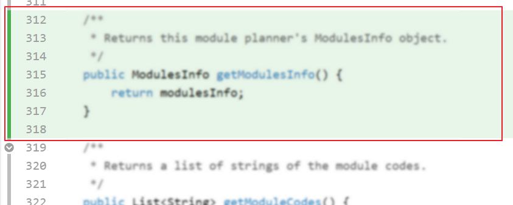








{#====================================================================================================================
 # Common fragments
 #====================================================================================================================#}

<box type="warning" seamless>

**The goal of freezing features in the pre-release iteration** is to subject the features to at least one round of intensive non-dev testing before they are released to the users. In other words, avoiding behavior changes unless they are strictly necessary, so that we minimize the possibility of introducing more bugs. 
In a real project, minor or critical changes might be allowed even near a deadline -- but here, we do not allow _any_ feature changes because it can start us on a slippery slope and many "is this change allowed?" queries. Therefore, {{ version_final }} should not have _any_ behaviors that were not already tested in the <tooltip content="PE Dry run">PE-D</tooltip>). Hence, the feature freeze ==comes into effect at the point you released the JAR file that was used for the PE-D==.

While the info below provides you what to do and what not to do in {{ version_final }} specific cases, the important thing is to understand and ==**follow the spirit of the _feature freeze_** (i.e., do not change features further; correct unintentional errors only)==.

**Allowed in the {{ version_final }} milestone:**{.text-success}

* fixing bugs (but not _feature flaws_) -- we use a very restrictive definition of 'bugs' for the feature freeze; to avoid violating the feature freeze unintentionally, be sure to check the FAQs below before you do any fixes/tweaks.{icon="fas-check" i-class="text-success"}
* improving documentation %%(e.g., update UG, DG, code comments)%%
* improving code quality
* improving the testing aspect %%(e.g., add more tests)%%
* removing features %%(i.e., removing an entire feature or a part of a feature)%%

**Not allowed in {{ version_final }}:**{.text-danger}

* adding/changing features (even minor behavior enhancements/tweaks){icon="fas-times" i-class="text-danger"}
* any UI enhancements (even purely cosmetic enhancements e.g., alignments, style changes are not allowed)
* updates to the contents of data files bundled with the JAR file (as they control the behavior of the app)

**Using 'Planned Enhancements' DG section to counter known feature flaws:** Given you are not allowed to fix feature flaws in {{ version_final }}, we allow you to optionally add a section named `Appendix: Planned Enhancements` to the end of the DG. More details in the panel below:

{{ embed_topic("tp-deliverables-dg-fragment.md#planned-enhancements-info", "Admin " + icon_embedding + " tP → Deliverables → DG (extract): Planned Enhancements", "3", indent="1") }}

****FAQs on what is allowed during the feature freeze:****

<panel type="seamless" header="**[Q0]** What's the ==penalty for violating the feature freeze==?" minimal>

**A:** This will be case by case (depending on the severity), but an indicative/minimum penalty is `-1` per member, per violation. i.e., if there is only one violation that is not severe, each member will lose 1 mark.
</panel>

<panel type="seamless" header="**[Q1]** How to differentiate between **bugs vs enhancements**?" minimal>

**A:** A bug in this context is when the actual behavior differs from the _advertised_ behavior (i.e., the behavior stated in the UG) due to an _error_ in the code. 
It will be considered a feature change (i.e., not allowed to do) if,

* the current behavior is not strictly 'incorrect' but 'can be better'.
* the current behavior inconveniences the user but there is a way to work around it.
* the advertised behavior was not actually implemented (or only partially implemented) in the JAR used for the PE-D.

If the current behavior differs from the UG but the current behavior is not strictly incorrect, update the UG to match the current behavior (in the interest of minimizing code changes). However, an exception can be made if the behavior in the UG (but is not working in the app) was already implemented in {{ version_penultimate }} (i.e., there is code that is specifically written for the behavior in concern) but it is not working due to a bug in that specific code. When fixing such a case, clearly describe in the PR description where the existing implementation is (you can point to a commit, a code segment, or a past PR) and why it wasn't working.
</panel>

<panel type="seamless" header="**[Q2]** Will we be **penalized for feature flaws not fixed** during the feature freeze?" minimal>

**A:** Product design is hard, and achieving a very good design takes experience, skill, and multiple iterative refinements. Hence, having some feature flaws at this stage is natural. Accordingly, feature flaws will not be penalized in the following cases:

* If the feature flaw will be fixed by an item you listed in the _Planned enhancements_ DG section (as mentioned above).
* After the feature flaw is reported during the PE, you successfully argued it as 'not in scope' (i.e., fixing that flaw is of lower priority than the work done already, and hence it is justifiable to be postponed to a future version). Reporters of such bugs will earn partial credit.

In addition, you can mitigate the impact of feature flaws and thus lower its severity by tweaking the UG (e.g., explain the feature better, clearly state the limitations and guide users to work around those limitations)
</panel>

<panel type="seamless" header="**[Q3]** What if an issue is related to a **behavior not specifically stated** in the UG?" minimal>

**A:** In that case, we go by the reasonable 'correct' behavior that one expects. For example, the UG might not specify what happens if a user typed an extra space after the first keyword of the command (e.g., `mark[SPACE]1` vs `mark[SPACE][SPACE]1`) in which case the reasonable correct behavior is to ignore the extra space.
</panel>

<panel type="seamless" header="**[Q4]** What if a **feature is mentioned in the UG but not available** fully in the product?" minimal>

**A:** Describing a feature in the UG without implementing it is a UG bug. The remedy is to remove the feature from the UG. 
If the behavior difference is because some parts of the feature is not implemented yet, the feature is incomplete (i.e., not a bug). The remedy is to remove the feature (if it is not usable in the current form) or update the UG to match the current version of the feature.
</panel>

<panel type="seamless" header="**[Q5]** Can we **tweak validity checks** for a user input, or error/exception handling?" minimal>

**A:**

  * **Can be allowed only if the current behavior causes the software to _misbehave_** (i.e., crash, give <popover content="i.e., the result given by the app differs from the result that matches the user input">incorrect results</popover>, store <popover content="i.e., the same data item is stored as different values in multiple places, or the value stored by the app is different from the one given by the user">inconsistent data</popover>, or make it unusable for typical users).
  * **Accepting seemingly 'unsuitable' values** for an input (e.g., accepting numbers for a person name, empty value as a parameter): 
    This is not considered 'incorrect' (giving more freedom to the user is not necessarily incorrect) unless those unsuitable values causes the application to misbehave.
  * **Accepting supposedly invalid values** (e.g., end date is earlier than start date; February 30th) is, while not ideal, not necessarily incorrect either (i.e., adopting a [garbage-in garbage-out](https://en.wikipedia.org/wiki/Garbage_in,_garbage_out) approach to input validation). However, if such data can make other things go haywire (e.g., crash the app, corrupt the data file), accepting them can be considered a bug, and fixed.
  * **Rejecting valid inputs** is a bug and can be fixed, unless such data is not expected to be used (in normal usage), or if a reasonable workaround exists (e.g., not accepting `s/o` in a person name is a problem but until it is supported, users can be asked to use a workaround such as using `s o` or `son of`).
  * **Validity checks on edits to the data file**: 
    As per AB3 UG (which states the current level of support for editing the data file manually), only valid edits will be supported. If the file is invalid, the app will start with an empty file (not crash). You may rectify only if the current level of support doesn't meet that bar. Furthermore, you may state in the UG that certain incorrect edits to the datafile can result in unexpected behaviors, and caution users to edit the file only if they know what they are doing.
  * **Handling extraneous inputs** (e.g., extra parameters, repeated parameters etc.) in commands: 
    The command 'forgiving' these extraneous inputs (i.e., giving an output same as or similar to if those inputs are not present) is not incorrect. You can mention in the UG that such inputs will be ignored. AB3 already does a similar thing for some commands. Any special handling of such inputs can be left as a future enhancement.
</panel>

<panel type="seamless" header="**[Q6]** Can we **tweak UI text** (i.e., error/help messages or other text shown to the user)?" minimal>

**A:** Only if the current text is incorrect (i.e., a bug). Adding more information or otherwise 'enhancing' the text is not allowed. Other points to note,

  * **Spelling errors and grammar errors** in the UI (or docs) can be fixed, as they are errors by definition.{{ bullet_tick_green }}
  * **Outdated AB3 terms** (e.g., 'addressbook', 'person') can be updated to a term that matches your application. This applies to the data file name as well.
  * **If a user action <tooltip content="i.e., does not perform the action user requested but does not also give any indication that the action was not performed">fails silently</tooltip>**, it can be fixed to inform the user of the problem.
  * **Widening the scope of a message (or making it more general)** is allowed. For example, suppose an error can be caused by a problem in parameters x, y, or z but the error message says `problem in x or y`. In this case the current error message is incomplete and hence you may widen its scope (e.g., `problem in x or y or z`) or make it more general (e.g., `problem in parameters`).
  * **Making user-facing info more specific/informative** (e.g., changing a generic error message `Command format is invalid` into a more specific error message `The parameter p/ in the command is not valid`) is an enhancement i.e., not allowed.{{ bullet_x_red }}
  * **Merely standardizing text** (e.g., to use the same term everywhere) is an enhancement i.e., not allowed.
</panel>

<panel type="seamless" header="**[Q7]** Can we **tweak case-sensitivity** of a feature?" minimal>

**A:** If the case-sensitivity of a feature does not follow the real world, it is considered a feature flaw (i.e, the design of the feature is not optimal). The best you can do in {{ version_final }} is to document this behavior clearly in the UG. 
An exception is when the UG clearly states the case sensitivity but the actual feature implementation doesn't follow it, in which case it is a bug and can be fixed.
</panel>

<panel type="seamless" header="**[Q8]** A UI **text gets truncated (or overflows)** for certain inputs (or certain Windows sizes); can we fix them?" minimal>

**A:** Only if the behavior hinders normal usage i.e., the user not being able to see the full text in _any way_ can be considered an 'incorrect' behavior, and hence, a bug. If the user is able to see the full text by resizing the Window or using another view provided by the app, it is not a bug. 
  Also, accommodating 'extreme' inputs (e.g., a person name with 1000 characters, an index that exceeds the range of `int`) can be considered a nice-to-have feature, to be added in a future version (i.e., lack of it is not a bug).
</panel>

<panel type="seamless" header="**[Q9]** Can we **tweak the command format**?" minimal>

**A:** No, as this would be considered changing the design of a feature.
</panel>

<panel type="seamless" header="**[Q10]** What if the **UI is inconsistent with the data**?" minimal>

e.g., the UI continues to show an item after it was deleted in the most recent command

**A:** Yes, this can be fixed as the UI is showing 'incorrect' data. 
  Alternatively, UI not auto-updating immediately after a command executes can be considered a separate feature that the current version of the app doesn't have yet. In that case, make it clear in the UG and also inform users how to update the UI %%(e.g., by running another command)%%.

**[Q10a]** What if after a command is executed the UI doesn't switch to the intended view, or switch to a view not intended? 
**A:** If there is a way for the user to switch to the target view (e.g., by typing another command or clicking somewhere in the UI), this will be considered a 'can be better' situation (i.e., an enhancement, not allowed to fix).
</panel>

<panel type="seamless" header="**[Q11]** The tester has categorized a PE-D issue as a feature-flaw but we think it is a bug (or vice versa). How to proceed?" minimal>

**A:** The category chosen by the tester is immaterial. You have to choose the correct category and proceed accordingly. Do not fix feature flaws even if the tester categorized them as bugs.
</panel>

<panel type="seamless" header="**[Q12]** We already merged a PR that violates the feature freeze. Now what?" minimal>

**A:** No penalty if you revert the change for the final submission. You can use [GitHub's _Revert PR_ feature](https://docs.github.com/en/pull-requests/collaborating-with-pull-requests/incorporating-changes-from-a-pull-request/reverting-a-pull-request) for this. Failing that, you'll need to reverse the merge commit of the offending PR manually, or at least do another PR to reverse the effect of the previous feature freeze violation.
</panel>

<panel type="seamless" header="**[Q13]** How to decide between recording a feature flaw as a 'known issue' (in the UG) and a 'planned enhancement' (in the DG)?" minimal>

**A:**

* UG's 'Known Issues' is a way to caution users about limitations of the app. In terms of grading, informing users of an issue can reduce the severity of the issue, but they are not totally immune from being reported/penalized as bugs. 
  DG's 'Planned Enhancements' are immune from PE bug reporting. It's mostly for PE purposes (i.e., a course-specific item); not something you see often in real DGs.
* There is no limit to how many known issues you can list in the UG, but listing many will put the product in a negative light.
* You can list the same item in both, in which case the presentation/details of it can vary between the two too (as the two documents are meant for two different audiences).
</panel>

<panel type="seamless" header="**[Q14]** What if the same bug is reported in the PE?" minimal>

**A:** In the PE, the tester and the dev team are expected to attempt to reach a decision before the teaching team's opinion is factored in. Therefore, our policy is not to judge potential PE issues in advance, so as not to preempt the PE process.
</panel>

</box>

<box type="important" icon=":fas-hourglass-half:" seamless>

**This task is time-sensitive.** If done later than the [deadline](weeklySchedule.html#:~:text=for%20exact%20dates.-,Deadline%20for%20weekly%20tasks,-The%20soft%20deadline), it will not be counted as 'done' (i.e., no grace period). %%Reason: This is 'an early draft'; if done late, it can't count as 'early'.%%
</box>

<box type="important" seamless icon=":fas-skull:">

**Lookout for these mistakes** which were the most common in previous runs of the course:

* **Not following the [required phrasing style for the first sentence](https://se-education.org/guides/conventions/java/{{ "basic" if cs2113 else "intermediate" }}.html#:~:text=In%20method%20header%20comments%2C%20the%20first%20sentence%20should)** of Java method header comments.{ icon="fas-skull" i-class="text-danger" }
* **Not following the [convention for Git commit message subject](https://se-education.org/guides/conventions/git.html#:~:text=Commit%20message%3A%20Subject)**. 
  Caution: This is very hard to rectify later, after PR containing the commits have been merged. 
  %%Reason: While Git allows editing past commits, it changes their timestamp, which affects your weekly code contribution stats (which are factored into evaluating the consistency of your coding work over the project duration)%%
* **Forgetting to do each PR from a separate branch** (i.e., send PR from the `master` branch) of your fork. This error means your PR will not be considered as _following the forking workflow correctly_.
</box>

{#====================================================================================================================
 # CS2103 Weekly Intros
 #====================================================================================================================#}

<box dismissible>

{{ icon_individual }} **indicates an individual task** %%(i.e., each team member has to do the task, graded individually)%% 
{{ icon_team }} **indicates a team task** %%(some or all members may do the work; graded for the whole team)%%.

</box>

{#====================================================================================================================#}

<box dismissible>

{{ icon_important_big_red }} **tP tasks progress is graded**. Completing individual and team tasks are considered for grading the _project management_ component of your project grade. That said, unless a deliverable is marked 'time-sensitive', there is no penalty for missing a deadline provided you catch up with most of them within a few days after the deadline.

{{ embed_topic("tp-grading.md#project-management-grading", "Admin " + icon_embedding + " tP → **Grading → Project Management**", "3", indent="1") }}

{{ embed_topic("weeklySchedule.md#deadline-definition", "Admin " + icon_embedding + " Weekly schedule → **Deadline for weekly tasks**", "1", indent="1") }}

{{ icon_important_big_red }} **Most aspects of project progress are tracked using automated scripts.** ==Please follow our instructions closely or else the script will not be able to detect your progress==. We prefer not to waste admin resources processing requests for partial credit for work that did not follow the instructions precisely, unless the progress was not detected due to a bug in the script.
</box>

<box type="tip" icon=":fas-chart-gantt:" icon-size="3x" seamless>

****Iterative means no need for detailed plans, right?****{.text-success}

Continuing from the points raised in the 'Sidebar: Project planning, with a twist' last week ...

**Iterative projects typically do not start with a very detailed plan for the _final_ product**, because an iterative project accepts that the project requirements can change along the way and hence it is futile to create detailed plans of the final product at the very start.

However, it does not mean we simply keep adding features without any plan and whatever we have at the end is the final product. Instead,

1. **we should have a clear overall direction** (e.g., target user, value proposition), and,
1. **we should start each iteration with a clear, detailed, and precise plan of the intended outcome of _that_ iteration**.

**Even the plan of the current iteration _can_ change as the iteration progresses** (e.g., if we realize we underestimated the effort required for that iteration), but that would be a case of 'changing the current iteration plan', not a case of 'making it up as we go'.
</box>

{#====================================================================================================================#}

<include src="tp-timeline.md#v11-goals" />

<box type="tip" icon=":fab-git-alt:" icon-size="3x" seamless>

 ++**Start using Git via the CLI**++{.text-success .font-monospace}

If you have been using Sourcetree (or other GUI) for Git before, we strongly recommend that you ==move towards using the CLI to perform Git tasks== in the second half of the semester. Doing so will strengthen your Git knowledge (because CLI takes you closer to what's actually happening, while GUIs might hide such details). 
But you can continue to use your favorite Git GUI for a more 'visual' view of your repo, side-by-side with the CLI e.g., from Sourcetree, you can open a gitbash terminal, run the command in that terminal, and see the result in the GUI.
</box>

<box dismissible id="prReviewsMatter">

{{ icon_important_big_red }} **PR review comments matter!** Remember to do proper PR reviews throughout the tP, at least for non-trivial changes, as the quality and quantity of PR review comments you have given to peers affect your [tP marks](tp-grading.html) (under the _project management_ aspect).
</box>

{#====================================================================================================================#}

As we start working towards {{ version_first }}, keep the following iteration goals in mind:

<include src="tp-timeline.md#v12-goals" />

<box type="info" seamless>

**Feel free to improve AB3 in any way you see fit.**{.text-info} While not very 'buggy', AB3 is not 'perfect' either (it is not meant to be a 'model solution'). In particular, ==find and fix any bugs it has==. If you are not sure if something is a bug or an intended behavior, you can post in the forum to check. 
While we are on the topic, also note that the architecture of AB3 doesn't suit every kind of application either. As you gain more experience in other application domains, you will learn different types of architectures that you can add to the collection of different architectures that you can consider for future projects. The same goes for the tool chain and the tech stack of AB3. Therefore, **do not try to apply AB3 as a template for _every_ other project you encounter in the future**.
</box>
<box>

<include src="tp-tasks-fragment.md#prReviewsMatter" />

</box>

{#====================================================================================================================#}

<box>

##### How to define version numbers?{.text-info}

While there is no universal set of rules on choosing version numbers for a product, there is a convention named **[SemVer](https://semver.org/) that is well-defined and widely used**. Our tP version numbers (`{{ version_first }}`, `{{ version_penultimate }}`, `{{ version_final }}` etc.) do not follow SemVer strictly though.

While on the topic of version numbers, **_milestones_ and _versions_ are not the same thing**. For example, you can have a version released in the middle of a milestone, and you can define a milestone that does not release a new version of the product. For convenience, the tP uses them interchangeably (e.g., `{{ version_first }}` is used to mean a version as well as a milestone) because its major milestones coincide with its version releases. 
In a similar vein, we use the version number to refer to the iteration as well, although they are not the same thing. So, when we say _iteration `{{ version_first }}`_, we mean _the iteration that ends in the milestone `{{ version_first }}`_ (that also happens to deliver the product version `{{ version_first }}`)

</box>
<box type="tip" icon-size="2x" seamless>

**Using parallel PRs yet?** We encourage you to try sending parallel PRs (i.e., send another PR while the previous PR you sent is waiting to be merged) if you haven't done that yet. %%Reason: It's important to learn how to do that, because in most real projects it is common to have multiple open PRs from the same author.%%
</box>
</box>
<box type="info" icon=":bi-emoji-surprise:" icon-size="2x" seamless>

**Shocked by iP to tP transition?** Around this time you will realize how the speed you can implement things in the tP is significantly slower compared to the iP. As discouraging as this might feel, there are several ways this can contribute towards the learning outcomes of this course, and it is not expected to affect your tP grade either.

<panel type="seamless" header="More on this ...">

1. **It is important to realize that working in larger code bases is a much slower affair.** The number of lines an engineer can write per day is often limited to a double-digit value, [even going as low as 20](https://medium.com/modern-stack/how-much-computer-code-has-been-written-c8c03100f459#:~:text=As%20we%20can%20see%2C%20a,in%20a%20given%20working%20year.)).
1. **The speed varies from project to project**, and naturally, is slowest at the start when you are very new to the project. Even so if you are new to working with legacy code. On the positive side, the iterative approach we use gives us room to adjust targets based on the actual speed you can deliver in the tP code base.
1. **The slowness of progress can be partly due to design flaws** of the current code base (i.e., the design makes code changes harder than necessary). Keep a lookout for such cases, and if you can think of design tweaks that makes the code easier to change, go ahead and try them out. Such work can earn credit too.

Finally, we don't expect each of you to put into the tP more _effort_ than you put into the iP (i.e., as the progress in the tP is expected to be slower, it is not necessarily write as much code or implement as many features as you did in the iP). Keep in mind the tP had been done by thousands of students before, and we are well aware that the amount of new features that you can deliver in the tP is not much. So, the slow progress will not affect your tP grade, as that is already factored into the grading. **What is needed is for you to recalibrate your own tP expectations/plans to match the reality of the tP environment** -- such recalibration is a learning outcome of the course too.
</panel>
</box>

{#====================================================================================================================#}

As we start working towards {{ version_penultimate }}, keep the following iteration goals in mind:

<include src="tp-timeline.md#v13-goals" />

<box dismissible>

****{{ icon_tip }} How much is enough to get full marks?**** Not surprisingly, a common question tutors receive around this time of the project is "can you look at our project and tell us if we have done enough to get full marks?". Here's the answer to that question:

**The tP _effort_ is graded primarily based on peer judgements** (tutor judgements are used too). That means you will be judging the effort of another team later, which also means you should be able to make a similar judgement for your own project now. While we understand effort estimating is hard for software projects, it is an essential SE skill, and we must practice it when we can.

**The expected minimum bar to get full marks for _effort_** is given <trigger trigger="click" for="modal:mid13-effortBar"> here</trigger>.

<modal large header="tP -> Expectations -> [Extract] Functionality Expectations" id="modal:mid13-effortBar">
<include src="tp-expectations.md#functionality-expectations"/>
</modal>

If you surpass the above bars (in your own estimation), you should be in a good position to receive full marks for the effort. But keep in mind that there are many other components in the [tP grading](tp-grading.md), not just the effort.
</box>

{#====================================================================================================================#}

As we start working towards {{ version_final }}, keep the following iteration goals in mind:

<include src="tp-timeline.md#v14-goals" />

<box dismissible>

{{ icon_tip }} when setting the {{ version_final }} deadline in GitHub milestones, remember that the {{ version_final }} submission deadline is early in Week 13 for _everyone_ (does not vary by tutorial day). Set your own milestone deadline accordingly, or else our grading scripts will flag it as an 'unsuitable' deadline.
</box>

<box background-color="white" border-color="red">

**Remind yourself of the project grading criteria and our policy on reuse** (e.g., ==how to give credit for reused code==):

<panel type="seamless" src="tp-grading.md#main" header="%%Admin {{ icon_embedding }} tP → Grading%%" class="embedding" />
<panel type="seamless" src="appendixB-policies.md#policy-reuse" header="%%Admin {{ icon_embedding }} Policy on reuse%%" class="embedding" />
</box>

{#====================================================================================================================
 # CS2113 Weekly Intros
 #====================================================================================================================#}

<box>

{{ icon_important_big_red }} Timely completion of the weekly tP tasks can improve the _project management_ component of your tP grade.

{{ embed_topic("tp-grading.md#project-management-grading", "Admin " + icon_embedding + " tP → Grading → Project Management", "3", indent="1") }}

</box>

{#====================================================================================================================#}

<box>

<include src="tp-tasks-fragment.md#prReviewsMatter" />
</box>

{#====================================================================================================================#}

<include src="tp-tasks-fragment.md#common-mistakes" />

{#====================================================================================================================#}


Some things to note as you start the {{ version_penultimate }} iteration:
* **Set moderate targets for functionality.** Adding more functionality than needed will not earn you more marks but can expose you to higher risk of bugs. 
  **Focus on improving the process and the quality** instead.
* **Move in small steps, and keep the product working at each step.** If it breaks, you will only have to examine the latest change for the cause of the breakage.


{#====================================================================================================================#}


==This week, you get a chance to fix your tP bugs (in the project, as well as documentation) without any penalty.== What's more, others will help you find those bugs (via tutorial activities and the PE Dry Run happening in this week).

To take advantage of the above, try to make your {{ version_penultimate }} (product, DG, and UG) as close to what you intend to submit as your final version (i.e., {{ version_final }}).


{#====================================================================================================================#}
{# Steps
{#====================================================================================================================#}
{{ icon_individual }} %%Individual Task%%: Explore AB3 features

* **Objectives:** (1) To get each of you to think of ways to improve AB3 (2) To detect any Java version compatibility issues between your local set up and the expected Java version.

* **Submission:** via [Canvas survey named `tP: AB3 Initial Experience`]({{ url_canvas_home }}/quizzes) by =={{ get_date(date_w4_start, 1, time="23:59") }}==

* **Steps:**
    1. Download the latest released version %%(i.e., the jar file)%% of AB3 from [its upstream repo](https://se-edu.github.io/addressbook-level3/UserGuide.html).
    1. Get it running in your computer. Play around with it to familiarize yourself with its current features.
    1. Add yourself to the list of contacts in AB3 (using the `add ...` command).
    1. Take a screenshot of the AB3 Window, while it shows your own contact info you added earlier. Save it as a `.png` file.
    1. Think about how the AB3 user experience can be improved, for example, by tweaking the command format, or the GUI, or the features. Note them down as a list of feature suggestions, as free text (i.e., no specific format). 
       Suggested: Try to come up with at least 5 ways to improve AB3, while also trying to go beyond the simple/obvious ones (i.e., this is a chance to be insightful but also creative). 
       Also keep the following tP constraints/recommendations in mind when doing this, as improvements that are not aligned with [tP constraints](tp-constraints.html) are unlikely to be useful later.
       {{ embed_topic("tp-constraints.md#Constraint-Typing-Preferred", "Admin " + icon_embedding + " tP Constraints → Constraint-Typing-Preferred", "2", indent="3") }}
       {{ embed_topic("tp-constraints.md#Recommendation-CLI-First", "Admin " + icon_embedding + " tP Constraints → Recommendation-CLI-First", "2", indent="3") }}

6. Use the Canvas survey mentioned above to submit the screenshot and the feature suggestions. 
   Note: The feature suggestions you submit will be shared with the team members later, so that your team can use them when designing the tP product later.

{#====================================================================================================================#}
{{ icon_team }} %%Team Task%%: Set up a project meeting time

* After forming teams, **set up a weekly project meeting time/venue (and communication channels) with your team members**:

{{ embed_topic("tp-teams.md#teamCommunication", "Admin " + icon_embedding + " **Teams → Communication**", "2", indent="1") }}

{#====================================================================================================================#}
{{ icon_team }} %%Team Task%%: Check up on team's collective iP status

* Check with all team members if any of them needs help doing the iP, and source within the team to provide the needed help as much as you can %%e.g., offer to sit with them while they do the iP so that you can try to help when needed.%% 
  **Submission:** After completing this task (i.e., after asking all team members if they need help for the iP, and coming up with a plan to help those who asked for help), one member should ==inform your tutor== so that we can track the status of this task. We don't need to know who asked for help though e.g., `One member is slightly behind and one significantly behind. We plan to have a code-together session on Sunday so that we can help them if they encounter problems.`

<box type="tip" seamless>Mentorship within the team is highly-encouraged and rewarded. Besides, it is in your interest to help team members level up before the tP coding begins, and also, a good early opportunity to build team spirit.</box>

{#====================================================================================================================#}
{{ icon_team }} Start weekly project meetings

* We recommend you start weekly project meetings now. You can use the meeting to do tP tasks, but also help each other do iP tasks. On a related note, ==it is also acceptable to discuss weekly Canvas quiz (if any) together with team members as you do the quiz== i.e., discuss and decide the answer collectively, but you should not give away your answers to someone who was not part of that discussion.

{#====================================================================================================================#}
{{ icon_team }} Decide on an overall project direction %%(user profile, value proposition)%%

* **Decide the target user profile, and value proposition**, as described in the panels below (tip: you can use your first project meeting for this):

<box type="warning" seamless>

As we are still at the early stages of identifying a problem to solve, do not think of the product (i.e., the _solution_) yet. That is, ==do not discuss the product features, UI, command format, and implementation details, etc.== unless they are pertinent to the user profile or the problem addressed.
</box>

<box type="tip" seamless>

<include src="../book/about/usage.md#tip-about-popup-url" />
</box>

{{ embed_topic(baseUrl+"/admin/tp-expectations.md#main", "Admin " + icon_embedding + " **tP: Expectations**", "3", indent="2") }}
{{ embed_topic(baseUrl+"/admin/tp-constraints.md#main", "Admin " + icon_embedding + " **tP: Constraints**", "3", indent="2") }}
{{ embed_topic("tp-grading.md#criteria-productDesign", "Admin " + icon_embedding + " **tP: Grading → ==Criteria Used for Grading the Product Design==**", "3", indent="2") }}

<box type="tip" seamless>

**Pick a CLI-friendly product domain**: Given `Recommendation-CLI-First` and `Constraint-Typing-Preferred` mentioned in the panels above, it makes sense to pick a product domain that is more suitable for CLI interactions i.e., a product that deals with easy-to-type textual data, needs a small number of data fields, and each data field is short. %%For example, a blog editor is an unsuitable product domain because it also deals with non-text data (e.g., images, videos) and some data fields are quite long (i.e., paragraphs of text). Similarly, keeping track of extensive employee records may be an unsuitable domain if there are many data fields per employee.%%
</box>

* **Submission**: Submit via TEAMMATES.
  * Details to submit:
    1. **Product name** (plain text only) %%e.g., ClientContactsPro%%
    1. **Target user** profile (plain text only) %%e.g., freelance event photographers%% 
       This is a general description of the target user, not the 'persona' you defined (the latter serves as a concrete representation of the target user, for your internal use only).
    1. **Value proposition** i.e., what problem does the product solve? (plain text paragraph, no more than 50 words) %%e.g., provide fast access to client contact details, optimized for users who prefer a CLI%% 
       This is ==not a list of features== -- you should not think about exact features yet.
    1. **Link to the project notes document**: This should be an online document/page (not a folder) -- e.g., a GoogleDoc (not a Google Drive location) -- that is publicly accessible. If your project notes are in multiple locations/files, this one document should contain the link to the other documents with guidance on which link is for what.
  * You'll receive an email from TEAMMATES with the submission link. ==Only one member needs to submit== on behalf of the team. All members can view/update the submission. 
  * {{ icon_info }} Submission link will be sent to you by {{ date_w4_start | date(format_normal, 3) }} %%(reason: we need a few days to set up the submission system _after_ teams have been finalized)%%.
  * {{ icon_Q }} FAQ: Can we change these values later? 
    Answer: Yes. If the submission deadline is not over yet, use the same link to update the submission. If the submission deadline is over, email the updated name, target user, value proposition to `{{ course | lower }}@comp.nus.edu.sg`.
  

{#====================================================================================================================#}
{{ icon_team }} Start a collaborative doc to take project notes

* Keep project notes in an easy-to-use collaborative doc (Recommended: use a GoogleDoc). This document will be checked by the instructors at various points. 
  Remember to choose a tool that ==allow public _view_ access== e.g., GoogleDoc can be shared via a public link so that the document can be viewed by others. You'll be asked to submit this link to us in the next week. 
  {{ icon_important_big_red }} Make sure all your current and future project notes (if split into in multiple documents) are reachable via links given in this document and are viewable by the public.

{#====================================================================================================================#}
{{ icon_team }} Brainstorm user stories

<box type="info" tags="m--cs2103" seamless>

**You can do this step as if the tP is a greenfield project** (i.e., as if there is no AB3), to get the full experience of this activity. Some of the user stories you come up with may already be implemented in AB3, but that can be sorted out later.
</box>

<pic eager class="indented-level2" src="{{baseUrl}}/admin/images/v00.png" width="250px"></pic>

* **Learn** [**the _recipe for brainstorming user stories_** in the textbook → Specifying Requirements → UserStories →  Usage]({{ baseUrl }}/se-book-adapted/chapters/specifyingRequirements.html#a-recipe-for-brainstorming-user-stories). 
  Also learn about <trigger trigger="click" for="modal:v10-brainstorming">brainstorming</trigger> and <trigger trigger="click" for="modal:v10-userstories">user stories</trigger>. 
  We recommend you view the following video, as it has some additional commentary on the recipe to be used:

{{ panopto("c0612db9-3cf1-4bab-a066-b07501387c0f", desc="Additional commentary on the recipe to be used") }}

* **Follow the steps in the recipe mentioned above to arrive at user stories for the product**, with your team members.  If you don't follow the recipe mentioned above, you could end up with a different set of user stories than otherwise.
  

* **User stories for what version?** At this stage, collect user stories to cover at least the final version you hope to deliver at the end of the semester. It is OK to go even beyond that %%(reason: we are simulating a project that will continue even after the semester is over)%%. 
  Do not omit user stories already covered by the features in AB3 %%i.e., the user story should be recorded even if AB3 already caters for it.%%

* **How many user stories?** Aim to collect more user stories than you can deliver in the project. %%Aim to create at least 30 user stories. Include all 'obvious' ones you can think of but also look for 'non obvious' ones that you think are likely to be missed by other competing products.%%

* **User stories of what size?** Normally, it is fine to use _epic_-level user stories in the early stages of a project but given this is a small project, you may want to eventually break them down to smaller user stories (i.e., small enough for one person to implement in 1-2 days). Some examples (from the iP product domain):
  * {{ bad }} As a user, I can track my schedule, so that I can know when to do things. 
    %%Reason: too big, as _track_ can involve a lot of things.%%
  * {{ good }} As a user, I can add a time to a task, so that I can record when a task need to be done.
  * {{ good }} As a user, I can see the pending task that has the next earliest deadline, so that I can know what I need to do next.

* **What format?**: You may use a sentence format or a table format but do maintain the prescribed three-part structure of a user story. In particular, ==try to include the _benefit_ part in most user stories== as that will come in handy when prioritizing user stories later.

* **Submission** (to be checked by the tutor later): 
  * Intermediate steps (e.g., persona, scenarios): Keep records these in your collaborative project document started in the previous week.
  * Brainstormed user stories:  Record them using an <!--~~write each user story in a piece of paper (e.g. yellow sticky note, index card, or just pieces of paper about the size of a playing card). Alternatively you can~~--> online tool (some examples given in <trigger trigger="click" for="modal:v10-onlinetools">[Textbook {{ icon_embedding }} Specifying Requirements → UserStories → Usage → (panel) Tool Examples ]</trigger>). 
  {{ icon_tip }} **Use an online spreadsheet for recording user stories** (e.g., Google Sheets), if you are not sure which tool to use. -- they are easy to edit, share, color, and more importantly, sort/filter. 
  {{ icon_info }} If you put the user stories in a location other than your main collaborative project notes document (i.e., the one given [here](teamList.html)), ensure that location is viewable by the public, and the main document has a link to that location. Otherwise, the tutor will not be able to see your list of user stories.

<modal large header="Textbook {{ icon_embedding }}" id="modal:v10-brainstorming">
<include src="../book/gatheringRequirements/brainstorming/unit-inElsewhere-asFlat.md" boilerplate/>
</modal>

<modal large header="Textbook {{ icon_embedding }}" id="modal:v10-userstories">
<include src="../book/specifyingRequirements/userStories/unit-inElsewhere-asFlat.md" boilerplate/>
</modal>

<modal large header="Textbook {{ icon_embedding }} Specifying Requirements → UserStories → Usage → (panel)Tool Examples" id="modal:v10-onlinetools">
<include src="../book/specifyingRequirements/userStories/usage/tools.md"/>
</modal>

{{ icon_tip }} **If you choose to use the GitHub issue tracker to manage user stories**, you need to set up your team's GitHub organization, team repo, and its issue tracker first. Instructions for doing those steps are in the panel below.

<panel header="%%Admin {{ icon_embedding }} Appendix E: GitHub (extract)%%">
  <include src="appendixE-gitHub.md#organization-setup"/>
  <include src="appendixE-gitHub.md#tp-team-repo-setup"/>
  <include src="appendixE-gitHub.md#issue-tracker-setup"/>
</panel>

{#====================================================================================================================#}
{{ icon_team }} Choose user stories for {{ version_first }}

<box type="tip" icon=":fas-route:" icon-size="3x" seamless>

##### Sidebar: Project planning, with a twist

Intuitively, you might think the right thing to do is to decide what features will be in {{ version_final }} and then plan the intermediate versions based on that. But that's not what we are going to do.

Why? Given the difficulty of reliably estimating the effort each feature will need, any such long-range plan is likely to be inaccurate.

Instead, what we will do is to ==assume the current iteration is the last iteration==, plan that iteration to deliver the product (based on available time), and try to follow that plan as best as we can. After the iteration is over, we plan the next iteration as if _it's_ the last iteration. But that time, you can factor in the experience from the previous iteration to do a better job of planning.

How is that better?
* Shorter-term plans have a better chance of being accurate and doable.
* You get multiple clean shots at project planning. Each try can learn from the previous tries. Hence, more learning.
* As each iteration produces a working product, you always have a working product, which practically eliminates the risk failing to deliver a working product by the final deadline.

</box>

**The goal of this activity is to come up with the _smallest possible product that is still usable_** so that it can be implemented as {{ version_first }}, to be delivered at the end of the first project iteration i.e., NOT what you _can_ or _want to_ do in {{ version_first }}, but what you _must_ do in {{ version_first }}. We try to make it small because ==you will have only two weeks to implement {{ version_first }}== and coding as a team is a lot harder than writing code alone. %%**Why {{ version_first }} and not v1.1?** v1.1 is a mere documentation update only. {{ version_first }} will be the first version that contains functionality changes.%%

{{ icon_important_big_red }} Do not discuss features, UI, command format, or implementation details yet. That would be like _putting the cart before the horse_. At this stage we are simply trying to choose which _user needs_ to fulfill first.

* If the product _can_ be of some use without a given user story, that user story should be left out of {{ version_first }}, even if the omission makes the product hard to use, as long as the product is not _impossible_ to use %%e.g., in most cases a product can be used without an 'edit item' feature because the user can always delete an item and add a new item instead of editing an existing an item%%.
* Don't worry about {{ version_penultimate  }}. You can design {{ version_penultimate }} after {{ version_first }} done.
* Don't worry about {{ version_first }} being 'too small'. You can always add more features to {{ version_first }} if you finish it ahead of schedule. 
  {{ icon_tip }} You can also select an additional set of user stories that are _nice-to-have_ in v1.2, to be done but only if there's time left.
* If possible, narrow the scope of {{ version_first }} further e.g., narrower target user, a smaller value proposition.

Suggested workflow:
* **First stage**:
  * Divide the user stories among team members.
  * Each member will go through their user stories to discard (e.g., cross out, or move to a different location, but not delete) which are _definitely not needed_ for {{ version_first }}.
* **Second stage**:
  * All members discuss the remaining user stories (i.e., the ones not discarded in the first stage), and try to trim the list further.

<box type="info" icon=":fas-question-circle:"seamless>

**FAQs**{.text-info}

**Q:** What if the chosen user stories for {{ version_first }} is not enough to do a meaningful work division among team members? 
**A:** In that case, at a later stage, you can add more user stories until there is enough for a meaningful work distribution. But at this point focus on selecting the smallest sub-set of _must_have_ user stories only.

**Q:** Should we start implementing {{ version_first }} now? 
**A:** Not at all. That is scheduled several weeks later. For now, just figure out the minimal feature set required for the product. We'll let you know when it is time to start working on {{ version_first }}.

**Q:** Should we omit user stories that are already supported by AB3? 
**A:** No, you should still include them. Reason: The existing implementation might still require some work before it fits your product.

**Q:** All the user stories we selected for {{ version_first }} are already supported by AB3. What now? 
**A:** That's fine. It means you can get to {{ version_first }} with very little effort, which is a good thing. Once you've finished {{ version_first }}, if there is time left, you can add more things to it (e.g., {{ version_first }}.1 etc.) at that time.

</box>

{#====================================================================================================================#}
{{ icon_team }} Set up the project repo

* Set up the team org, the team repo, and individual forks as explained below:

{{ embed_topic("appendixE-gitHub.md#organization-setup", "Admin " + icon_embedding + " Appendix E (extract): **tP Organization Setup**", "1", indent="1") }}
{{ embed_topic("appendixE-gitHub.md#tp-team-repo-setup", "Admin " + icon_embedding + " Appendix E (extract): **tP Team Repo Setup**", "1", indent="1") }}
{{ embed_topic("appendixE-gitHub.md#tp-individual-fork-setup", "Admin " + icon_embedding + " Appendix E (extract): **tP Individual Fork Setup**", "1", indent="1") }}

{#====================================================================================================================#}
{{ icon_individual }} Get familiar with the code base

<box type="info" icon=":fas-question:" seamless>

**FAQ**: Is this a team task or an individual task? 
A: It's an individual task (note the icon {{ icon_individual }} above), to be done by each member, as we want _every_ member to be familiar with the code base.
</box>

<box type="info" icon=":fas-clock:" seamless>

==Ideally, you should do this task in this week==, but you may take an extra week (i.e., by week 7) to finish.
</box>

* Do the following tutorials to get familiar with the codebase
  * [Tutorial 1 - Tracing a Command Execution Path]({{ url_ab3_fork_website }}/tutorials/TracingCode.html)
    * We recommend that you put in a sincere effort into this tutorial because tracing through the code of an unfamiliar code base is an important skill that you will not be able to learn/practice it later in the project as the code will no longer be 'unfamiliar' to you later.
    * Submission [optional]: Post an issue in your team's repo with the title `Tutorial: tracing code`. In the description, add a 2-3 screenshots you took while at various points of the tutorial. You may close the issue soon after.
  * **[Tutorial 2 - Adding a new Command]({{ url_ab3_fork_website }}/tutorials/AddRemark.html)**
    * If you are an experienced programmer, you can add a different command than the one given in the tutorial.
    * **Submission:** Do your changes in a branch named `tutorial-adding-command`, push to your fork, and create a PR from your fork to your team's repo. You may close the PR soon after.
    * FAQ: Do we have to write/update test cases too? 
      A: Not a strict requirement, but given the purpose of this tutorial is to learn the code base, it's ideal if you do. It will familiarize you with the existing testing infrastructure. Otherwise, you can run into difficulties when you are writing test cases for your own features later.
  * [Tutorial 3 - Removing a field from an entity]({{ url_ab3_fork_website }}/tutorials/RemovingFields.html)
    * This tutorial is optional to do, but **at least give it a quick read**.
    * Submission: not required.
* The PRs created for tutorials need not be merged, unless the changes are actually in line with your project idea.
* For reference, given below is the workflow you should follow when merging code in your tP:

{{ embed_topic("appendixE-gitHub.md#workflow", "Admin " + icon_embedding + " Appendix E(extract): **Workflow**", "1", indent="1") }}

{#====================================================================================================================#}
{{ icon_team }} Conceptualize {{ version_first }}

* Based on your user stories selected previously, conceptualize the product in terms of how it will look like at {{ version_first }} ==in the form of a <trigger trigger="click" for="modal:v10-featureLists">feature list</trigger>==. 
  Note down the feature list in your online project notes document.

<modal large header="Textbook {{ icon_embedding }}" id="modal:v10-featureLists">
<include src="../book/specifyingRequirements/featureList/what/unit-inElsewhere-asFlat.md" boilerplate/>
</modal>

<box type="info" icon=":fas-question:" seamless>

**FAQ**: How many features should we put in {{ version_first }}? 
**A:** Aim for the _smallest set of features the product cannot do without_. Even a most basic version of those features is enough. After completing that feature set, you can add more if there is time left.
</box>

{#====================================================================================================================#}
{{ icon_team }} Draft the feature specificationDraft the UG

<include src="tp-tasks-fragment.md#alert-time-sensitive" />

* Draft a user guide in a convenient medium (e.g., a GoogleDoc) to describe what the product would be like when it is at {{ version_first }}.
  * We recommend that you follow the [AB3 User Guide]({{ url_ab3_upstream_website }}/UserGuide.html) in terms of structure and format.
  * As this is a draft only and the final version will be in a different format altogether %%(i.e., in Markdown format)%%, don't waste time in formatting, copy editing etc. You can also limit this to just the 'Features' section only and omit the other sections. 
  While the UG draft need not be 'polished', it should be detailed enough to tell the user how to use the product features in concern.
  * IMPORTANT:
    * Specify the precise/full command syntax for the CLI commands that you will deliver at {{ version_first }}.
      i.e., we want you to know exactly what you plan to deliver at {{ version_first }} -- while it is fine to change this plan later, it is still important to have a plan first.
    * Include all features that will be available in {{ version_first }}. There is no need to include features that will be delivered beyond {{ version_first }}.
  * Consider including examples of expected outputs too.
  * {{ icon_important_big_red }} **Submission** [one person per team]: Save the draft UG as a PDF file, name it `{team-id}.pdf` e.g., `{{ example_team_id }}.pdf`, and upload to Canvas.

* **Deadline:** Recommended to finish by the regular weekly project deadline (i.e., before the next {{ lecture_name }}), but given the iP final submission is due this week, you may take until Sunday ({{ get_date(date_w7_start, 2) }}) to submit this.

* **Objective:** This deliverable links back to the following point made earlier:
  > 1. ...
  > 2. we should start each iteration with a clear, detailed, and precise plan of the intended outcome of that iteration.

  Furthermore, this deliverable forces you to make some fine-grained product design decisions early, thus giving you a better idea about the complexities that lies ahead, and hence, a better sense of the effort that will be required.

* **Deliverable: Collate into a document the _complete_ detailed description of the intended behavior of the product at `{{ version_first }}`.**
  * The intended audience for this document is team members, not end users (i.e., this is not a user guide).
  * Use a medium that is convenient for collaboration (e.g., a GoogleDoc).
  * The content need not be polished. Don't waste time in formatting, copy editing etc.
* **For each feature, specify the following:**

<box>

**Purpose**: What it does

**Command format**: The precise command format of the command. 
Example commands %%(to show how the command is used)%%

**For each parameter**, specify:

* Acceptable values %%e.g., If a command takes a person name as a parameter, what inputs are accepted as valid person names?%% Some example aspect to consider:
  * Which formats are allowed for dates, times, telephone numbers, etc.?
  * How does extra/leading/trailing spaces affect the value -- for instance is 'John Doe' same as 'John&nbsp;&nbsp;&nbsp;Doe' (note the multiple spaces in the second name)?
  * How does UPPER/lower case affects values -- is `John Doe` same as `john doe`?
  * It's not enough to state 'valid name'; you need to specify what rules will be used to determine if the input is a valid name.
* Error message if the value is not acceptable
* Rationale for any the validity rule %%e.g., why only certain characters are allowed for person names?%%

Yes, making these decisions is not easy -- and that's why we want you to think about them now rather than later. Feel free to discuss these validation rules in the forum.

**Outputs**: Precise expected outputs when the command,
* succeeds %%e.g., changes in the GUI, messages shown to the user%%
* fails %%e.g., what are the error messages shown when a specific parameter is invalid, missing, specified multiple times, etc.%%

**Duplicate handling:** What rules are used to determine if two contacts are duplicates? %%e.g., is having the same name enough, or all details need to be the same?%% 
How does the application react to such duplicate entries? Reject or accept? Why?

**Relevant UI mock-ups**, unless the UI will be exatly the same as AB3 %%(they can be hand-drawn or created using a tool such as PowerPoint, PlantUML, Figma, etc. -- they can be very low-fidelity mock-ups, as they are meant to be temporary)%%

---

{{ icon_tip }} **Recommended: Prioritize above finer aspects of features**, for example, as must-have (to implement in {{ version_first }}) and nice-to-have (i.e., to implement in {{ version_first }} only if there is time) 
   %%e.g., you can decide one date format (to accept in user commands) as must-have and two other formats as nice-to-have.%%
</box>

* **It is OK to make compromises** when making product decisions as every design option has costs and benefits, and sometimes, costs outweigh the benefits. 
For example, it is fine to restrict the person name to a certain length and a character set even if it is theoretically possible for those restrictions to conflict with some real-world person names. But you need to be aware of such conflicts, justify the restriction (e.g., ease of implementation/display), and know how users can work around such a conflict should they encounter it %%(e.g., if you app doesn't allow two contacts to have the same name but the user need to store two contacts which are different people with the same name, what should the user do?)%%.

* **You are welcome to (but not required to) follow AB3** when defining the behavior of the new features %%e.g., use similar command formats, input validation rules, error message formats%%. 
  {{ icon_Q }} Should the feature specification include features already in AB3? 
  Yes. <popover content="The AB3 does not have a feature spec covering those features (and the UG does not cover all details of a feature). Furthermore, the current behavior of those feature may not be an exact match for your proposed product.">Why?</popover> But you may copy-paste parts of the UG onto your feature spec if that helps.

* **Ensure feature-fit**: While doing this, ensure the features written by each member fit together to form a cohesive product, and meet other grading criteria of the _product design_ aspect. This might require several rounds of refinement. You are encouraged to peer-review feature details written by other team members and refine the overall product design together.

{{ embed_topic("tp-grading.md#criteria-productDesign", "Admin " + icon_embedding + " **tP: Grading → ==Product Design==**", "3", indent="1") }}

* {{ icon_important_big_red }} **Submission** [one person per team]: Save the file as a PDF file, name it `{team-id}.pdf` e.g., `{{ example_team_id }}.pdf`, and upload to Canvas.
* **Grading criteria**: to be considered 'done', the feature spec. should meet all the following criteria:
  * Covers all features in the smallest set of features the product cannot do without.
  * Contains all details mentioned above for each of those features
  * Details seem well-thought-out (i.e., not a half-hearted attempt to satisfy the expected level of details)

 

  <box>

  {{ icon_tip }} Recommended: **Divide <tooltip content="i.e., work related to the User Guide and the Developer Guide">documentation work</tooltip> among team members equally; preferably based on enhancements/features each person would be adding** %%e.g., If you are the person planing to add a feature X, you should be the person to describe the feature X in the User Guide and in the Developer Guide%%.

  %%Reason: In the final project evaluation your documentation skills will be graded based on sections of the User/Developer Guide you have written.%%

  {{ embed_topic("tp-grading.md#criteria-documentation", "Admin " + icon_embedding + " **tP: Grading → ==Documentation==**", "3") }}
  

  If you are not sure what we mean by 'enhancements/features each person would be adding' mentioned above, see the panel below for our recommendation on how to divide the tP work:
  {{ embed_topic("tp-expectations.md#individualExpectations", "Admin " + icon_embedding + " tP:  Individual Expectations on Implementation", "2") }}

  </box>

{#====================================================================================================================#}
{{ icon_team }} Refine the product design

* Review the UG draft to ensure the features written by each member fit together to form a cohesive product. Note that cohesiveness of the product can affect the grading of the _product design_ aspect.

{{ embed_topic("tp-grading.md#criteria-productDesign", "Admin " + icon_embedding + " **tP: Grading → ==Product Design==**", "3", indent="2") }}

{#====================================================================================================================#}
{{ icon_team }} Update project website: `AboutUs`, `README`

<box type="info" seamless>

**Recommended procedure for updating docs**:{.text-info}

1. Divide among yourselves who will update which parts of the document(s).
1. Update the team repo by following the workflow given below:

{{ embed_topic("appendixE-gitHub.md#workflow-before-v11", "Admin " + icon_embedding + " Appendix E(extract): **Workflow**", "3") }}

**Guidance on using documentation tools** (e.g., How to preview changes locally before committing/pushing) can be found in the relevant section of the Developer Guide of your team project website that you set up earlier. Given below is a shortcut, for your convenience:

* If your project is using **Jekyll** for documentation, refer [this Jekyll Guide @SE-EDU/guides](https://se-education.org/guides/tutorials/jekyll.html#:~:text=github.io/myrepo-,Updating%20documents,-Jekyll%20uses%20kramdown).
* If your project is using **Markbind** for documentation, refer [this MarkBind Guide @SE-EDU/guides](https://se-education.org/guides/tutorials/markbind-forked-sites.html#:~:text=latest%20%2D%2Dsave%2Ddev-,Updating%20documents,-MarkBind%20is%20a).
</box>

<panel type="seamless" header="**FAQ:** When all members are updating the same document, can we create one issue and assign it to all?">

**A:** In the tP (in which our grading scripts track issues assigned to each member), it is better to create separate issues so that each person's work can be tracked separately. For example, suppose everyone is expected to update the User Guide (UG). You can create separate issues based on which part of the UG will be updated by which person e.g., `List-related UG updates` (assigned to John), `Delete-related UG updates` (assigned to Alice), and so on.
</panel>

<include src="tp-tasks-fragment.md#common-mistakes" />

****A: Update the following pages in your project repo:****

* **_AboutUs_ page**:
  This page (in the `/docs` folder) is used for course admin purposes. ==Please follow the format closely== or else our scripts will not be able to give credit for your work.
  * Add your own details. Include a ==suitable photo== as described <trigger trigger="click" for="modal:mid-v12-photo">here</trigger>.
  * There is no need to mention the tutor/lecturer, but OK to do so too.
  * The filename of the profile photo should be `docs/images/github_username_in_lower_case.png` 
    ==Note the need for lower case== (<tooltip content="GitHub usernames are not case sensitive, but URLs in GitHub-pages are -- to avoid any mismatches, we have fixed the file name here to be lower case">%%why lowercase?%%</tooltip>) %%e.g. `JohnDoe123` -> `docs/images/johndoe123.png` not `docs/images/JohnDoe123.png`%%. 
    ==If your photo is in jpg format, name the file as `.png` anyway==.
  * Indicate the different roles played and responsibilities held by each team member. You can reassign these <trigger trigger="click" for="modal:midv11-rolesAndResponsibilities">roles and responsibilities %%(as explained in Admin {{ icon_embedding }} Project Scope)%%</trigger> later in the project, if necessary.

<modal large header="Admin {{ icon_embedding }} Choosing a profile photo" id="modal:mid-v12-photo">
<include src="tp-deliverables-website-fragment.md#profile-photo"/>
</modal>

<modal large header="Admin {{ icon_embedding }} Project Scope (extract): roles and responsibilities" id="modal:midv11-rolesAndResponsibilities">
<include src="tp-expectations.md#roles"/>
</modal>

* **README** page: Update it to match your project.

  * Add a UI mockup of your intended final product.
    Note that the ==image of the UI should be `docs/images/Ui.png`== so that it can be downloaded by our scripts. Limit the file to contain one screenshot/mockup only and ensure the new image is roughly the same `height x width` proportions as the original one. %%Reason: when we compile these images from all teams into one page ([example]({{ url_team_list }})), yours should not look out of place.%% 
    {{ info }} The UI mock up can be a hand-drawn sketch or created using a tool such as PowerPoint, PlantUML, Figma, etc.  
    {{ icon_Q }} Can the AB3 screenshot used for this? Only in the unlikely case that your {{ version_first }} UI looks exactly the same as AB3.

  * Update all contents to match your own project.

  * Update the link of the GitHub Actions _build status badge_ () so that it reflects the build status of your team repo.

  * Acknowledge the original source of the code e.g., 
    `This project is based on the AddressBook-Level3 project created by the [SE-EDU initiative](https://se-education.org).`

<box type="tip" seamless>

If you did the above updates correctly, your UI mock up and profile photos should appear in your project website and this [**Project List Page**]({{ url_team_list }}).
</box>

****B: Also update site-wide settings****, as necessary:

* You need to update the `AB-3` in the top navigation bar of your project website (it's in `docs\_config.yml` and `docs/_sass/minima/_base.scss` if using Jekyll; in `docs\_markbind\layouts\default.md` if using MarkBind). 

* More info on updating site-wide settings such as the above:
  * If using Jekyll: follow [the Jekyll Guide @SE-EDU/guides](https://se-education.org/guides/tutorials/jekyll.html#:~:text=the%20final%20outcome.-,Site%2Dwide%20settings,-Typically%2C%20the%20_config). 
  * If using MarkBind: follow [the MarkBind Guide @SE-EDU/guides](https://se-education.org/guides/tutorials/markbind-forked-sites.html#:~:text=edit%20source%20files.-,Site%2Dwide%20settings,-The%20markbind/tweaking). 

{#====================================================================================================================#}
{{ icon_individual }} %%[Optional] Update the UG%%

<box type="info" seamless>

Doing this task now means you'll have less to do later, but it is OK if you want to delay this until you have implemented the features.
</box>

* **Update the UG** in your tP repo. While you can reuse some content from the _feature specification_ that you did earlier, note that UG is intended for end users, and hence the format, level of details, pitching etc. need to match that audience. For example, the UG should not contain all the nitty-gritty details that is in the feature spec.
* **You can use the current AB3 UG for guidance** on the format/flow/tone/level-of-details etc.
  **Move the draft UG content into the User Guide page** in your repository. Update the content/structure/formatting as necessary, to match the final form of the UG. If a feature is not implemented in the current version, you can either omit it from the UG or mark it as 'Coming soon' (e.g., `## Archiving contacts [coming soon]`).
* As <trigger trigger="click" for="modal:v11-divideDocs">mentioned before</trigger>, while it is more convenient for one person to update the entire UG, we strongly recommend that **each person updates their own part of the docs** so that we can easily track the contribution of each member using [RepoSense]({{ url_tp_dashboard }}).
* **The scope of this update can be `{{ version_first }}`** i.e., only update features that you plan to have in that version. 
  Furthermore, as you haven't implemented `{{ version_first }}` yet, this update will be somewhat speculative. The content may need to be tweaked later if the actual implementation of the feature deviated from the current plan.

<modal large header="About Dividing Documentation Work" id="modal:v11-divideDocs">
  <include src="tp-tasks-fragment.md#divideDocs"/>
</modal>

{#====================================================================================================================#}
{{ icon_individual }} Add a skeletal PPP

<box type="info" seamless>

At the end of the project, each member needs to create a Project Portfolio Page (PPP) to describe your contribution to the project. Let's create a skeletal version of the PPP now itself so that everyone becomes aware how detailed you need to be about your individual contributions at the end of the project.
</box>

* **Create a skeletal version of your _Project Portfolio Page (PPP)_**.
  * Just the headings are enough. You can write `to be added soon` as placeholders for content.
  * PDF conversion not required.
  * Follow the details in the panel below.

{{ embed_topic("tp-deliverables.md#tp-deliverables-ppp", "Admin " + icon_embedding + " tP → Deliverables → Project Portfolio Page", "2", indent="2") }}

{#====================================================================================================================#}
{{ icon_team }} Update the DG: user stories, glossary, NFRs, use cases

<include src="tp-tasks-fragment.md#divideDocs" />

* **Add the following to the DG**, based on your project notes from the previous weeks. No need to update other sections, for now. 
  {{ icon_tip }} Some examples of these can be found in the [AB3 Developer Guide](https://se-education.org/addressbook-level3/DeveloperGuide.html#product-scope).

  * **Target user profile**, **value proposition**, and <trigger trigger="click" for="modal:v10-userstories">**user stories**</trigger>: Update the target user profile and value proposition to match the project direction you have selected. Give a list of the user stories (and update/delete existing ones, if applicable), including priorities. This can include user stories considered but will not be included in the final product.
  * <trigger trigger="click" for="modal:v10-usecases">**Use cases**</trigger>: Give use cases (textual form) for a few representative user stories that need multiple steps to complete. %%e.g. Adding a tag to a person (assume the user needs to find the person first)%%
  * <trigger trigger="click" for="modal:v10-nfr">**Non-functional requirements**</trigger>:
    Note: Many of the given project constraints can be considered NFRs. You can add more. e.g. performance requirements, usability requirements, scalability requirements, etc.
  * <trigger trigger="click" for="modal:v10-glossary">**Glossary**</trigger>: Define terms that are worth recording.

<box type="info" seamless>

**The above DG sections should cover the _full requirements_ of the product**, some of which might not even get implemented by the end of this semester i.e., do not limit to just the requirements you intend to implement in the next iteration. Reason: All identified requirements need to be documented for future reference.

Furthermore, these sections will be graded at the final project evaluation, and any bugs in the content can cost you marks at that point. The panel below gives some relevant DG bug examples you can lookout for:

<panel header="Admin {{ icon_embedding }} Tp Grading → Examples of DG Bugs (extract)" minimized>

<include src="tp-grading-bugs-fragment.md#userStoryBugs" />
<include src="tp-grading-bugs-fragment.md#useCaseBugs" />
<include src="tp-grading-bugs-fragment.md#nfrBugs" />
<include src="tp-grading-bugs-fragment.md#glossaryBugs" />
</panel>
</box>

<modal large header="Textbook {{ icon_embedding }} Specifying Requirements → Use Cases" id="modal:v10-usecases">
<include src="../book/specifyingRequirements/useCases/introduction/unit-inElsewhere-asFlat.md" boilerplate />
</modal>

<modal large header="Textbook {{ icon_embedding }}" id="modal:v10-nfr">
<include src="../book/requirements/nonFunctionalRequirements/unit-inElsewhere-asFlat.md" boilerplate/>
</modal>

<modal large header="Textbook {{ icon_embedding }}" id="modal:v10-glossary">
<include src="../book/specifyingRequirements/glossary/what/unit-inElsewhere-asFlat.md" boilerplate/>
</modal>

<modal large header="Textbook {{ icon_embedding }}" id="modal:v10-userstories">
<include src="../book/specifyingRequirements/userStories/introduction/unit-inElsewhere-asFlat.md" boilerplate/>
</modal>

{#====================================================================================================================#}
{{ icon_team }} Practice the workflow with a sample repo

* We recommend that you practice the forking workflow with your team members as described in the textbook section given in the panel below. 
  {{ icon_tip }} You can use your tP GitHub org for this exercise too.

{{ embed_topic("../book/gitAndGithub/forkingWorkflow/text.md#body", "Textbook " + icon_embedding + " Git & GitHub → **The forking workflow**", "1", indent=2) }}

{#====================================================================================================================#}
{{ icon_team }} Do a practice iteration (`{{ version_practice }}`)

<box type="info" seamless>

**A secondary purpose of this iteration `{{ version_practice }}` is to practice the required workflow** while modifying some documentation files, before you start updating the code in the following iteration.
 The panel below explains how to use GitHub to do a project iteration.

{{ embed_topic("appendixE-gitHub.md#tp-schedule-tracking", "Admin " + icon_embedding + " Appendix E(extract): **Project schedule tracking**", "1", indent="1") }}
</box>

<box type="tip" seamless>

**Strongly recommended to do this as a team activity** (preferably F2F, or else connected via Zoom/MST), at least until everyone has merged a few PRs for this iteration. That will help you proceed faster (e.g., a PR can be reviewed immediately after it has been created) and will also make it easy for you to help each other w.r.t. to the workflow matters.
</box>

* **Tasks 2, 3, and 4 (given in subsequent sections) are the documentation updates to be done** in this iteration.
* **Don't forget to 'wrap up' the milestone** (as explained in the panel above), after the work is done.

{#====================================================================================================================#}
{{ icon_team }} Plan the next iteration (`{{ version_first }}`)

* {{ icon_team }} **Plan the next iteration**. As you know, you should follow the _breadth-first iterative_ process. Therefore, first you must decide what functionalities should be in the product if you had only two weeks to implement it. You have done that already when you chose user stories for {{ version_first }}, translated that to features, and even drafted the UG based on those features. You can tweak that plan further at this point if you wish, given that you now have some idea of how fast the team can work when using the prescribed workflow.
  * ==**Aim to produce a _working_ [MVP](https://en.wikipedia.org/wiki/Minimum_viable_product)**== at the end of this iteration even if the functionalities are not polished (polishing can be done in a later iteration).
  * **Avoid depth-first implementations**: "I'll do the back-end part of feature X in this iteration" is not acceptable as that is not in the spirit of breadth-first iterative process. Remember, we are pretending this to be the last iteration; why would you implement the back-end part of a feature in the last iteration? 
    It is OK to add simpler versions of bigger features, but not OK to add partial features that can't be used yet.
  * **[Recommended, Optional] Break the iteration into two _mini_ iterations** as follows:

<panel type="info" header="Splitting `{{ version_first }}` into two **_mini_ iterations**" expanded>

* `{{ version_first }}`: the first working version of your product, to be delivered by the mid-milestone (i.e., in about one week). As this is an internal milestone, the exact deadline is upto your team.
* `{{ version_first }}b`: an even more functional version of the product, to be delivered by the end of the full iteration (i.e., in two weeks)

This goal of this 'optimization' is to reduce the risk of an <tooltip content="i.e., you have no working version of the product by the time you reach the iteration deadline.">iteration deadline _overrun_</tooltip>. As a side benefit, it also gives you more opportunities to practice iteration planning.

The reason for naming the earlier milestone as `{{ version_first }}` is so that even if you fail to finish the second one, you can still get credit for reaching `{{ version_first }}` (which is the milestone tracked by grading scripts) -- think of the first iteration as _minimal deliverables for `{{ version_first }}`_ and the second one as containing _do-if-there-is-time_ improvements.

Each mini iteration should deliver a working product, not just do half of the tasks planned for the full iteration. Otherwise, it defeats the purpose of this optimization.
</panel>

* {{ icon_team }} **Divide the work among the team members** i.e., the work required for the current iteration.
* {{ icon_individual }} **Reflect the above plan in the issue tracker** by assigning the corresponding issues (create new issues if necessary) to yourself and to the corresponding milestone. %%For example, the user story pertaining to the increment `show a placeholder for photo, showing a generic default image` should be assigned to Jake and to milestone `{{ version_first }}`%%

{#====================================================================================================================#}
{{ icon_individual }} Start implementing the next version

* If you have time, start implementing v1.2.

{#====================================================================================================================#}
{{ icon_individual }} Start implementing {{ version_first }}

<box>

{{ icon_tip }} **You may <tooltip content="i.e., copy-paste, not clone/fork">re-purpose/adopt</tooltip> code** from any of the below to be used in your tP, provided you give credit to the source (and do not claim such code as yours).
* The iP code of any of your team members, or of any other person in the course.
* Code from [AddressBook-Level2](https://se-education.org/addressbook-level2/) or any code used in course activities {{ "e.g., personbook" if not tic4001 }}

</box>

<box>

{{ icon_tip }} **Learn how to use Gradle**

* The tP project template given to you is already configured to use Gradle (a build automation and dependency management tool).
* If you haven't encountered Gradle before, learn more about Gradle from the [_Gradle tutorial_ @SE-EDU/guides](https://se-education.org/guides/tutorials/gradle.html)
* Some useful Gradle tasks you can try (to familiarize yourself with using Gradle):
  * `run`: runs the project code
  * `clean`: deletes files generates from previous runs
  * `check`: runs the tests
  * `checkstyleMain`: checks your Java functional code for compliance with _some_ (but not all) rules specified in the coding standard, using a tool called checkstyle
  * `checkstyleTest`: similar to above, but checks the test code instead
  * `shadowJar`: creates a JAR file for your project
* Note that GitHub Actions too is using Gradle to check the code you push to GitHub. Specifically, it runs the `check` task and then it uses the `shadowJar` task to build the JAR file which is then used to do I/O redirection tests (as per the files in your `text-ui-text` folder)
</box>

* Start implementing {{ version_first }}, by adding code in small steps, while working in parallel, aiming to produce a VERY simple working version after one week, and a bit more functional version at the end of iteration (i.e., after two weeks).

* See the panel below for our recommendations on the project workflow.

{{ embed_topic("appendixE-gitHub.md#workflow", "Admin " + icon_embedding + " Appendix E(extract): **Workflow**", "3", indent="2") }}

{#====================================================================================================================#}
%%{{ icon_individual }} Ensure you know tP expectations%%

* If you haven't done so already, make sure you know individual and team expectations of the tP

{{ embed_topic("tp-expectations.md#functionalityExpectations", "Admin " + icon_embedding + " tP: Functionality Expectations", "3", indent="1") }}
{{ embed_topic("tp-expectations.md#individualExpectations", "Admin " + icon_embedding + " tP: Individual Expectations (and ==guidance on work distribution==)", "3", indent="1") }}
{{ embed_topic("tp-expectations.md#teamExpectations", "Admin " + icon_embedding + " tP: Team Expectations", "3", indent="1") }}
{{ embed_topic("tp-supervision.md#making-project-decisions", "Admin " + icon_embedding + " tP → Supervision (Extract) → **Tutor's role in making project decisions**", "3", indent="1") }}

{#====================================================================================================================#}
{{ icon_team }} Adjust process rigor if necessary

* **Adjust process rigor**, as explained in the panel below:

{{ embed_topic("appendixE-gitHub.md#workflow-after-v11", "Admin " + icon_embedding + " Appendix E(extract): **Workflow (after " + version_first + ")**", "3", indent="1") }}

{#====================================================================================================================#}
{{ icon_team }} Start proper milestone management

* **Set up the issue tracker** as described in the panel below, if you haven't done so already.

{{ embed_topic("appendixE-gitHub.md#issue-tracker-setup", "Admin " + icon_embedding + " Appendix E(extract): **Setting up the issue tracker**", "1", indent="1") }}

* **Start proper schedule tracking and milestone management** as explained in the panel below.

{{ embed_topic("appendixE-gitHub.md#tp-schedule-tracking", "Admin " + icon_embedding + " Appendix E(extract): **Project schedule tracking**", "1", indent="1") }}

{{ icon_tip }} **Try to achieve all milestone requirements, but do not fret if you miss a few**.  You will get full marks for this aspect as long as you achieve about 75% of the milestone requirements on average. Yes, that's a pretty low bar, but we have set it low in order to reduce workload and stress. Ideally, you should achieve 90-100%.

{#====================================================================================================================#}
{{ icon_team }} Use GitHub to manage milestones

* We ==recommend== using the GitHub issue tracker and its _milestones_ feature to manage your project milestones, as explained in the following panels.

{{ embed_topic("appendixE-gitHub.md#issue-tracker-setup", "Admin " + icon_embedding + " Appendix E(extract): **Setting up the issue tracker**", "1", indent="2") }}
{{ embed_topic("appendixE-gitHub.md#tp-schedule-tracking", "Admin " + icon_embedding + " Appendix E(extract): **Project schedule tracking**", "1", indent="2") }}

{#====================================================================================================================#}
{{ icon_individual }} Add the first functionality increment

* **Ensure you are aware of the instructions for planning this iteration**, given as part of previous week's tP instructions, and also repeated in the panel below for your convenience:

{{ embed_topic("tp-tasks-fragment.md#desc_plan_the_next_iteration", "%%**[Repeated from last week]**%% Admin " + icon_embedding + " tP: Week 7: Plan the next iteration", "1", status="expanded", indent="1") }}

* **{{ icon_important_big_red }} Iteration deadline: week 9 Thu 23:59** (i.e., in about 2 weeks).
* **Push as hard as you can afford to** in this iteration: While we have kept the expectations bar low for this iteration (so as not to overwhelm inexperienced programmers), you are encouraged to push as hard as you can in this iteration. Reason: past students have lamented not doing enough in `{{ version_first }}` that left 'too much' to do in `{{ version_penultimate }}` and `{{ version_final }}`. 
At the same time, we recommend you should also play it safe by aiming to reach a _smallest possible_ version early and squeeze more in only if there is time left.

* {{ icon_important_big_red }} **From this point onwards each member is expected to contribute <tooltip content="the amount of code does not matter; even small contributions are acceptable">some</tooltip> code to each <tooltip content="{{ version_penultimate }}, {{ version_final }}"> milestone</tooltip>, preferably each week; only merged code is considered as contributions** %%<popover content="The ability to deliver code incrementally is an important learning outcome of this course because incremental delivery, among other things, improves the _visibility_ of your work.">(reason)</popover>%%.
  * {{ icon_Q }} FAQ: Does that mean I have to merge at least one PR every week? 
    A: While that is ideal, it is not a requirement that you merge PRs every week. ==Consistency of contribution is detected based on commit timestamps==, not based on when you merge the code. Don't worry if a certain week is shown in red because the commits in that week have not been merged yet; it will eventually turn green after you merge the code, and the temporary red will not affect the grade. 
      That said, [{{ icon_tip }} aim for small PRs](https://docs.github.com/en/pull-requests/collaborating-with-pull-requests/getting-started/best-practices-for-pull-requests#:~:text=pull%20request.%22-,Write%20small%20PRs,-Aim%20to%20create) (and also, small focused commits). A PR that takes more than a week to merge is likely too large, or too-slow in moving forward.  

* ==**If you plan to rename the Java packages**==, you may want to do it around this time. Doing it later can be more difficult %%(e.g., it can cause more merge conflicts)%%, and can cause problems in our code authorship tracking. Also note that renaming packages is optional.

* **Note: you are required to follow the forking workflow** for at least for the first part of this iteration:
{{ embed_topic("appendixE-gitHub.md#workflow-before-v11", "Admin " + icon_embedding + " Appendix E(extract): **Workflow**", "3", indent="1") }}

<panel type="seamless" header="**FAQ: Do we have to keep updating tests when we update functional code?**">

There are several options you can choose from:

1. Update/add tests every time you change functional code. This is what normally happens in stable production systems. For example, most OSS projects will not accept a PR that has failing tests or not enough new tests to cover the new functional code.
2. Disable failing tests temporarily until the code is stable. This is suitable when the functional code is in a highly volatile state (e.g., you are still experimenting with the implementation). The benefit is that you avoid the cost of writing tests for functional code that might change again soon after. Some costs: (a) harder to detect regressions during the period tests are disabled (b) testing work pile up which could distort your estimate of real progress (c) forgetting to enable the tests in time 
  This is still a viable option during some stages of a tP e.g., during the early part of an iteration, or while a PR is still in 'draft' state (i.e., for getting early feedback from the team).
4. Decide certain tests are not worth the effort to maintain, and delete them permanently. Result: Less test code to maintain but higher risk of undetected regressions.
</panel>

{#====================================================================================================================#}
{{ icon_individual }} Add some JUnit Tests

* We recommend that each person adds some JUnit tests to test their tP code.

* Some examples from [AddressBook-Level2](https://github.com/se-edu/addressbook-level2):
  * <tooltip content="Software Under Test">SUT</tooltip>[`seedu.addressbook.common.Utils.java`](https://github.com/se-edu/addressbook-level2/blob/master/src/seedu/addressbook/common/Utils.java) 
    Tests: [`seedu.addressbook.common.UtilsTest.java`](https://github.com/se-edu/addressbook-level2/blob/master/test/java/seedu/addressbook/common/UtilsTest.java) 
    {{ icon_info }} Note how **the test class is in the same package as the SUT** (although in a different folder). Advantage: the test class has access to all non-private members of the SUT, including _package private_ members.
  * SUT: [`seedu.addressbook.parser.Parser.java`](https://github.com/se-edu/addressbook-level2/blob/master/src/seedu/addressbook/parser/Parser.java) 
    Tests: [`seedu.addressbook.parser.ParserTest.java`](https://github.com/se-edu/addressbook-level2/blob/master/test/java/seedu/addressbook/parser/ParserTest.java) 
    {{ icon_info }} Note how some of the test methods follow a different naming convention e.g., `parse_emptyInput_returnsIncorrect()`. Cross-check the coding standard to confirm if this naming convention is allowed.
  * SUT: [`seedu.addressbook.data.AddressBook.java`](https://github.com/se-edu/addressbook-level2/blob/master/src/seedu/addressbook/data/AddressBook.java) 
    Tests: [`seedu.addressbook.data.AddressBookTest.java`](https://github.com/se-edu/addressbook-level2/blob/master/test/java/seedu/addressbook/data/AddressBookTest.java)

{#====================================================================================================================#}
{{ icon_team }} Manage the iteration, and deliver {{ version_first }}

<box type="warning" seamless>

Note that the product you deliver at the end of this iteration must be working although the functionality is basic.
</box>

* {{ icon_team }} **Manage the iteration** `{{ version_first }}`, and reach the milestone `{{ version_first }}` (which delivers product version `{{ version_first }}`) as explained in the panel below.

{{ embed_topic("appendixE-gitHub.md#tp-schedule-tracking", "Admin " + icon_embedding + " Appendix E(extract): **Project schedule tracking**", "1", indent="1") }}

* **Wrap up the iteration/milestone**. When the milestone deadline is near (e.g., 0.5 days before the deadline), if you think some of the ongoing work intended for the current iteration may not finish in time, you can reassign them to a future iteration, provided they are not _essential_ for the `{{ version_first }}` (i.e., you can still get a 'working product' without them).

* **Do a release on GitHub**, when the product `{{ version_first }}` is ready. Requirements:
  * **==Write a fairly detailed _Release Note_==** in the text field GitHub provides for the description of the release. In particular, describe what has been changed (compared to AB3). This is just an itemized list of _What's New_ -- no need to be as elaborate as a user guide. 
    **Include screenshots** (or screen recordings) of your product in action, featuring the changes you've done. 
    {{ icon_important_big_red }} These release notes will be checked by the teaching team to verify (a) that they are written reasonably well, and, (b) that the features mentioned in there show the product has reached the MVP level of functionality.
  * **Upload the JAR file** as well.

* When the {{ version_first }} is ready, do a release on GitHub. Remember to upload the jar file as well.
* Wrap up the milestone on GitHub.

{{ embed_topic("appendixE-gitHub.md#tp-schedule-tracking", "Admin " + icon_embedding + " Appendix E(extract): **Project schedule tracking**", "1", indent="2") }}

{#====================================================================================================================#}
{{ icon_team }} Wrap up {{ version_first }}

* **Wrap up the milestone** using a git tag `{{ version_first }}`. When the milestone deadline is near (e.g., 0.5 days before the deadline), if you think some of the ongoing work intended for the current milestone may not finish in time, you can reassign them to a future milestone, provided they are not _essential_ for the `{{ version_first }}` (i.e., the you can still get a 'working product' without them).

{#====================================================================================================================#}
{{ icon_individual }} Start updating UML diagrams in the DG

<box type="tip" seamless>

This is a good time to get familiar with the diagramming tools used by the tP.
</box>

* {{ icon_individual }} **Each member is expected to update at least one UML diagram in the DG**, to match the changes you've done in `{{ version_first }}`. You may do this towards the end of `{{ version_first }}`, or soon after you finish it.
* Updating the DG text to match the diagrams is optional (it can be done in `{{ version_penultimate }}`).
* FYI, the panel below has some DG tips, some of which are related to drawing diagrams.

<panel type="light" minimized>

 {{ icon_tip }} Admin {{ icon_embedding }} tP Deliverables → DG → Tips

<include src="tp-deliverables-dg-fragment.md#dgTips" />

</panel>

{#====================================================================================================================#}
{{ icon_team }} Do an informal demo of {{ version_first }}

1. **Run your app using the latest released version `{{ version_first }}`** (or `{{ version_first }}b`, if applicable). 
1. **Take screenshots** of each available feature in action.
1. **Add those screenshots to the shared workspace.** You can also add the screenshots to your _project notes_ document with an appropriate heading e.g., `{{ version_first }} features demo`, and reuse them as necessary in the documentation.
1. **Take screenshots** of ==each updated feature in action== (if the feature is not obvious from the screenshot, you can annotate the screenshot to draw attention to where the feature appears in the screenshot).
1. **Add those screenshots to your _project notes_ document** (the same document specified in [this page](teamList.md)) with an appropriate heading e.g., `{{ version_first }} features demo`.  Alternatively, you can screen-record a demo, upload it to somewhere, and post the link in the project notes document.

{#====================================================================================================================#}
{{ icon_team }} Do a postmortem of the previous iteration

* Discuss with the team how the iteration went (i.e., what worked well, what didn't), and your **plans to improve the process** (not the product) in the next iteration.
* Keep notes about the discussion in your shared _project notes document_ so that the tutor can check them later.

{#====================================================================================================================#}
{{ icon_individual }} Start the next iteration

<box type="important" tags="m--cs2103" seamless>

==**This iteration is your last chance to add/change features.** You are strongly discouraged from adding new features in the following iteration (i.e., {{ version_final }}).== That iteration (which is shorter than usual) is best reserved for bug fixing and documentation work only.==**This iteration is your last chance to add features** as a strict feature-freeze will be enforced in the next iteration (i.e., {{ version_final }}).== That iteration (which is shorter than usual) is reserved for bug fixing and documentation work only. Any non-compliance with that restriction will be penalized. In other words, **in terms of product design and implementation, treat this iteration as creating the final version of the product**.

The version you deliver in this iteration (i.e., `{{ version_penultimate }}`) will be subjected to a peer testing (aka [PE Dry Run](tp-pe.html#tp-practical-exam-dry-run-pe-d)) and you will be informed of the bugs they find (no penalty for those bugs). The same peer testers will be asked to check if you have changed features during the feature freeze later.

Given that you'll have to make important feature decisions in this iteration, it may be useful to know what kind of _feature flaws_ that can cost you marks  (you will not be allowed to fix feature flaws while a feature-freeze is in force). The panel below contains some excerpts from the guidelines your peers will use to determine feature flaws of your product after the final submission.

<panel header="Admin {{ icon_embedding }} tP → **Grading → Product Design** (excerpt) → Feature Flaws" minimized>
<include src="tp-grading-bugs-fragment.md#featureFlaws" />
</panel>

<panel header="Admin {{ icon_embedding }} Practical Exam → **Guidelines for determining bugs in the final version (excerpts)**" minimized>

...

<include src="tp-pe-bug-triaging-guidelines-fragment.md#how-to-prove-out-of-scope" />

...
<include src="tp-pe-bug-triaging-guidelines-fragment.md#triaging-feature-flaws" />
</panel>


During the feature freeze, you will not be allowed to tweak even things such as error messages. The panel below gives some details on the feature-freeze that will be imposed in {{ version_final }}, to prepare you in advance:

<panel header="Admin {{ icon_embedding }} tP → **{{ version_final }} (extract) → More details on the feature freeze**" minimized>

<include src="tp-tasks-fragment.md#feature-freeze-details" />
</panel>

</box>
<box tags="m--tic4001" type="tip" seamless>

In the final iteration (i.e., the one after this), you will be doing a lot of additional things e.g., adding documentation.
Hence, it is in your interest to ==finish implementing all your <tooltip content="features you want to include in your final version (i.e., {{ version_final }})">final features</tooltip> in this iteration itself== so that you can use the final iteration for polishing up the functionalities and adding documentation.
</box>

As you did in the previous iteration,
* **Plan the next iteration** (steps are given below as a reminder):
  * {{ icon_team }} Decide which enhancements will be added to the product in this iteration, assuming this is the last iteration.
  * {{ icon_team }} If possible, split that into two incremental versions `{{ version_penultimate }}` and `{{ version_penultimate }}b`.
  * {{ icon_team }} Divide the work among team members.
  * {{ icon_individual }} Reflect the above plan in the issue tracker.
* {{ icon_individual }} **Start implementing** the features as per the plan made above.
* {{ icon_team }} **Track the progress** using GitHub issue tracker, milestones, labels, etc.

In addition,
* **Maintain the defensiveness of the code**: Remember to use assertions, exceptions, and logging in your code, as well as other defensive programming measures when appropriate. 
  {{ icon_important_big_red }} Remember to [enable assertions in your IDEA run configurations](https://se-education.org/guides/tutorials/intellijUsefulSettings.html) and [in the gradle file](https://se-education.org/guides/tutorials/gradle.html#enabling-assertions).
* {{ icon_tip }} Recommend: **Each PR should also update the relevant parts of documentation and tests**. That way, your documentation/testing work will not pile up towards the end.

{#====================================================================================================================#}
{{ icon_individual }} Make the code more defensive

* **Improve the defensiveness of the code**: We recommend you add assertions, exceptions, and logging to your code. 
  {{ icon_important_big_red }} Remember to enable assertions in your,
  * [IDEA run configurations](https://stackoverflow.com/questions/18168257/where-to-add-compiler-options-like-ea-in-intellij-idea) -- if your IntelliJ is set not to use Gradle when running the project)
  * [the `build.gradle` file](https://stackoverflow.com/questions/48396274/how-to-enable-assertions-in-the-gradle-run-task) -- if you use Gradle to run the project, or if your IntelliJ is using Gradle to run the project

{#====================================================================================================================#}
{{ icon_individual }} Update the DG with design details

<include src="tp-tasks-fragment.md#alert-time-sensitive" />

<box type="warning" seamless>

You are discouraged from moving sections currently in `DeveloperGuide.md` to additional markdown files. Reasons: 1. You need to submit the DG as a single PDF file at the end of the semester. 2. When checking DG-related tP increments, we only check your contributions to that file.

A similar requirement applies to the `UserGuide.md` too.
</box>

<panel type="seamless" header="{{ icon_Q }} FAQ: Why not wait till the end to write documentation?">

Here are some reasons:
* We want you to take at least two passes at documenting the project so that you can learn how to evolve the documentation along with the code %%(which requires additional considerations, when compared to documenting the project only once)%%.
* It is better to get used to the documentation tool chain early, to avoid unexpected problems near the final submission deadline.
* It allows receiving early self/peer/instructor feedback.
</panel>

* **Update the Developer Guide** as follows:
  * You can take some inspiration from the [DG of the AB3 (se-edu/addressbook-level 3) project]({{ url_ab3_fork_website }}/DeveloperGuide.html).
  * ==Each member should describe the implementation of at least one enhancement she has added== (or planning to add).  
    Expected length: 1+ page per person
  * Describing the design at a multiple-levels (e.g., first, describe at _architecture-level_, then describe at _component-level_) is optional. It is also acceptable to have one _Design & Implementation_ section in which you describe the entire thing at the class- and object-level.
  * The description can contain things such as,
    * How the feature is implemented (or is going to be implemented).
    * Why it is implemented that way.
    * Alternatives considered.

<panel type="success" expanded>

#####  {{ icon_tip }} Admin {{ icon_embedding }} tP Deliverables → DG → Tips

<include src="tp-deliverables-dg-fragment.md#dgTips" />

</panel>

{#====================================================================================================================#}
{{ icon_team }} Do a trial JAR release

<include src="tp-tasks-fragment.md#alert-time-sensitive" />

* {{ icon_important_big_red }} **Do a <tooltip content="resulting in a jar file on GitHub that can be downloaded by potential users">product release</tooltip>** [as described in the Developer Guide]({{ url_ab3_fork_website }}/DevOps.html#making-a-release). You can name it something like `{{ version_first }}.1` (or `{{ version_penultimate }}.trial`). ==Ensure that the jar file works as expected in an empty folder and using Java 11==, by doing some manual testing. %%Reason: You are _required_ to do a proper product release for {{ version_penultimate }}. Doing a trial at this point will help you iron out any problems in advance. It may take additional effort to get the jar working especially if you use third party libraries or additional assets such as images.%%
* {{ icon_tip }} If you want to smoke-test your JAR file on an OS that is not available within your team, you can post a request in the forum to see if anyone else in the class can help you smoke-test it on that OS.

{#====================================================================================================================#}
{{ icon_individual }} Ensure the code is RepoSense-compatible

* **Ensure your code is <tooltip content="i.e., RepoSense can detect your code as yours">RepoSense-compatible</tooltip>** and the **code it attributes to you is indeed the code written by you**, as explained below:
  * Go to the [tp Code Dashboard]({{ url_tp_dashboard }}). Click on the `</>` icon against your name and verify that the ==lines attributed to you (i.e., lines marked as green)== reflects your code contribution correctly. This is important because some aspects of your project grade (e.g., code quality) will be graded based on those lines. 
  &nbsp;&nbsp;&nbsp;&nbsp;
  

  * More info on how to make the code RepoSense compatible:

{{ embed_topic("tools.md#reposense", "Admin " + icon_embedding + " Tools → RepoSense", "1", indent="2") }}

<panel type="seamless" header="**FAQ:** What if someone took over a feature from another team member?">

  **A:** In terms of effort distribution, it's up to the team to tell us who did how much. Same goes for assigning bugs. So, it's fine for someone to take over a feature if the team is able to estimate the effort of each member, and they have a consensus on who will be responsible for bugs in that feature. 
 For code authorship, only one person can claim authorship of a line, and that person will be graded for the code quality of that line. By default that will be the last person who edited it (as per Git data) but you can [override that behavior using `@@author` tags](tools.html#tool-reposense-for-authorship-tracking).
</panel>

{#====================================================================================================================#}
{{ icon_individual }} Smoke-test CATcher

* **This activity is compulsory and counts for `3` participation points.** Please do it before the weekly deadline.

<box dismissible>

%%**{{ icon_info }} Some background:** As you know, our <tooltip content="i.e., Practical Exam">PE</tooltip> includes peer-testing tP products under exam conditions. In the past, we used GitHub as the platform for that -- which was not optimal (e.g., it was hard to ensure the compulsory labels have been applied). As a remedy, some ex-students have been developing an app called <tooltip content="CAT stands for Crowd-sourced Anonymous Testing">CATcher</tooltip> that we'll be using for the PE this semester.%%
</box>

This week, we would like you to smoke-test the CATcher app **to ensure it can work with your OS, Browser, GitHub account**, by following the steps given in the panel below.

<panel type="info" header="**Steps for smoke-testing CATcher:**" minimized>

1. **Go to the CATcher Web version** at https://catcher-org.github.io/CATcher/ using ==the same computer (i.e., not a mobile device) that you plan to use for the practical exam==.
   * Use a common browser such as Chrome, Edge, Firefox, Safari
   * Allow popups from https://catcher-org.github.io/
   * If you encounter other problems at the app launch, refer to the [Notes on using CATcher](https://catcher-org.github.io/ug/) -- look for information related to the Web app (not the desktop app).
1. **Login**: Choose the _session_ `{{ course_pair }} Alpha Test`, and submit.
   <pic eager src="images/catcherLogin.png"></pic>
1. In the next screen, login to CATcher using your GitHub account. 
   If the app asks for public repo access permissions, grant it (just go with the default settings).
1. **Let CATcher create a repo named `alpha`** in your GitHub account, when it asks for permission. That repo will be used to hold the bug reports you will create in this testing session.
1. **Use the app (not the GitHub Web interface) to create 1-2 <tooltip content="i.e., bug reports containing some random content">dummy bug reports</tooltip>**. The steps are similar to how you would enter bug reports in the GitHub issue tracker. Include at least one screenshot in one of those bug reports. 
   {{ icon_tip }} you can ==copy-paste screenshots== into the bug description. 
   {{ icon_tip }} You can use Markdown syntax in the bug descriptions. 
   {{ icon_info }} The `severity` and `type` labels are compulsory.
1. **Report any problems you encounter** at the [CATcher issue tracker](https://github.com/CATcher-org/CATcher/issues).
1. **Do NOT delete the `alpha` repo** created by CATcher in your GitHub account (keep it until the end of the semester) as our scripts will look for it later to check if you have done this activity.

</panel>


* **[Heads up] Load-testing CATcher will be done during the upcoming {{ lecture_name }}** ({{ get_date(date_w11_start, 0, time="") }}), during the first 15 minutes of
{{ lecture_name_short }}. This is ==different from smoke-testing== you did above, and this will count for participation separately. 
  Therefore, remember to ==attend the {{ lecture_name_short }} (via Zoom or F2F) at least for the first 15 minutes== (this activity cannot be done any other time).


{#====================================================================================================================#}
{{ icon_individual }} Deliver {{ version_penultimate }}

* Deliver the features that you planned for {{ version_penultimate }}.

* In case you didn't pay much attention to this last week, here is another reminder about what you can and can't do during {{ version_final }} _feature _freeze_.

<panel header="Admin {{ icon_embedding }} tP → **{{ version_final }} (extract) → More details on the feature freeze**" minimized>

<include src="tp-tasks-fragment.md#feature-freeze-details" />
</panel>

<box type="info" seamless tags="m--cs2103">

**Have any suggestions to improve AB3?**{.text-info}

Now that you have worked with AB3 codebase for a while, if you have any suggestions on how to improve AB3 (for future batches), feel free to post in the [AB3 upstream issue tracker](https://github.com/se-edu/addressbook-level3/issues). 
  %%Examples: places where the design/code can be simplified, hard to understand parts of the code, tips you can share with future batches, ...%%
</box>

{#====================================================================================================================#}
{{ icon_individual }} Update user docs

<include src="tp-tasks-fragment.md#alert-time-sensitive" />

* {{ icon_important_big_red }} **Update the {{ version_penultimate }} User Guide** to match the current version of the product. %%Reason: testers will need to refer to the UG during the practical exam dry run%%.
  * Remove mentions of any features not implemented yet, if any. As you are not allowed to change features during the iteration {{ version_final }}, there is no point keeping those in the UG. 
  Alternatively, clearlyClearly indicate which features are not implemented yet %%e.g. tag those features with a `Coming soon`%%.
  * For those features already implemented, ensure their descriptions match the exact behavior of the product %%e.g. replace mockups with actual screenshots%%

{{ embed_topic("tp-deliverables.md#tp-deliverables-ug", "Admin " + icon_embedding + " tP → Deliverables → User Guide", "3", indent="1") }}

* **Save the UG as a PDF file** ==using [this technique](https://se-education.org/guides/tutorials/savingPdf.html) exactly==. You'll need this file later when you create a product release. There is no specific file name convention for this version of the UG, but do use a reasonable file name: e.g., `Contacts-Pro-User-Guide.pdf`.

{{ embed_topic("tp-tasks-fragment.md#caution-on-pdf-conversion", "Admin " + icon_embedding + " tP → " + version_final + " → Caution on PDF conversions", "3", indent="1") }}
{{ embed_topic("tp-constraints.md#Constraint-PDF-Friendly", "Admin " + icon_embedding + " tP Constraints → Constraint-PDF-Friendly", "2", indent="1") }}

* **Update the _landing page_ (`docs/index.md`)**: Update to look like a real product (rather than a project for learning SE) if you haven't done so already. In particular, ==update the `Ui.png` to match the current product (<trigger trigger="click" for="modal:v13-tipsForProductScreenshot">{{ icon_tip }} tips</trigger>)==.

<modal large header="Admin → Project Deliverables → Website -> Tips for Product Screenshots" id="modal:v13-tipsForProductScreenshot">
  <include src="tp-deliverables-website-fragment.md#tips-for-product-screenshot"/>
</modal>

{#====================================================================================================================#}
~~{{ icon_team }} Demo {{ version_penultimate }}~~

==**To reduce workload, this deliverable has been removed from tP requirements this semester.**==
<s>

* ~~As was done in `{{ version_first }}`,~~
  * ~~Run your application using the ==JAR file== that you released for `{{ version_penultimate }}`.~~
  * ~~Take screenshots of each available feature in action (or screen-record a demo -- need not be polished).~~
  * ~~Add those screenshots (or upload the demo video somewhere and give the link) to your _project notes_ document with an appropriate heading e.g., `{{ version_penultimate }} features demo`.~~
</s>

{#====================================================================================================================#}
{{ icon_individual }} Add sequence diagrams to the developer guide

* Add sequence diagrams to enhance your DG wherever they can be useful. Note that diagrams you add in this week will receive feedback while diagrams added later will not.
* {{ icon_tip }} Try to do this before {{ day_first_tutorial }} so that the added sequence diagrams can get peer feedback via the DG peer review that will happen during this week's tutorial.

{#====================================================================================================================#}
{{ icon_individual }} Deliver {{ version_penultimate }}

* As before, do a release on GitHub and upload ==both the {{ version_penultimate }} JAR file and the UG PDF file== (as two separate files -- do not put them inside a zip file). 
  Do this before the deadline as PE-D testers will start downloading jar files ahead of time.
* ==IMPORTANT: ensure your jar file was generated using Java 11 and can work on all major OS'es using JDK 11.==

{{ embed_topic("tp-constraints.md#Constraint-Java-Version", "Admin " + icon_embedding + " tP Constraints → Constraint-Java-Version", "2", indent="2") }}

* Wrap up the milestone on GitHub.

{#====================================================================================================================#}

{{ icon_team }} Release {{ version_penultimate }}

* {{ icon_important_big_red }} **Do a <tooltip content="resulting in a jar file on GitHub that can be downloaded by potential users">proper product release</tooltip>** [as described in the Developer Guide]({{ url_ab3_fork_website }}/DevOps.html#making-a-release). Do the release by the given deadline. Do some manual tests to ensure the jar file works. 
   Include ==both the JAR file and the UG PDF file (as two separate files)== in the release.
   The UG should be uploaded as an 'asset' (similar to the JAR file), not embedded in the release note.
   Otherwise, our scripts will not be able to detect it. 
  It is optional to write detailed release notes for this version.
* **You can do an _additional_ release before the [PE dry run (PE-D)](tp-ped.html)** if you wish, as long as you do it before 10 am Friday. That additional release is still considered part of {{ version_penultimate }} and therefore, can contain new features. When doing this additional release, do not delete the previous release %%(reason: it is good to preserver the release history)%% -- testers are expected to test the latest release file anyway. You may use any suitable version number for this JAR file e.g., `{{ version_penultimate }}.1`. 
  Waiting till Friday 10am to release the `{{ version_penultimate }}` is strongly discouraged because if you miss that deadline, your team will not be able to benefit from the PE-D at all. It is better to have an earlier release to fall back on in case that happens.
* **The <trigger trigger="click" for="modal:v13-jar-desc">_feature freeze_</trigger> will apply at the point you released the JAR file that was used in the PE-D** i.e., the features submitted in the final `{{ version_final }}` two weeks later should be the same as the features tested during PE-D, which is the rationale for the feature freeze anyway.

<modal large header="" id="modal:v13-jar-desc">
<include src="tp-tasks-fragment.md#feature-freeze-details"/>
</modal>

{#====================================================================================================================#}
{{ icon_team }} Wrap up {{ version_penultimate }}

* as before

{#====================================================================================================================#}
{{ icon_individual }} Review others' DG

<!--
* ~~**Divide into two sub-teams**, ensuring that each team has at least one member who is good with UML.~~ 
  This activity is to be done individually.
-->

* To be done during the tutorial. Please don't do this task before the tutorial as others need time to update their DGs.
* ==Read _all_ instructions== before you start the activity.
* **Find the team choices you have been allocated to review**, as given in the panel below.




{{ allocation[1] }}
{{ reviewed_team }}



<a href="https://github.com/nus-{{ course | lower}}-{{ semester }}/{{ tp_repo_name }}/pulls?q=is%3Aopen+is%3Apr+{{ team_id }}+" class="badge bg-primary">PR</a>



<a href="https://{{ semester }}-{{ team_id | lower}}.github.io/{{ tp_repo_name }}/DeveloperGuide.html" class="badge bg-primary">DG</a>



`{{ team_id }}`  {{ get_dg_link(team_id) }} {{ get_pr_link(team_id) }}


<panel header="Allocation for DG review" >

Your GitHub  | First choice | Second choice | Third choice
-------------|--------------|---------------|-------------
`{{ allocation[0] }}` | {{ get_links(allocation[1]) }} | {{ get_links(allocation[2]) }} | {{ get_links(allocation[3]) }}

Allocation not available yet... 
</panel>

* **Decide which of the given team(s) to review**:
  * Open the DG link of the team allocated as 'First choice'.
  * Confirm that the DG has significant updates, to the diagrams in particular. If it doesn't, you can try the DG of the 'Second choice' team, and failing that, 'Third choice' team.
  * If neither _one_ of the three has enough updates but collectively they have enough updates, you can also review all of them.
  * Failing all above, you can pick any other team(s) to review.
  * Try to give at least 4 comments in total.
  * If the PR already has reviews, you can give your own input of the existing review comments too.

* **Go to the PR** of the team(s) you have chosen to review.
* **Review the `Design` and the `Implementation` sections w.r.t possible DG bugs** (given further down); add your observations as comments. 

<box>

* In the PR, add _review comments_ (i.e., in the {{ show_as_rounded_tab(':octicon-diff: files changed') }} tab) in the corresponding place of the code.
  * In this case, choose the {{ button('Start a review', button_style="success") }} option rather than {{ button('Add single comment') }} option.
* But ==if the 'files changed' tab is too laggy, you can add a normal comment instead== in the {{ show_as_rounded_tab(':octicon-comment-discussion: conversation') }} tab. 
  * In this case, enter each observation as a separate comment %%(reason: our bot will count the number of comments you have given to determine if you qualify for participation points)%%
* As you know, it is better to phrase your comments as question/doubts (e.g., `Is this format correct? Should it be ... instead?`) rather than directives (e.g., `Change this to ...`). 
  Where possible, use screenshots from their DG in your comments, preferably with annotations. This is particularly useful when commenting on diagrams. An example given below: 
  <pic eager src="images/ReviewCommentExample.png"></pic>
* The understanding you gain from this exercise can indirectly determine how well you do in your own project. Note that your comments will be reviewed by a tutor later.
<!--
* Do not finalize the review at this stage. Just keep adding comments.
* **The understanding you gain from this exercise can indirectly determine how well you do in your own project.** ==If you have even the slightest doubt about your observations in this exercise, please discuss it with the tutor== to ensure you have the right understanding of the criteria used.
-->
</box>

<box border-left-color="green">

##### DG - Possible Bugs
{{ icon_important_big_red }} Pay attention to these as they are same as the final evaluation criteria of the DG. 

{{ embed_topic("tp-grading-bugs-fragment.md#umlDiagramBugs", "Admin " + icon_embedding + " tP Grading → DG Bugs → UML Diagrams → Possible Bugs", "3", indent="1", status="expanded", type="danger") }}
{{ embed_topic("tp-grading-bugs-fragment.md#generalDocBugs", "Admin " + icon_embedding + " tP Grading → General Documentation Bugs", "3", indent="1", status="expanded", type="danger") }}

Also see:
{{ embed_topic("tp-deliverables-dg-fragment.md#dgTips", "Admin " + icon_embedding + " tP: Deliverables → DG → Tips", "3", indent="1", status="expanded", type="success") }}

</box>

<!--
* **Discuss your comments/observations/doubts with the tutor** and other team members to confirm the comments you entered are correct.
* **Update your review comments if necessary**, based on the discussion you just had. After that, you can submit the review. 
-->
* **After the tutorial**, if you are unsure about a concern raised by a reviewer, you can post in the [forum]({{ url_forum }}) to seek the opinion of the teaching team.

{#====================================================================================================================#}
{{ icon_individual }} Get ready for the practical exam dry run

* The practical exam dry run (PE-D) will be held in the coming {{ lecture_name }}. It is ==graded==. See the panel below for more info.

{{ embed_topic("tp-ped.md#tp-practicalexam-dry-run", "Admin " + icon_embedding + " tP Deliverables → **Practical Exam - Dry Run**", "1", indent="1") }}

{#====================================================================================================================#}
{{ icon_individual }} Attend the practical exam dry run

* =={{ icon_important_big_red }} See info in the panel below:==

{{ embed_topic("tp-ped.md#tp-practicalexam-dry-run", "Admin " + icon_embedding + " tP Deliverables → **Practical Exam - Dry Run**", "1", indent="1") }}

{#====================================================================================================================#}
{{ icon_individual }} Alpha-test the product

Test the product yourself (test each others' features) using the JAR file, report the bugs in the issue tracker, and fix them in due course.

{#====================================================================================================================#}
{{ icon_individual }} Start fixing PED bugs

1. ****Triage the bugs you received in the PE-D****, by following the procedure given below:

{{ embed_topic("tp-ped-fragment.md#after-ped", "Admin " + icon_embedding + " tP → Deliverables → **After the PE-D**", "3", indent="1") }}


2. **Freeze features**. As mentioned earlier, you are strongly discouraged from adding/updating features in this iteration. The remaining time is to be spent fixing problems discovered late and wrapping up the final release.
2. ****Note what is allowed in this milestone****:

<include src="tp-tasks-fragment.md#feature-freeze-details" />

3. ****Start fixing bugs**** that you selected to fix in this iteration. Don't rely on PE-D alone to find bugs. Also keep in mind that bug fixing can cause regressions which you'll have to catch and fix.

<box type="info" seamless>

As before, you may split this milestone into smaller iterations if you wish e.g., `{{ version_final }}`, `{{ version_final }}b`, ...

**Expectations at mid-{{ version_final }}** (i.e., by the tutorial date):
* **Minimal:** all PE-D bugs have been triaged, bugs to be fixed in the current iteration have been chosen, and assigned to relevant team members.
* **Recommended:** all (or almost all) the PE-D bugs that you have chosen to fix have been fixed already.

**On the tutorial day, ==one member should post a message in your team's MS-Teams channel==** %%(i.e., the one inside the MS-Teams used for tutorials)%% stating if PE-D bug triaging is done, how many bugs were selected as 'must fix' and 'good to fix' in {{ version_final }} and how many of them have been done already. Remember to ==tag the tutor== in that post. Note that this post will be counted as a team progress deliverable e.g.,

>Our team's mid-{{ version_final }} progress:
>* PE-D issues received: 47
>* Unique bugs: 14
>   * Not allowed to fix in v1.4: 3
>   * Must fix: 6 (fixed: 5)
>   * Good to fix: 4 (fixed: 1)
>   * Won't fix / invalid: 1

{{ icon_important_big_red }} **If you have `0` for the category `Not allowed to fix in v1.4`** when doing the above, we urge you to take another harder look at constraints imposed by the feature freeze, to confirm you are not violating the feature freeze inadvertently (which can cost you marks later). It is common for _some_ of the PE-D bug reports to be related to enhancements rather than bugs that are allowed to be fixed in v1.4. Therefore, it is 'unusual' to have 0 bugs for that category.

</box>

4. ****Submit peer evaluations for PE-D testers****: Submit your peer-evaluation of PE-D testers to indicate how well they helped your team. 
   Deadline: {{ timing_badge("by " + get_date(date_w13_start, 4), "danger") }} 
   The submission is to be done via the TEAMMATES system. 
   Only one team member needs to submit on behalf of the team but discuss among team members first. 
   Base the evaluation on the quality/usefulness of the bugs reported as well as the quantity. 
   Here are the two questions you'll need to answer in the evaluation:

<panel type="seamless" header="Q1: Performance of PE-D testers" minimized>

In this context, a good bug report,

* has a descriptive title,
* has enough details,
* severity/type labels chosen are not too far off,
* is written in a non-confrontational tone, and
* points out a potentially problematic behavior (or a good way to improve the product)

Rate each tester on the following scale:

Poor | Below expectations | Meets expectations | Exceeds expectations | Greatly exceeds expectations
----|---|---|---|---
no bug reports from this tester | just a few bug reports, and none are good | 3-5 good bug reports | 6-8 good bug reports | 9 or more good bug reports

</panel>
<panel type="seamless" header="Q2: Rank PE-D testers" minimized>

Rank the PE-D testers based on their performance (five rank 1 to the top performing tester):

`Tester A`: rank __ 
`Tester B`: rank __ 
...

</panel>

PE-D bug titles will be prefixed with tester ID e.g., (`[PE-D][Tester A] UG does not load`) to make it easy for you to <tooltip content="using GitHub issue tracker's filters/search box">filter</tooltip> bugs reported by each tester. 
Furthermore, tester ID mapping (i.e., who is Tester A, Tester B, etc.) will be sent to you via email within 1 day after the PE-D.



{#====================================================================================================================#}
{{ icon_individual }} Polish the deliverables

* **Do more extensive testing yourselves**. The panel below contains guidelines your peers will use when determining bugs in the final product -- knowing them might be useful in preventing such bugs in your product in the first place.
  {{ embed_topic("tp-pe-bug-triaging-guidelines-fragment.md", "Admin " + icon_embedding + " Practical Exam → **Guidelines for determining bugs**", "3", indent="1") }}
* **Update documentation** to match the product. In particular, finalize the content of the DG early and check it thoroughly for bugs (reason: unlike the UG, the DG did not get tested in the PE dry run).
  {{ embed_topic("tp-grading-bugs-fragment.md#dgBugs", "Admin " + icon_embedding + " tP Grading → **Possible DG Bugs**", "3", indent="1") }}
* **Consider increasing test coverage** by adding more tests if it is lower than the level you would like it to be. Take note of our expectation on test code (given in the panel below).

{{ embed_topic("tp-expectations.md#testing-expectations", "Admin " + icon_embedding + " tP → Grading → **Expectation on testing**", "3", indent="1") }}

* **After you have sufficient code coverage, fix remaining code quality problems** and bring up the quality to your target level. 
  Refactoring code does not violate a feature freeze (as refactoring doesn't change the behavior). Still, it is not advisable to (but you are allowed to) do _major_ refactorings this close to a major release.

{{ embed_topic("tp-grading.md#projectGrading-codeQuality-criteria", "Admin " + icon_embedding + " tP → Grading → **Code Quality Tips**", "3", indent="1") }}

{#====================================================================================================================#}
{{ icon_individual }} [Optional] Draft the PPP

<include src="tp-tasks-fragment.md#alert-time-sensitive" />

* **Create the first version of your _Project Portfolio Page (PPP)_** if you opt to submit a PPP -- the panel below to learn when you should opt to submit it..==Each member needs to create a PPP== to describe your contribution to the project.

{{ embed_topic("tp-deliverables.md#tp-deliverables-ppp", "Admin " + icon_embedding + " tP → Deliverables → Project Portfolio Page", "2", indent="1", status="peek") }}


<box type="tip" seamless>

Convert the PPP to a PDF to see if the page-count is within expectations (the PDF version can be longer than what you would expect by looking at the HTML version).
</box>


{#====================================================================================================================#}
{{ icon_team }} ~~Prepare for the demo rehearsal~~

Not applicable this semester

<!--
* You will do a product demo during the tutorial to serve as a rehearsal for the final project demo at {{ version_final }}
  * ==**Follow final demo instructions** (given in the panel below)== as much as possible .
  * **Cover all features**, not just the ones added in the recent iteration.
  * **Make it a 'well prepared' demo** i.e., know in advance exactly what you'll do in the demo.

\{\{ embed_topic("tp-deliverables.md#tp-deliverables-demo", "Admin " + icon_embedding + " tP → Final Demo (extract)", "3", indent="2") }}
-->

{#====================================================================================================================#}
{{ icon_team }} Prepare final deliverables

* Final deliverables are due early next week. You are advised to start preparing them well in advance of the submission deadline as any deadline overruns can result in penalties.

{#====================================================================================================================#}
{{ icon_team }} Double-check RepoSense compatibility

* {{ icon_important_big_red }} Once again, double-check to ensure the code attributed to you by RepoSense is correct.

{{ embed_topic("tp-tasks-fragment.md#midV13-repoSenseCompatible", "Admin " + icon_embedding + " tP → mid-" + version_final + " → Making the Code RepoSense-Compatible", "1", indent="1") }}

{#====================================================================================================================#}
{{ icon_team }} Try PDF conversions early

* Take note of the following project constraint:

{{ embed_topic("tp-constraints.md#Constraint-PDF-Friendly", "Admin " + icon_embedding + " tP Constraints → Constraint-PDF-Friendly", "2", indent="1") }}
{{ embed_topic("tp-constraints.md#Constraint-File-Size", "Admin " + icon_embedding + " tP Constraints → Constraint-File-Size", "2", indent="1") }}

* Take note of the following info about the PDF conversion, appearing in next week's project tasks. Particularly, note the suggestion to try PDF conversions early.

{{ embed_topic("tp-tasks-fragment.md#caution-on-pdf-conversion", "Admin " + icon_embedding + " tP → " + version_final + " → Caution on PDF conversions", "3", indent="1") }}

{#====================================================================================================================#}
{{ icon_individual }} Do final polish-ups

* Continue with any remaining bug fixing and test/code-quality/documentation improvements.

{#====================================================================================================================#}
{{ icon_individual }}{{ icon_team }} Submit deliverables

* **Deadline** for all {{ version_final }} submissions is **{{ date_final_submission | date(format_normal)}} {{ time_final_submission }}:00** unless stated otherwise. Note that {{ time_final_submission }}:01 is considered late, as per the Canvas deadline mechanism.
* {{ icon_important_big_red }} **Penalty for late submission** (per file): Given that you are part-time students, we'll try to be as lenient as possible w.r.t. the late submission penalty but there will be no free deadline extensions, to be fair to those who submit on time. 
  ==-1 mark for missing the deadline (up to 2 hour of delay).== 
  -2 for an _extended delay_ (up to 24 hours late). 
  Penalty for delays beyond 24 hours is determined on a case by case basis.
  * Even a one-second delay is considered late, irrespective of the reason.
  * For submissions done via Canvas, the submission time is the timestamp shown by Canvas.
  * When determining the late submission penalty, **we take the latest submission** even if the same exact file was submitted earlier. Do not submit the same file multiple times if you want to avoid unnecessary late submission penalties.
  * The whole team is penalized for problems in team submissions %%e.g., a -1 penalty for a team submission will be a -1 penalty for each team member%%. 
    Only the respective student is penalized for problems in individual submissions.
* **Submit via the Canvas assignment we have set up**.
  {{ course}}T students: documents should be submitted to both courses. It's not enough to submit to CS2101 side only.
* {{ icon_important_big_red }} **Follow submission instructions closely**. ==Any non-compliance will be penalized==. e.g. wrong file name/format. 
  Canvas might automatically add a file name suffix (e.g., `*-1.pdf`, `*-2.pdf`, ...) if you upload a file multiple times. You can safely ignore that suffix.
* **Do not update the code during the 14 days after the deadline.** Get our permission first if you need to update the code in the repo during that _code-freeze_ period.
  * You can update issues/milestones/PRs even during the _code-freeze_ period.
  * [{{ course }}T only] You can update the source code of the docs (but not functional/test code) if your CS2101 submission deadline is later than our submission deadline. However, a code-freeze period of 1-2 days is still recommended, so that there is a clear gap between the tP submission and subsequent docs updates. 
   On a related note, there is no need to additional stylistic 'beautifications' to the docs before submitting to CS2101 side. The two teaching teams have agreed that there will be no extra credit for such additional  beautifications.
  * You can update the code during the code-freeze period if the change is related to a late submission approved by us.
  * You can continue to evolve your repo after the code-freeze period.

<big>**Submissions:**</big>

<box id="caution-on-pdf-conversion" type="important" seamless>

**Don't take PDF conversion lightly:**{.text-danger} **To convert the UG/DG/PPP into PDF format**, go to the generated page in your project's github.io site and use [this technique](https://se-education.org/guides/tutorials/savingPdf.html) to save as a pdf file. ==Using other techniques  or not following the settings suggested in the given technique can result in issues== such as missing background colors, poor quality resolution, unnecessarily large files (the last two can be considered as bugs).

**The PDF versions of the UG/DG/PPP should be _usable_** by the target readers, even if not as neat/optimized as the Web versions. For example, margins and page breaks need not be optimized, but they should not hinder the reader either. Assume some will occasionally choose the PDF version over the Web version %%e.g, for printing, offline viewing, annotating etc.%%

**PE uses the PDF versions of UG/DG, not the Web version!**{.text-danger} Any problems in those PDF files (e.g., broken links, messed up formatting) can be reported as bugs.

**Ensure hyperlinks in the pdf files work**. ==Broken/non-working hyperlinks in the PDF files will be considered as bugs==. Again, use the conversion technique given above to ensure links in the PDF files work.

**PDF files should**,
  * **be paginated** at a reasonable page size (e.g., A4). %%Reason: single-page PDF files don't work well in some PDF viewers, and not suitable for printing either.%%
  * **allow copying text** so that readers can copy text from them %%(e.g., copy an example command from the UG)%%.

**Try the PDF conversion early**. If you do it at the last minute, you may not have time to fix any problems in the generated PDF files (such problems are more common than you think).
</box>

<box type="tip" seamless>

**Side benefits for early submissions:**{.text-success} Given that _using buffers to reduce the risk of deadline overruns_ is a learning outcome of this course, we strongly encourage setting an internal submission deadline a few hours earlier than the actual deadline. As an incentive, we plan to perform some checks on early submissions and inform you if we found issues with your submission %%(e.g., incorrect file name/format)%%, thus giving you a chance to fix them before the deadline and avoid a penalty for it.

</box>

<box type="tip" seamless>

**You may use automated tools to improve documentation:**{.text-success} e.g., tools such as Grammarly may be used to improve the writing quality and find grammar errors.

</box>

<box type="info" seamless>

**The icon {{ icon_team }} indicates team submissions.** Only one person need to submit on behalf of the team but we recommend that others help verify the submission is in order. 
==We will not entertain requests to limit late penalties of team submissions to one person== even if the delay was one person's fault. That is, the responsibility (and the penalty) for team submissions are to be shared by the whole team rather than burden one person with it.

</box>

* **Product**:{icon="fas-users"}
  * Do a release on GitHub, tagged appropriately e.g., `{{ version_final }}` or `{{ version_final }}b`. 
    Writing detailed release notes is optional. 
    No need to include UG/DG pdf files in the release.
  * Upload the jar file to Canvas. 
    File name: `[team ID][ProductName].jar` %%e.g. [{{ example_team_id }}][ContactsPlus].jar%% 
    {{ icon_important }} Recommended to avoid spaces and special characters in the product name as it can cause problems when running the JAR file using the command line. 
    %%{{ icon_info }} This name requirement is for the JAR file you upload to Canvas only. You may name the JAR file you upload to GitHub in any reasonable way.%%

{{ embed_topic("tp-deliverables.md#tp-deliverables-executable", "Admin " + icon_embedding + " tP → Deliverables → Executable", "3", indent="2") }}

* **Source Code**: Push the code to GitHub and tag with the version number. Source code (==please ensure the code reported by RepoSense as yours is correct;== any updates to RepoSense config files or `@@author` annotations after the deadline will be considered a late submission). Note that the quality of the code attributed to you accounts for a significant component of your final score, graded individually.{icon="fas-users"}

{{ embed_topic("tp-deliverables.md#tp-deliverables-sourcecode", "Admin " + icon_embedding + " tP → Deliverables → Source Code", "3", indent="2") }}

* **User Guide**:{icon="fas-users"}
  * Convert to pdf and upload to Canvas.
  * File name: `[TEAM_ID][ProductName]UG.pdf`  %%e.g.[{{ example_team_id }}][ContactsPlus]UG.pdf%%

{{ embed_topic("tp-deliverables.md#tp-deliverables-ug", "Admin " + icon_embedding + " tP → Deliverables → User Guide", "3", indent="2") }}

* **Developer Guide**:{icon="fas-users"}
  * submission is similar to the UG
  * File name: `[TEAM_ID][ProductName]DG.pdf` %%e.g. [{{ example_team_id }}][ContactsPlus]DG.pdf%%

{{ embed_topic("tp-deliverables.md#tp-deliverables-dg", "Admin " + icon_embedding + " tP → Deliverables → Developer Guide", "3", indent="2") }}

* **[Optional] Project Portfolio Page (PPP)**:{icon="fas-user"}
  * HTML version: make available on `github.io`
  * PDF file: submission is similar to the UG 
    File name: `[TEAM_ID][Your full Name as Given in Canvas]PPP.pdf` %%e.g.[{{ example_team_id }}][Leow Wai Kit, John]PPP.pdf%% 
    {{ icon_info }} Use `-` in place of `/` if your name has it e.g., `Ravi s/o Veegan` → `Ravi s-o Veegan` (reason: Windows does not allow `/` in file names)
  * See the panel below to learn when you should opt for this submission.

{{ embed_topic("tp-deliverables.md#tp-deliverables-ppp", "Admin " + icon_embedding + " tP → Deliverables → Project Portfolio Page", "3", indent="2", status=("peek" if cs2103 else "minimized")) }}

* **Product Website**: Update website (home page, `Ui.png`, `AboutUs.md` etc.) on GitHub. Ensure the website is auto-published.{icon="fas-users"}

{{ embed_topic("tp-deliverables.md#tp-deliverables-website", "Admin " + icon_embedding + " tP → Deliverables → Product Website", "3", indent="2") }}

{#====================================================================================================================#}
{{ icon_team }} Wrap up the milestone

* As usual, wrap up the milestone on GitHub %%i.e., close issues/PRs/milestone (no code changes allowed)%%. Note that the deadline for this is the same for everyone (i.e., does not depend on your tutorial).

{#====================================================================================================================#}
{{ icon_team }}~~Submit the demo video~~Submit the demo video

<pic eager src="{{baseUrl}}/admin/images/v05demo.png" style="width: 250px">
</pic>

{{ embed_topic("tp-deliverables.md#tp-deliverables-demo", "Admin " + icon_embedding + " tP → Deliverables → Demo", "3", status=("peek" if cs2103 else "minimized")) }}

<!--
* **Venue:** Same as the tutorial venue unless informed otherwise. You'll be using the TV at your regular tutorial table (not the projector) for the demo.
* **Schedule:** Your demo timing is same as your tutorial time in week 13.
  * Teams `1` and `3` will start at 05-minutes mark (e.g., 11.05 am), and teams `2` and `4` start at 30-minutes mark (e.g., 11.30 am).
  * Please ==arrive _before_ time== and remain outside the venue until called in. Late arrival or absence is liable to a penalty.
  * Any delay in starting the presentation is deducted out of your time allotment %%e.g., if you are scheduled to demo at 11.05-11.23 am (i.e., 18 minutes), you'll have to stop at 11.23 am even if you start at 11.10 am.%%
* You should bring your own adapter if the display adapters available in your tutorial venue don't work for you.
-->

{#====================================================================================================================#}
{{ icon_individual }} Prepare for the practical exam

{{ embed_topic("tp-pe-fragment.md#pe-overview", "Admin " + icon_embedding + " tP → **PE Overview**", "3", indent="2", type="success") }}

{{ embed_topic("tp-pe-fragment.md#pe-preparation", "Admin " + icon_embedding + " tP → **PE Preparation, Restrictions**", "3", indent="2", type="success") }}

* After reading the above 2, we ==strongly recommend you read ahead the info given in the item 6 below== as well, to know in advance what will happen during the PE itself.

{#====================================================================================================================#}
{{ icon_individual }} Attend the practical exam

* Ensure you read the instructions on **PE Preparation** (given in item 5 above)
* Attend the practical test, to be done during the {{ lecture_name }}.

{{ embed_topic("tp-pe-fragment.md#pe-phases", "Admin " + icon_embedding + " tP → **PE Phases**", "3", indent="1", type="success") }}

{#====================================================================================================================#}
{{ icon_individual }} %%[if needed] Attend the makeup practical exam%%

* In the very unlikely event that the PE had to be cancelled due to technical issues, attend the makeup PE on this day.
* Note: This is not an alternative option for students who could not attend the PE, as all students need to do the PE at the same time.

{#====================================================================================================================#}


{{ show_xp_page(week_num, weekly_tp_tasks['week' + week_num], 'tp-tasks-fragment.md') }}

{#====================================================================================================================#}



{{ show_tp_page(week_num) }}


