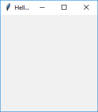
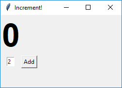
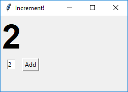

### GUI Basics

<box type="warning">

Writing _Graphical User Interfaces (GUIs)_ is relatively more complicated than writing regular code. Here, we give a very small peek into GUI programming in Python.
</box>

**There are different frameworks that you can use to write Python graphical user interfaces (GUIs)** %%e.g., Tkinter, KIVY, PyQT, WxPython%%. The one we'll be using here is Tkinter, which is a way to use the popular Tk GUI framework <tooltip content="Tk can be used via other languages too">via Python</tooltip>.

**Tkinter comes with the Python installation**; you can start writing Tkinter GUIs right away without having to install anything extra.

Here is the code for the simplest GUI:

<include src="inputOutput.md" boilerplate> 
<span id="input">

```python
from tkinter import *

# create a Window
window = Tk()

# set Window title
window.title('Hello World!')

# start the Window
window.mainloop()
```

</span>
<span id="output">


</span>
</include>

<p/>

**A GUI typically contains <tooltip content="elements on a GUI such as buttons, labels, text boxes are called _widgets_">_widgets_</tooltip>.** The example GUI below not only has some widgets but also has some dynamic behavior i.e., clicking the button increments the displayed number by the amount in the text box.

<include src="inputOutput.md" boilerplate> 
<span id="input">


</span>
<span id="output">


</span>
</include>

<p/>

Here's the full code for the above example:
```python{highlight-lines="3,8,12,18,25,29"}
from tkinter import *

# create a window
window = Tk()
window.title('Increment!')
window.geometry('250x150')

# create a label
label = Label(window, text='0', font=("Arial Bold", 50))
label.grid(column=0, row=0)

# create a text box
textbox = Entry(window, width=2)
textbox.grid(column=0, row=1)
textbox.insert(0, '2')


# define a function to be called when the button is clicked
def button_clicked():
    label_value = int(label['text'])  # get int value of the label text
    textbox_value = int(textbox.get())  # get int value of the textbox text
    label.configure(text=str(label_value + textbox_value))  # set label text to the sum of above two


# add a button, bind it to the function
button_ok = Button(window, text="Add", command=button_clicked)
button_ok.grid(column=1, row=1)

# start the window
window.mainloop()
```

Let's go through the code to see how it works.

* ```python{start-from=6}
  window.geometry('250x150')
  ```
  Sets the size of the Window.<p/>

* ```python{start-from=9}
  label = Label(window, text='0', font=("Arial Bold", 50))
  label.grid(column=0, row=0)
  ```
  * **Creates a [_Label_ widget](https://www.python-course.eu/tkinter_labels.php)** to show the current total. Sets its value to `0`. Sets the font to `Arial Bold` and font size to `50`.
  * There are [different ways to define the <tooltip content="i.e., where widgets are placed">layout</tooltip> of the GUI](https://www.python-course.eu/tkinter_layout_management.php). In this case we are using a <tooltip content="It places the widgets in a 2-dimensional table, which consists of a number of rows and columns. The position of a widget is defined by a row and a column number.">_grid_ approach</tooltip>. This statement places the label at `0,0` cell of the grid.<p/>

* ```python{start-from=13}
  textbox = Entry(window, width=2)
  textbox.grid(column=0, row=1)
  textbox.insert(0, '2')
  ```
  * **Creates an [_Entry_ widget](https://www.python-course.eu/tkinter_entry_widgets.php)** for the user to enter the increment size. Sets its width to `2` characters.
  * Places it at the `0,1` cell %%(i.e., first column, 2nd row)%%.
  * Sets the initial value of the widget to `2`. The value it placed at the `0`th character position.<p/>

* ```python{start-from=19}
  def button_clicked():
      label_value = int(label['text'])
      textbox_value = int(textbox.get())
      label.configure(text=str(label_value + textbox_value))
  ```
  **Creats a function to be called when the button is clicked.** It will increment the value shown in the label by the amount shown in the entry widget.
  * line %%#20%%: Reads the `text` property of the label widget and converts it to an `int`
  * line %%#21%%: Reads the value of the entry widget and converts it to an `int`
  * line %%#22%%: Sums the two values, converts the sum into a `str`, and sets it as the value of the label widget.<p/>

* ```python{start-from=26}
  button_ok = Button(window, text="Add", command=button_clicked)
  button_ok.grid(column=1, row=1)
  ```
  * **Creates a [_Button_ widget](https://www.python-course.eu/tkinter_buttons.php)** for the user to click. Sets its display text to `Add`. Sets its command to the function `button_clicked` i.e., when the button is clicked, the specified function will be called.
  * Places the button in the `1,1` cell of the grid.

{{ icon_resource }} Resources:
* [Best Python GUI Framework/Toolkits 2019](https://techsore.com/best-python-gui/)
* [Python Tkinter Course](https://www.python-course.eu/python_tkinter.php) from python-course.eu