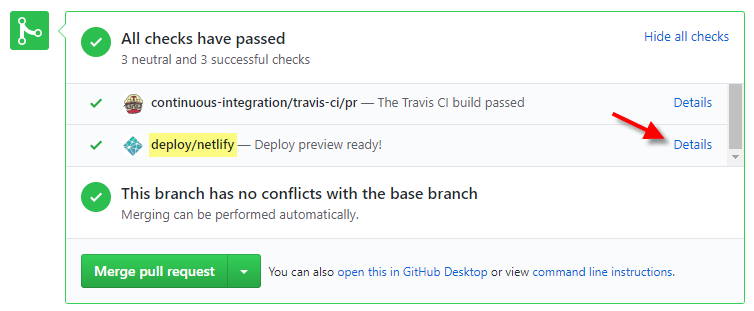




{{ show_week_pagetop(10, "tutorial") }}

#### {{ thumb(1) }} Review the <tooltip content="Developer Guide">DG</tooltip> of a Peer Team

* **Divide into two sub-teams**, ensuring that each team has at least one member who is good with UML.
* **Find the team your sub-team have been allocated to discuss** in the panel below and click on the link to locate their team PR.




{{ allocation[1] }}
{{ reviewed_team }}



[{{ team_id }}](https://github.com/nus-{{ module | lower}}-{{ semester }}/addressbook-level3/pulls?q=is%3Aopen+is%3Apr+label%3Atutorial.{{ team_id.slice(0, -2) }}+label%3Ateam.{{ team_id.slice(-1) }})


<panel header="Team allocation for PR discussion" minimized >

Team          | Sub-team A <small>%%(backup)%%</small> | Sub-team B <small>%%(backup)%%</small>
--------------|----------------------------------------|---------------------------------------

{{ get_review_allocation_for_team(team[1]) }}
{{ get_review_allocation_for_team(team[2]) }}
{{ team[0] }} | {{ get_pr_link(team[1]) }} <small>%%({{ get_pr_link(backup_team1) }})%%</small> | {{ get_pr_link(team[2]) }} <small>%%({{ get_pr_link(backup_team2) }})%%</small>

</panel>

* **Go to the PR** and **navigate the to the <trigger trigger="click" for="modal:t10-netlifyPreview">Netlify preview</trigger>**.
* **Confirm that the DG has significant updates**, to the diagrams in particular. If it doesn't, you can review the _backup_ team (given within brackets). %%If even the backup team is not suitable, choose any random teams having tutorials in the same day and not in the same tutorial as you.%%
* **Evaluate the `Design` and the `Implementation` sections against the stated expectations** (given further down); add your observations as comments. 

<modal large title="" id="modal:t10-netlifyPreview">
  
</modal>

<box>

* To be done collectively with sub-team members.
* Add _review comments_ in the corresponding place of the code. But ==if the <tooltip content="i.e., the tab named `Files changed`">_diff view_</tooltip> is too laggy, you can use a normal comment==. 
* Choose the `Start a review` option rather than `Add single comment`.
* Each person can do their own review, but coordinate with sub-team members to avoid duplicating the same point.
* Phrase your comments as question/doubts (e.g., `Is this format correct? Should it be ... instead?`) rather than directives (e.g., `Change this to ...`).
* Where possible, use screenshots from their DG in your comments, preferably with annotations. This is particularly useful when commenting on diagrams.
* Do not finalize the review at this stage. Just keep adding comments.
</box>

<box border-left-color="green">

##### DG Expectations 
{{ icon_important_big_red }} Pay attention to these as they are same as the final evaluation criteria of the DG. 

Also see:
{{ embed_topic("../../admin/project-w10-mid-v13.md#dgTips", "Admin " + icon_embedding + " tP: mid-v1.3 → DG Tips", "t10-dgTips", "3") }}

**Architecture**
- [ ] The Architecture diagram uses intuitive symbols.
- [ ] No indiscriminate use of double-headed arrows.
- [ ] Any <tooltip content="e.g., the sequence diagram showing interactions between main components">_architecture-level_</tooltip> diagrams do not contain lower-level details.
- [ ] The description given is understandable and sufficiently high-level.

**Diagrams**
- [ ] Uses the correct UML notation. 
  &nbsp;&nbsp;{{ icon_info }} If you notice UML notation errors, please point them out.
- [ ] Not cluttered with too much unnecessary details.
- [ ] Each diagrams is relatively simple and easy to understand.
- [ ] Uses multiple types of diagrams (ideal: uses Class Diagrams, Object Diagrams, Sequence Diagrams, Activity Diagrams)
- [ ] Diagrams are well-integrated into the description.
- [ ] Not repetitive (opposite: many similar diagrams with minor differences).

**Descriptions**
- [ ] Easy to understand/follow
- [ ] Just enough information: Not too much information. All important information is given.

**Overall**
- [ ] Polished: The document looks neat, well-formatted, and professional.

</box>

* **Discuss your comments/observations/doubts with the tutor** and other team members to confirm the comments you entered are correct.
* **Update your review comments if necessary**, based on the discussion you just had. After that, you can submit the review. 

